# 行为型模式

行为型模式处理对象之间怎样分配职责、传递请求、切换算法与状态，以及在不扩大直接依赖的情况下完成协作。GoF共有11种行为型模式。

## 1. 责任链（Chain of Responsibility）

### 机制

多个Handler形成处理链。每个处理者收到请求后决定自行处理、停止传递，或者交给下一个处理者。

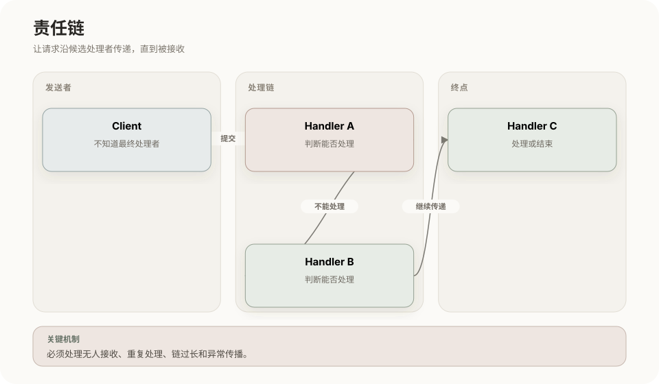

**UML 类图**

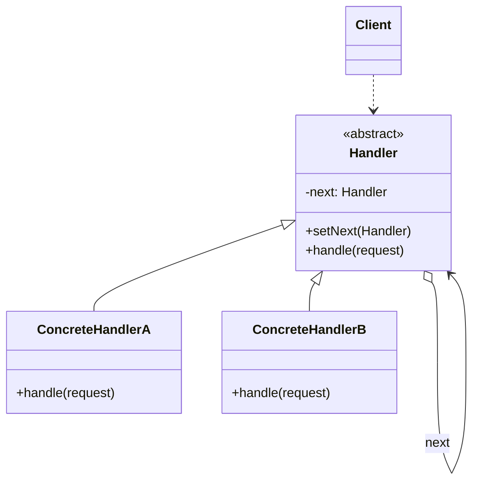
```mermaid
classDiagram
    class Handler {
        <<abstract>>
        -next: Handler
        +setNext(Handler)
        +handle(request)
    }
    class ConcreteHandlerA {
        +handle(request)
    }
    class ConcreteHandlerB {
        +handle(request)
    }
    class Client
    Handler <|-- ConcreteHandlerA
    Handler <|-- ConcreteHandlerB
    Handler o--> Handler : next
    Client ..> Handler
```

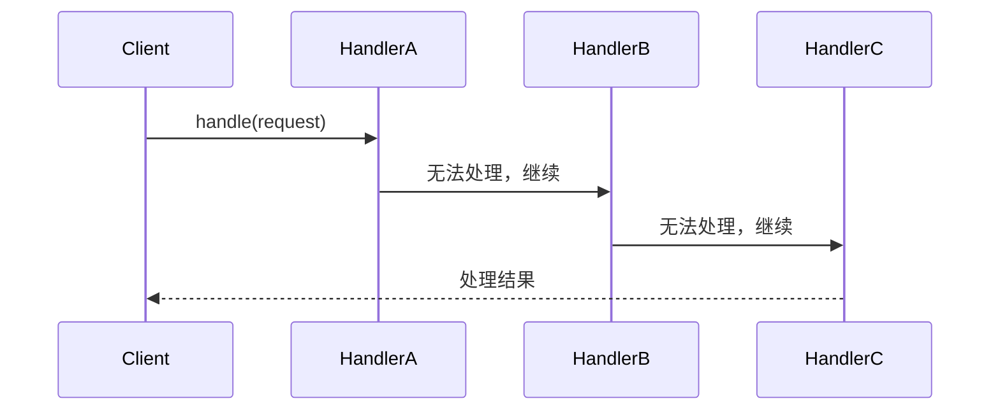
```mermaid
sequenceDiagram
    participant C as Client
    participant A as HandlerA
    participant B as HandlerB
    participant D as HandlerC
    C->>A: handle(request)
    A->>B: 无法处理，继续
    B->>D: 无法处理，继续
    D-->>C: 处理结果
```

请求发送者不必知道最终处理者。链可以运行时调整，但必须处理“无人接收”、重复处理、链路过长和异常传播等问题。

## 2. 命令（Command）

### 机制

把一次操作封装成Command对象。Invoker负责触发，ConcreteCommand持有Receiver并把`execute()`转换为接收者的具体操作。

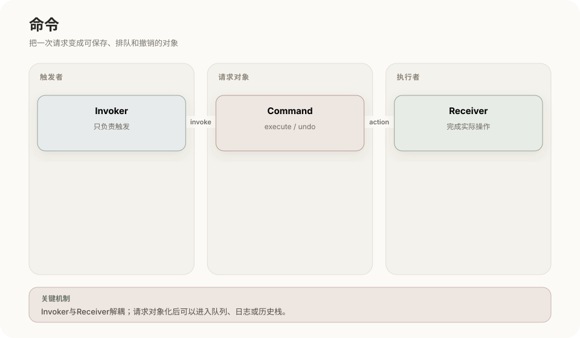

**UML 类图**

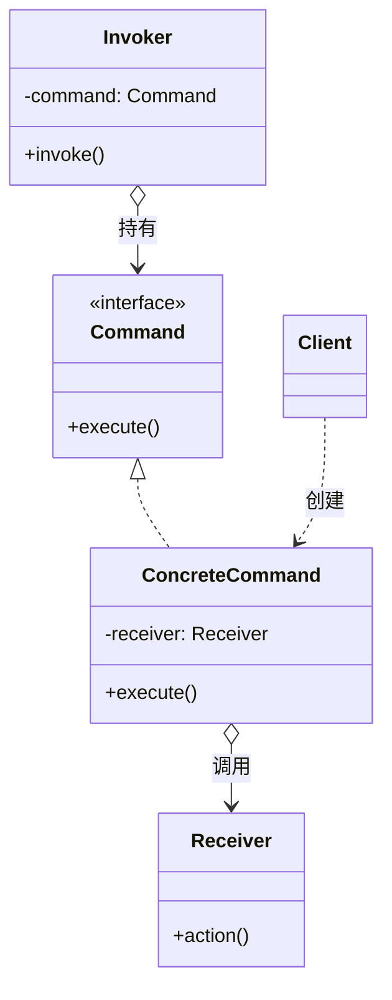
```mermaid
classDiagram
    class Command {
        <<interface>>
        +execute()
    }
    class ConcreteCommand {
        -receiver: Receiver
        +execute()
    }
    class Invoker {
        -command: Command
        +invoke()
    }
    class Receiver {
        +action()
    }
    class Client
    Command <|.. ConcreteCommand
    Invoker o--> Command : 持有
    ConcreteCommand o--> Receiver : 调用
    Client ..> ConcreteCommand : 创建
```

运行过程：Client创建Receiver和ConcreteCommand；把命令交给Invoker；Invoker在合适时机调用`execute()`；命令再调用Receiver。因为请求已经对象化，它可以排队、记录日志、组合成宏命令或保存撤销信息。

命令封装“做什么”，策略封装“用哪种算法做”。

## 3. 解释器（Interpreter）

### 机制

为一种简单语言定义语法表达式类。终结符和非终结符表达式组成抽象语法树，每个节点实现`interpret(context)`。

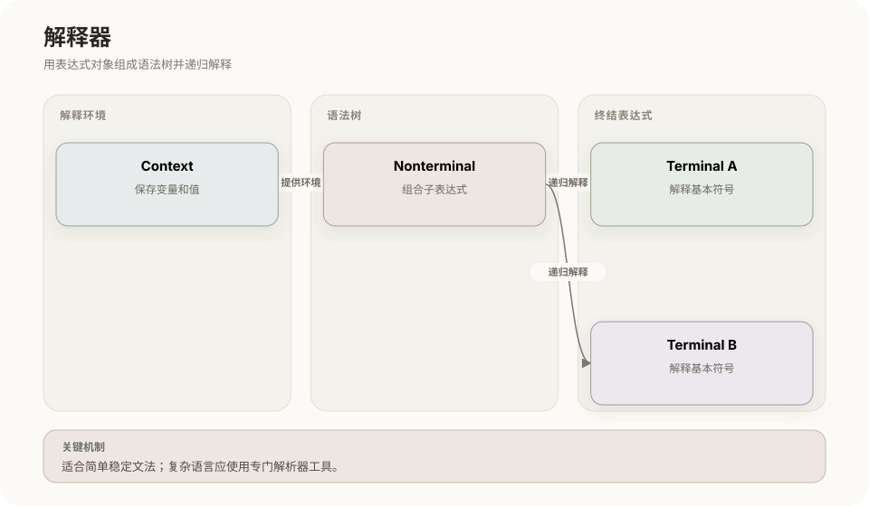

**UML 类图**

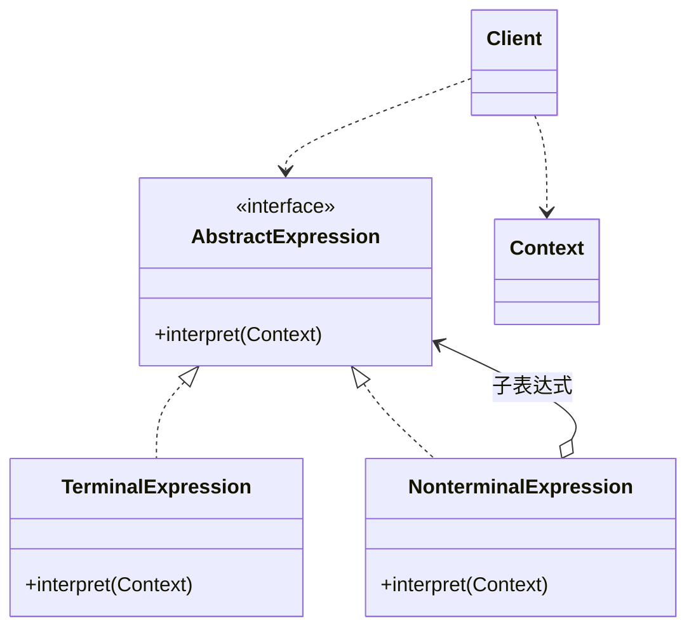
```mermaid
classDiagram
    class AbstractExpression {
        <<interface>>
        +interpret(Context)
    }
    class TerminalExpression {
        +interpret(Context)
    }
    class NonterminalExpression {
        +interpret(Context)
    }
    class Context
    class Client
    AbstractExpression <|.. TerminalExpression
    AbstractExpression <|.. NonterminalExpression
    NonterminalExpression o--> AbstractExpression : 子表达式
    Client ..> AbstractExpression
    Client ..> Context
```

运行过程：先把输入构造成表达式树；从根节点开始解释；非终结符递归解释子表达式；终结符处理最基本符号；Context保存变量和值。

它适合规则稳定、文法简单且执行效率不是首要问题的小型语言。复杂语法更适合使用专门解析器生成工具，避免类数量和递归结构迅速膨胀。

## 4. 迭代器（Iterator）

### 机制

Aggregate负责创建Iterator；Iterator保存当前位置，通过统一接口顺序访问元素，而不暴露集合内部结构。

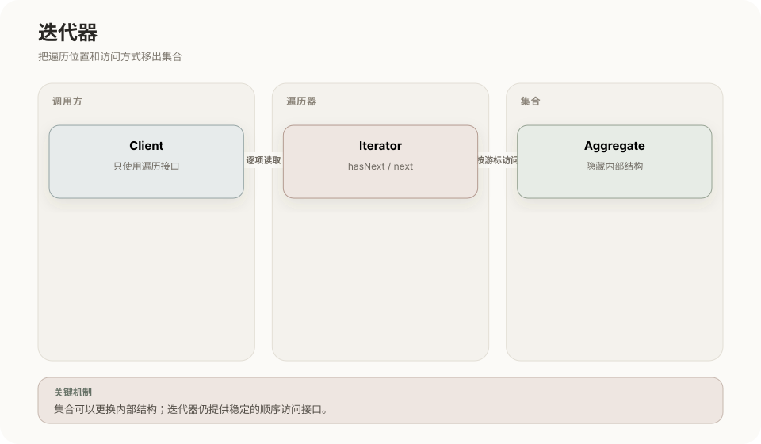

**UML 类图**

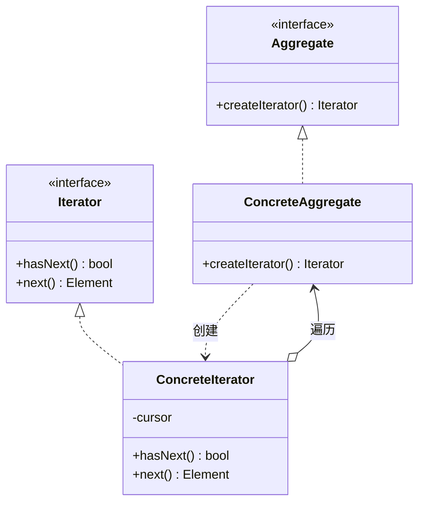
```mermaid
classDiagram
    class Aggregate {
        <<interface>>
        +createIterator() Iterator
    }
    class ConcreteAggregate {
        +createIterator() Iterator
    }
    class Iterator {
        <<interface>>
        +hasNext() bool
        +next() Element
    }
    class ConcreteIterator {
        -cursor
        +hasNext() bool
        +next() Element
    }
    Aggregate <|.. ConcreteAggregate
    Iterator <|.. ConcreteIterator
    ConcreteAggregate ..> ConcreteIterator : 创建
    ConcreteIterator o--> ConcreteAggregate : 遍历
```

运行过程：Client从集合取得迭代器；反复调用`hasNext()`和`next()`；迭代器维护游标并从集合读取元素。集合可以改变内部存储结构，只要迭代器接口保持不变。

常见考点包括正向与反向遍历、多个独立游标，以及遍历期间集合被修改时采用快速失败、快照或并发迭代语义。

## 5. 中介者（Mediator）

### 机制

多个Colleague不再彼此直接调用，而是把事件交给Mediator。Mediator知道协作规则，并决定接下来通知哪些对象。

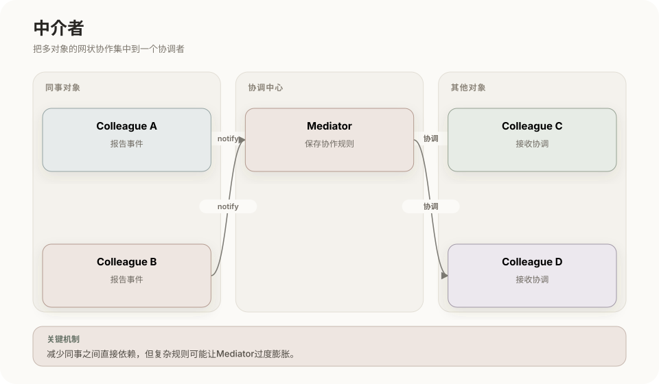

**UML 类图**

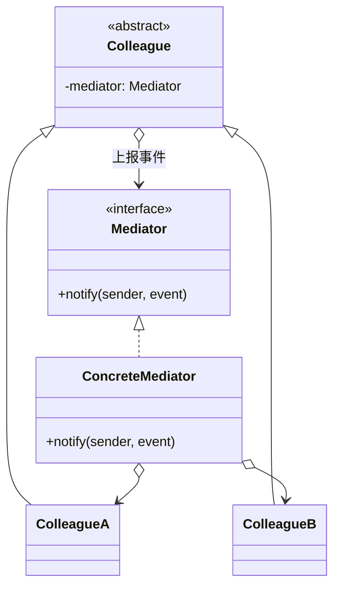
```mermaid
classDiagram
    class Mediator {
        <<interface>>
        +notify(sender, event)
    }
    class ConcreteMediator {
        +notify(sender, event)
    }
    class Colleague {
        <<abstract>>
        -mediator: Mediator
    }
    class ColleagueA
    class ColleagueB
    Mediator <|.. ConcreteMediator
    Colleague <|-- ColleagueA
    Colleague <|-- ColleagueB
    Colleague o--> Mediator : 上报事件
    ConcreteMediator o--> ColleagueA
    ConcreteMediator o--> ColleagueB
```

运行过程：某个Colleague状态变化后通知Mediator；Mediator依据协作规则调用其他Colleague；各同事类只依赖中介接口，网状依赖被集中管理。

它减少同事对象之间的直接耦合，但复杂规则可能全部聚集到Mediator，使其成为难以维护的巨大对象。

## 6. 备忘录（Memento）

### 机制

Originator创建包含自身状态的Memento；Caretaker只负责保存备忘录，不能读取或修改其中受保护的状态；恢复时再交还Originator。

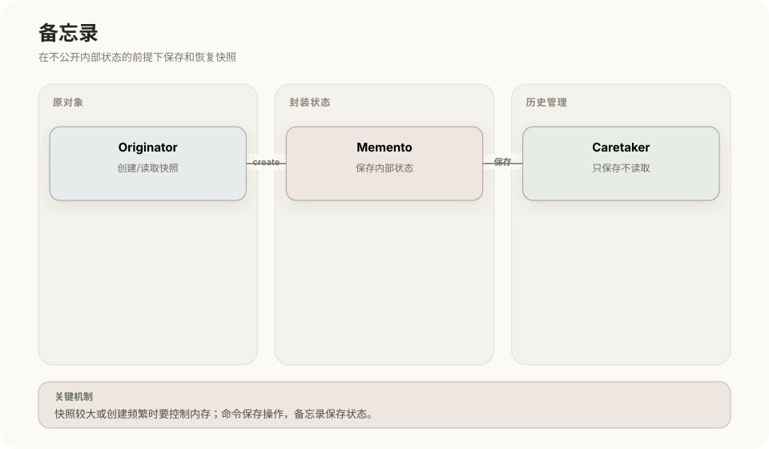

**UML 类图**

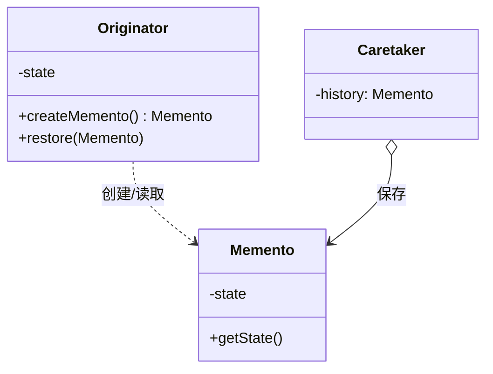
```mermaid
classDiagram
    class Originator {
        -state
        +createMemento() Memento
        +restore(Memento)
    }
    class Memento {
        -state
        +getState()
    }
    class Caretaker {
        -history: Memento
    }
    Originator ..> Memento : 创建/读取
    Caretaker o--> Memento : 保存
```

运行过程：操作前由Originator生成快照；Caretaker把它压入历史记录；需要撤销时取出Memento；Originator读取其中状态并恢复。

它在不公开对象内部字段的前提下支持恢复。代价是状态较大或快照频繁时占用大量内存。命令保存操作，备忘录保存状态，两者可以共同实现撤销。

## 7. 观察者（Observer）

### 机制

Subject保存Observer列表。状态变化后Subject逐一通知观察者，观察者再拉取状态或直接接收事件数据。

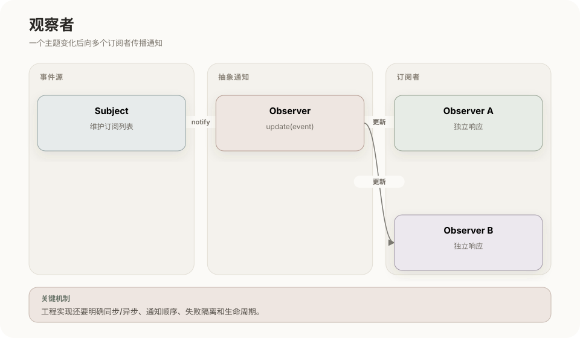

**UML 类图**

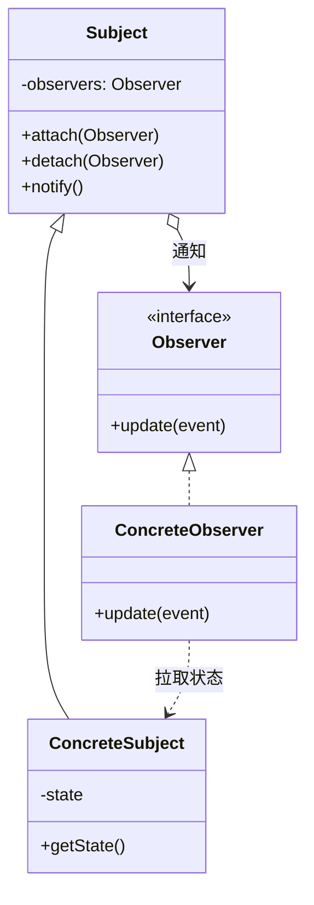
```mermaid
classDiagram
    class Subject {
        -observers: Observer
        +attach(Observer)
        +detach(Observer)
        +notify()
    }
    class ConcreteSubject {
        -state
        +getState()
    }
    class Observer {
        <<interface>>
        +update(event)
    }
    class ConcreteObserver {
        +update(event)
    }
    Subject <|-- ConcreteSubject
    Observer <|.. ConcreteObserver
    Subject o--> Observer : 通知
    ConcreteObserver ..> ConcreteSubject : 拉取状态
```

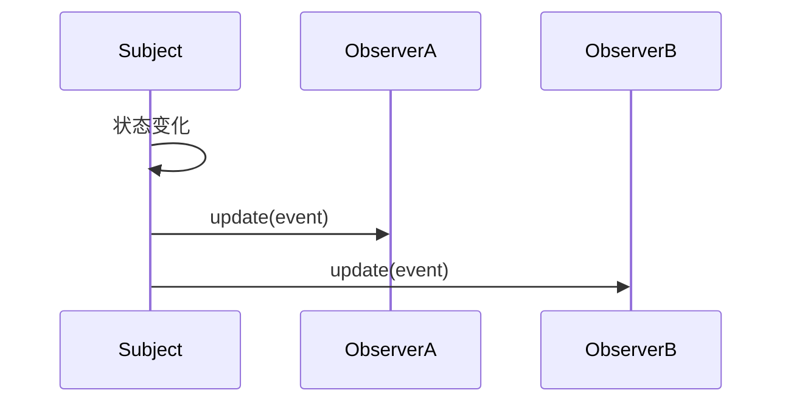
```mermaid
sequenceDiagram
    participant S as Subject
    participant A as ObserverA
    participant B as ObserverB
    S->>S: 状态变化
    S->>A: update(event)
    S->>B: update(event)
```

Subject不必依赖具体观察者，因此可以动态订阅和退订。工程实现还要明确同步或异步、通知顺序、失败隔离、重复订阅和对象生命周期。

观察者侧重“一处变化向多方传播”；中介者侧重“集中协调多个对象之间的复杂交互”。

## 8. 状态（State）

### 机制

Context把与状态相关的行为委托给当前State对象。状态迁移后，Context持有另一个ConcreteState，于是同一操作表现出不同效果。

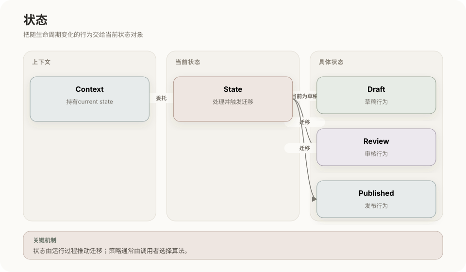

**UML 类图**

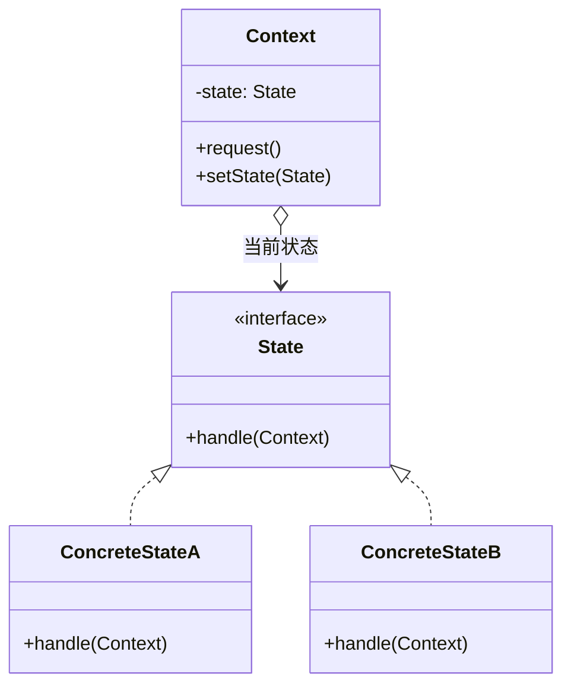
```mermaid
classDiagram
    class Context {
        -state: State
        +request()
        +setState(State)
    }
    class State {
        <<interface>>
        +handle(Context)
    }
    class ConcreteStateA {
        +handle(Context)
    }
    class ConcreteStateB {
        +handle(Context)
    }
    Context o--> State : 当前状态
    State <|.. ConcreteStateA
    State <|.. ConcreteStateB
```

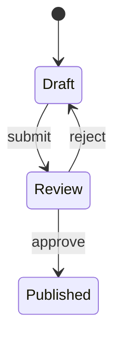
```mermaid
stateDiagram-v2
    [*] --> Draft
    Draft --> Review : submit
    Review --> Draft : reject
    Review --> Published : approve
```

它把大型状态条件分支分散到状态类中，并让迁移规则更明确。状态数量很少、行为简单时，直接条件判断可能更清楚。

策略通常由调用者选择算法，各策略相对独立；状态通常由对象运行过程触发迁移，各状态共同描述生命周期。

## 9. 策略（Strategy）

### 机制

把一组可以相互替换的算法封装成Strategy实现。Context持有一个Strategy，并把计算委托给它。

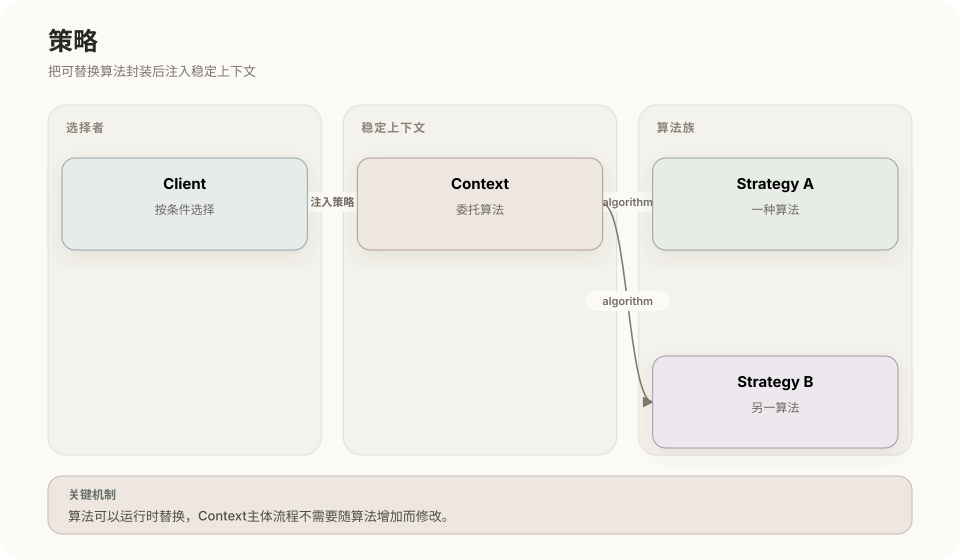

**UML 类图**

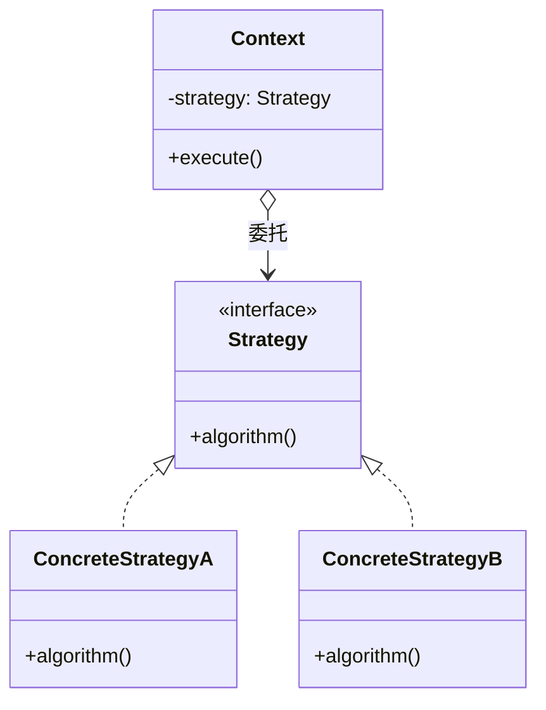
```mermaid
classDiagram
    class Context {
        -strategy: Strategy
        +execute()
    }
    class Strategy {
        <<interface>>
        +algorithm()
    }
    class ConcreteStrategyA {
        +algorithm()
    }
    class ConcreteStrategyB {
        +algorithm()
    }
    Context o--> Strategy : 委托
    Strategy <|.. ConcreteStrategyA
    Strategy <|.. ConcreteStrategyB
```

运行过程：Client依据配置或运行条件选择Strategy；注入Context；Context在稳定流程中调用统一算法接口；更换策略不需要修改Context的主体逻辑。

策略消除算法选择处的大量条件分支，但调用者需要知道各策略差异。若只是极短且不会扩展的分支，独立策略类可能增加无效复杂度。

## 10. 模板方法（Template Method）

### 机制

AbstractClass在模板方法中固定算法骨架，把部分步骤声明为抽象操作或钩子，由子类重写。

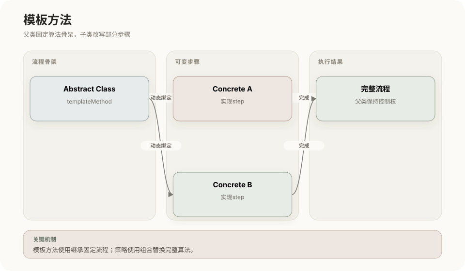

**UML 类图**

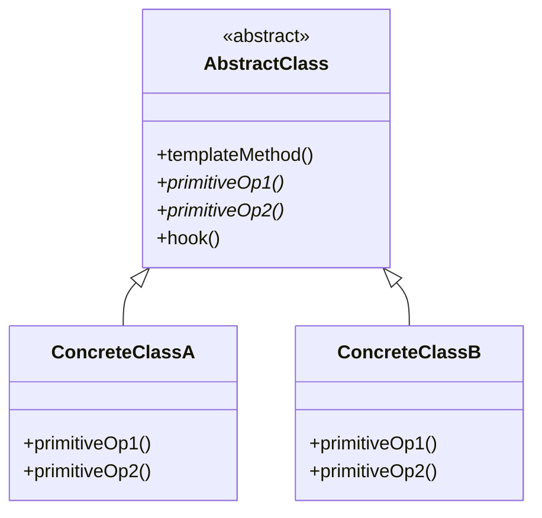
```mermaid
classDiagram
    class AbstractClass {
        <<abstract>>
        +templateMethod()
        +primitiveOp1()*
        +primitiveOp2()*
        +hook()
    }
    class ConcreteClassA {
        +primitiveOp1()
        +primitiveOp2()
    }
    class ConcreteClassB {
        +primitiveOp1()
        +primitiveOp2()
    }
    AbstractClass <|-- ConcreteClassA
    AbstractClass <|-- ConcreteClassB
```

运行过程：Client调用继承自父类的`templateMethod()`；父类按固定次序调用步骤；动态绑定使可变步骤进入具体子类；流程控制权始终在父类。

模板方法使用继承，在编译期形成关系；策略使用组合，可以在运行时整体替换算法。钩子通常有默认实现，子类可选择是否重写。

## 11. 访问者（Visitor）

### 机制

对象结构中的每种Element提供`accept(Visitor)`；Visitor为不同具体元素声明对应的`visit`方法。元素把自身传给访问者，形成双分派。

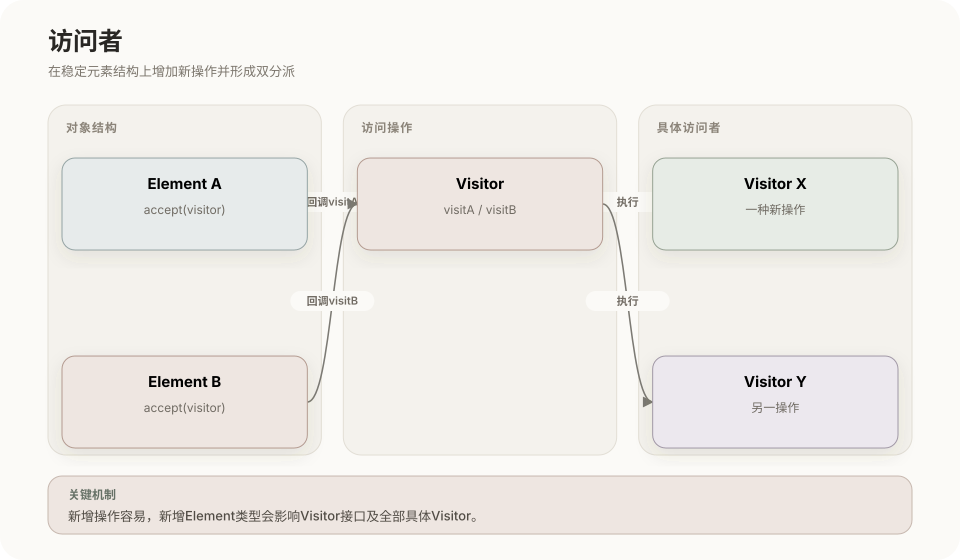

**UML 类图**

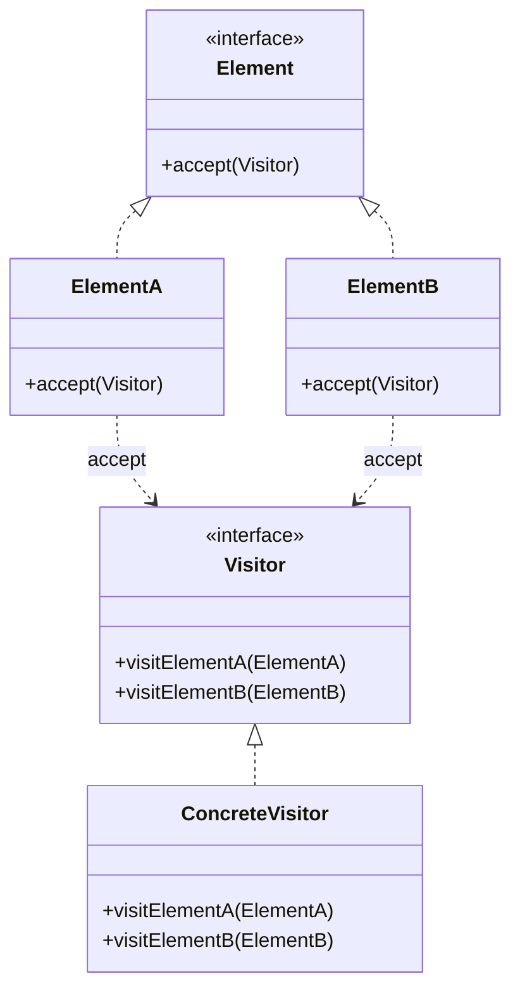
```mermaid
classDiagram
    class Visitor {
        <<interface>>
        +visitElementA(ElementA)
        +visitElementB(ElementB)
    }
    class ConcreteVisitor {
        +visitElementA(ElementA)
        +visitElementB(ElementB)
    }
    class Element {
        <<interface>>
        +accept(Visitor)
    }
    class ElementA {
        +accept(Visitor)
    }
    class ElementB {
        +accept(Visitor)
    }
    Visitor <|.. ConcreteVisitor
    Element <|.. ElementA
    Element <|.. ElementB
    ElementA ..> Visitor : accept
    ElementB ..> Visitor : accept
```

运行过程：Client选择Visitor并遍历ObjectStructure；每个元素执行`accept(visitor)`；元素根据自身具体类型调用`visitor.visitX(this)`；访问者执行与“元素类型 + 访问者类型”匹配的操作。

它适合元素类型稳定、需要频繁增加新操作的对象结构。增加Visitor很容易；增加新的Element类型却要修改Visitor接口和全部具体Visitor，因此元素类型经常变化时不合适。

## 12. 行为型模式总对照

| 模式 | 被封装或转移的内容 | 请求怎样运行 |
|---|---|---|
| 责任链 | 处理者选择 | 沿链传递直到被处理 |
| 命令 | 一次请求 | Invoker触发命令，命令调用Receiver |
| 解释器 | 语法规则 | 递归解释表达式树 |
| 迭代器 | 遍历位置和方式 | 迭代器逐个返回集合元素 |
| 中介者 | 多对象协作规则 | 同事报告事件，中介统一协调 |
| 备忘录 | 对象历史状态 | 保存快照并交还原对象恢复 |
| 观察者 | 状态变化通知 | Subject向多个Observer传播事件 |
| 状态 | 随生命周期变化的行为 | Context委托当前State并发生迁移 |
| 策略 | 可替换算法 | Context委托选定Strategy |
| 模板方法 | 固定流程中的可变步骤 | 父类控制骨架，子类实现步骤 |
| 访问者 | 施加在稳定元素结构上的操作 | Element回调Visitor形成双分派 |

## 13. 高频辨析

### 策略、状态与模板方法

| 对比项 | 策略 | 状态 | 模板方法 |
|---|---|---|---|
| 主要目的 | 替换算法 | 随状态改变行为 | 固定流程并开放部分步骤 |
| 主要机制 | 组合 | 组合与状态迁移 | 继承 |
| 谁决定变化 | 调用者或Context | 当前状态或Context | 子类实现 |
| 运行时切换 | 常见 | 核心特征 | 通常不切换子类 |

### 命令、责任链与备忘录

- 命令把请求本身封装成对象，使其可排队、记录和撤销；
- 责任链让请求在多个候选处理者之间寻找接收者；
- 备忘录保存对象状态，用于恢复；
- 一个系统可以把Command送入责任链，并用Memento保存撤销前状态。

### 观察者与中介者

- 观察者不规定各订阅者之间如何协作，只负责通知；
- 中介者了解并执行多对象之间的协作规则；
- 事件总线常具有观察者特征，复杂流程编排器更接近中介者。

## 相关章节

- [设计模式总览](01-设计模式总览.md)
- [创建型模式](02-创建型模式.md)
- [结构型模式](03-结构型模式.md)

