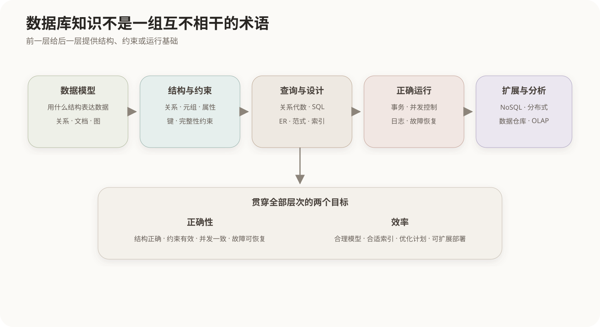

# 数据库设计导读

数据库系统解决的不是“把数据写进文件”这一个问题，而是同时解决数据如何组织、如何约束、如何查询、多人同时访问时如何保持正确，以及设备或进程故障后如何恢复。

本章按这些问题之间的依赖关系展开：



1. **数据模型**规定系统用什么结构表达现实数据；
2. **关系模型**把数据组织为关系，并用键和完整性约束维护正确性；
3. **关系代数和SQL**分别给出理论运算体系与实际操作语言；
4. **规范化和数据库设计**处理表结构中的冗余与异常；
5. **事务、并发控制和恢复**保证运行过程中的一致性；
6. **索引与查询优化**在不改变查询语义的前提下提高访问效率；
7. **非关系型、分布式数据库和数据仓库**面向不同的数据结构、规模和分析目标扩展数据库体系。

## 学习顺序

- 先理解“关系是元组的集合”，再学习关系代数和SQL；
- 先理解候选键与函数依赖，再判断范式；
- 先理解事务的ACID目标，再学习锁、隔离级别和日志恢复；
- 先区分数据模型，再比较关系数据库与各种非关系数据库。

## 核心关系

```text
现实对象 → 数据模型 → 数据结构与约束 → 查询和更新
                                  ↓
                事务 + 并发控制 + 恢复 → 正确运行
                                  ↓
                     索引 + 查询优化 → 提高效率
```

