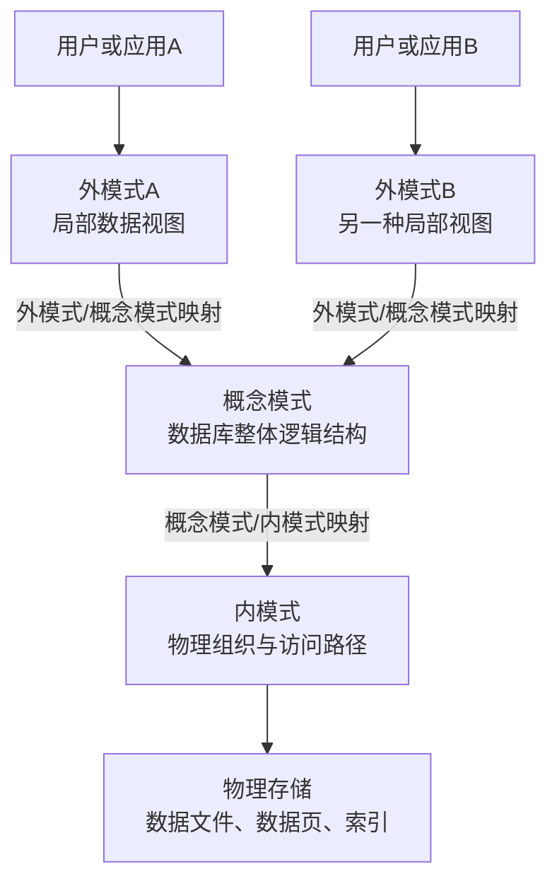
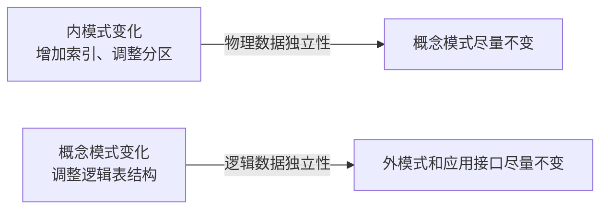

# 数据库三级模式

数据库三级模式解释同一批数据为什么能够同时拥有用户看到的局部形式、数据库整体的逻辑结构和DBMS内部的物理组织。它承接[数据库系统与数据模型](03-数据库系统与数据模型.md)，重点从“采用什么数据模型”转向“不同抽象层怎样隔离变化”。

## 来源和性质

数据库三级模式通常称为 ANSI/SPARC 数据库体系结构，由 ANSI/X3/SPARC 数据库管理系统研究组提出，其阶段性报告发布于1975年。

它是数据库管理系统的参考架构，不是应用程序必须采用的编码模式。普通业务开发不需要在代码中显式声明“正在使用三级模式”。

三级模式包括：

1. 外模式
2. 概念模式
3. 内模式



图中两层映射分别支持逻辑数据独立性和物理数据独立性。

## 概念模式

概念模式也叫模式或逻辑模式，描述整个数据库的总体逻辑结构，包括：

- 有哪些表、记录类型和字段；
- 数据之间有哪些联系；
- 可以进行哪些操作；
- 主键、外键、唯一性和其他完整性约束；
- 数据访问涉及的安全要求。

一个数据库通常只有一个概念模式。

代表性SQL是 `CREATE TABLE`：

```sql
CREATE TABLE documents (
    id         BIGINT PRIMARY KEY,
    title      VARCHAR(200) NOT NULL,
    content    TEXT,
    owner_id   BIGINT NOT NULL,
    created_at TIMESTAMP NOT NULL,
    FOREIGN KEY (owner_id) REFERENCES users(id)
);
```

这条语句定义表、字段、数据类型和约束，因此主要体现概念模式。

## 外模式

外模式也叫子模式或用户模式，描述某类用户或应用需要看到和使用的局部数据。

一个数据库可以有多个外模式。不同用户可以看到不同的数据范围、字段和表现形式。

代表性SQL是 `CREATE VIEW`：

```sql
CREATE VIEW document_list AS
SELECT id, title, created_at
FROM documents;
```

该视图只提供部分字段，隐藏了 `content`、`owner_id` 等数据。

SQL视图是数据库外模式的直接实现形式。现代应用中的ORM投影和API DTO具有相似作用，但严格来说不一定属于数据库自身的外模式。

## 内模式

内模式也叫存储模式，描述数据在数据库内部的物理组织和访问方式，包括：

- 数据文件和数据页；
- 记录的物理存放方式；
- 索引结构；
- 数据访问路径；
- 分区、压缩和存储位置。

一个数据库通常只有一个内模式。

可以由开发者控制的代表性SQL是 `CREATE INDEX`：

```sql
CREATE INDEX idx_documents_owner
ON documents(owner_id);
```

索引会影响数据访问方式，但通常不改变表向用户呈现的逻辑字段。

严格来说，`CREATE INDEX` 只能代表物理设计的一部分。数据页、文件格式、索引节点和记录编码等真正的内部实现通常由DBMS管理，无法用一条通用SQL完整描述。

## 三种模式与SQL的简化对应

```text
概念模式：CREATE TABLE
外模式：CREATE VIEW
内模式：CREATE INDEX
```

这是一种便于入门理解的对应关系，不表示每种模式只能使用这一条SQL，也不表示SQL语句本身等同于完整模式。

`SELECT * FROM t_xxxx` 是查询语句，不是模式定义：

- 如果 `t_xxxx` 是基本表，它读取概念模式定义的表；
- 如果 `t_xxxx` 是视图，它读取外模式提供的视图；
- 一条临时 `SELECT` 查询通常不单独称为外模式。

## 分为三级的意义



三级模式的核心目标是数据独立性。

### 物理数据独立性

增加索引、调整数据文件、改变分区或存储方式时，只要逻辑结构不变，业务查询原则上不需要修改。

这体现了概念模式与内模式的分离。

### 逻辑数据独立性

逻辑表结构发生变化时，可以通过兼容视图等方式，尽量维持特定用户或旧程序看到的数据形式。

这体现了外模式与概念模式的分离。逻辑数据独立性通常比物理数据独立性更难实现。

## 为什么开发者没有显式使用它也能开发

- DBMS已经负责大部分内模式工作；
- 开发者设计表和约束时已经在处理概念模式；
- SQL视图、查询投影、ORM和API承担了部分用户视图工作；
- 它是用于分析和标准化的参考架构，不是完成CRUD开发的前置条件。

因此，不知道三级模式并不妨碍普通数据库开发；它主要用于解释数据库如何隔离用户视图、全局逻辑结构和物理存储。

## 核心关系

```text
用户或应用 → 外模式 → 概念模式 → 内模式 → 物理存储
                ↑           ↑
          逻辑数据独立性  物理数据独立性
```

- 外模式面向特定用户或应用的数据范围；
- 概念模式描述数据库整体逻辑结构；
- 内模式描述物理组织和访问路径；
- 两层映射的目的不是增加层次，而是把局部接口、逻辑设计和物理实现的变化尽量隔离。
