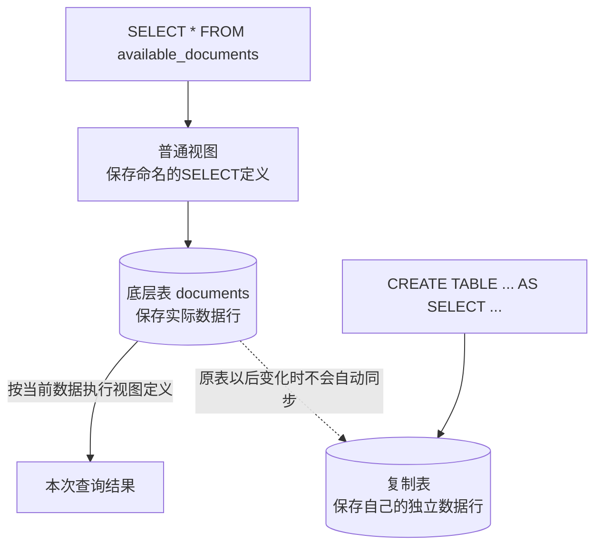

# 表与视图的区别

表和视图都是可以出现在SQL查询`FROM`子句中的数据库对象，但它们保存的内容不同。本节建立在[关系模型、键与完整性约束](04-关系模型键与完整性约束.md)和[SQL语言基础](06-SQL语言基础.md)之上，专门说明“可被查询”并不等于“独立保存数据”。

## 核心结论

> 视图就是一条被命名并保存起来的 `SELECT` 查询。它看起来可以像表一样被 `SELECT`，但通常没有自己独立存放那些结果行。

普通视图自己不保存独立数据，也没有一张专门保存查询结果行的实体表。它依赖于创建视图时所引用的底层表或其他视图。

这里的“视图”不是画图、结构图或可视化界面，而是一种数据库对象。



## 表

表保存表结构和实际数据行：

```sql
CREATE TABLE documents (
    id      INT PRIMARY KEY,
    title   VARCHAR(100),
    deleted BOOLEAN
);
```

执行：

```sql
INSERT INTO documents (id, title, deleted)
VALUES (1, '安装说明', false);
```

这条记录会实际写入 `documents` 表。

## 视图

创建普通视图：

```sql
CREATE VIEW available_documents AS
SELECT id, title
FROM documents
WHERE deleted = false;
```

数据库保存的视图定义包括：

- 视图名称：`available_documents`；
- 引用的底层对象：`documents`；
- 选择的字段：`id`、`title`；
- 筛选条件：`deleted = false`。

普通视图通常不会把查询得到的记录再复制并保存一份。

执行：

```sql
SELECT * FROM available_documents;
```

在查询含义上，相当于执行视图保存的查询：

```sql
SELECT id, title
FROM documents
WHERE deleted = false;
```

数据库读取 `documents` 当前的数据，按 `deleted = false` 筛选记录，再返回 `id` 和 `title`。

## 为什么底层表变化后视图结果会变化

因为普通视图保存的是查询定义，而不是一份独立的查询结果。每次查询视图时，结果都依赖底层表当前的数据。

如果执行：

```sql
UPDATE documents
SET deleted = true
WHERE id = 1;
```

编号1的记录不再满足视图定义中的 `deleted = false`，所以再次查询视图时不会返回该记录。

## 视图与复制表的区别

下面的语句不是创建视图，而是根据查询结果建立一张独立的表：

```sql
CREATE TABLE available_documents_copy AS
SELECT id, title
FROM documents
WHERE deleted = false;
```

`available_documents_copy` 保存自己的数据行。之后修改 `documents`，不会自动修改 `available_documents_copy`。

| 对象 | 保存内容 | 底层表修改后的表现 |
|---|---|---|
| 普通视图 | 查询定义 | 再查询时根据底层表当前数据产生结果 |
| 复制出来的新表 | 独立的数据行 | 不会自动跟随原表变化 |

## 表与普通视图对比

| 项目 | 表 | 普通视图 |
|---|---|---|
| 保存内容 | 表结构和实际数据行 | 通常只保存查询定义 |
| 数据来源 | 自身存储 | 底层表或其他视图 |
| 能否独立存在 | 可以 | 依赖其引用的底层对象 |
| 查询方式 | 可以使用 `SELECT` | 也可以像表一样使用 `SELECT` |
| 插入、修改、删除 | 通常可以 | 取决于视图是否可更新 |
| 常见用途 | 持久保存数据 | 简化查询、限制字段和记录、提供稳定的数据接口 |

## 视图是否可以修改

某些简单视图可以更新，修改最终作用于底层表：

```sql
CREATE VIEW document_titles AS
SELECT id, title
FROM documents;
```

复杂视图通常不能直接更新，例如：

```sql
CREATE VIEW document_counts AS
SELECT owner_id, COUNT(*) AS document_count
FROM documents
GROUP BY owner_id;
```

`document_count` 是计算结果。数据库无法仅根据修改后的数量确定应该怎样插入或删除底层记录。

具体可更新规则取决于数据库产品。

## 物化视图

物化视图是例外，它会实际保存查询结果：

```text
普通视图：保存查询定义
物化视图：保存查询结果
```

物化视图查询可能更快，但底层表变化后，物化视图保存的数据不一定立即更新，通常需要刷新。不同数据库产品的实现和语法不同。

## 核心关系

```text
表：保存结构和实际数据行
普通视图：保存命名的查询定义，查询时读取底层对象的当前数据
物化视图：保存查询结果，需要刷新来维持与底层数据的关系
复制表：保存独立副本，原表变化后不会自动同步
```

视图属于外模式的一种典型实现：它能够隐藏字段、筛选记录、简化查询并为应用提供相对稳定的数据接口，但普通视图不能代替底层表承担独立数据存储。
