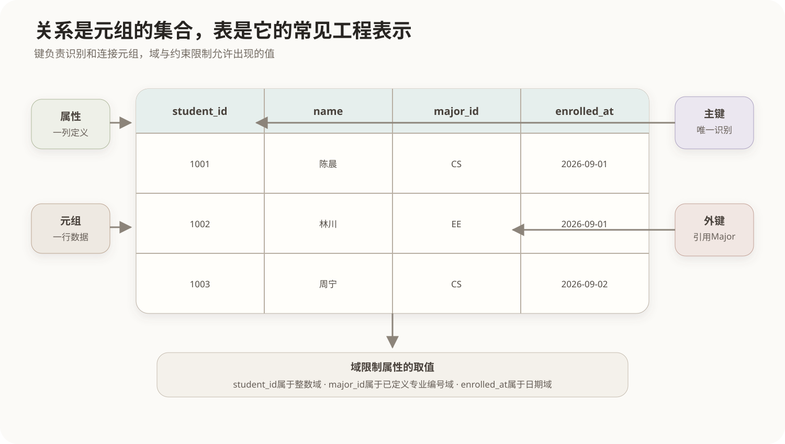

# 关系模型、键与完整性约束

## 1. 关系模型的基本结构

关系模型中的基本对象是**关系**。一个关系可以写成 `R(A1, A2, …, An)`：`R`是关系名，`A1…An`是属性。



| 关系模型术语 | 常见表格说法 | 含义 |
|---|---|---|
| 关系 | 表 | 同一结构的一组元组 |
| 元组 | 行、记录 | 一个对象或一次事实的数据 |
| 属性 | 列、字段 | 描述对象的一个方面 |
| 域 | 取值范围 | 属性允许采用的值的集合 |
| 关系模式 | 表结构 | 关系名、属性及约束的定义 |
| 关系实例 | 当前数据 | 某一时刻关系中的元组集合 |

关系在数学上是元组的集合，因此理论关系中元组无重复且没有固有顺序。SQL表允许在未声明键或未使用`DISTINCT`时出现重复行，查询结果也只有在`ORDER BY`后才保证特定顺序。这是关系模型理论与SQL工程实现之间的重要边界。

## 2. 关系操作为什么以关系为对象

选择、投影、连接等关系运算接收一个或多个关系，结果仍然是关系。这称为**闭包性**：

```text
关系 ──一元关系运算──> 关系
关系 × 关系 ──二元关系运算──> 关系
```

由于结果仍是关系，一次运算的结果可以继续作为下一次运算的输入。SQL子查询、视图和公用表表达式能够逐层组合，理论基础就在这里。

## 3. 超键、候选键和主键

设关系中的一组属性能够唯一标识每个元组：

- **超键**：能够唯一标识元组的任意属性组，可能包含多余属性；
- **候选键**：不含多余属性的最小超键；
- **主键**：从候选键中选定作为主要标识的一个；
- **备用键**：没有被选为主键的其他候选键；
- **组合键**：由两个或更多属性共同组成的候选键或主键；
- **外键**：本关系中的属性组，引用另一个关系的候选键，建立关系之间的联系。

例如学生关系：

```text
Student(student_id, id_card, name, major_id)
```

假设`student_id`和`id_card`都各自唯一，则二者都是候选键。选择`student_id`作为主键后，`id_card`成为备用键。`{student_id, name}`能唯一标识学生，但包含多余的`name`，所以是超键而不是候选键。

“最小”指属性集合不可再删，不是字符串最短、数值最小或占用空间最少。

## 4. 完整性约束

完整性约束用于阻止不符合数据规则的状态进入数据库。

### 4.1 实体完整性

主键必须唯一且不能为`NULL`，保证每个元组能够被确定地识别。

### 4.2 参照完整性

外键值必须满足以下两种情况之一：

1. 与被引用关系中的某个候选键值对应；
2. 在业务允许时取`NULL`，表示暂时没有对应对象。

删除或修改被引用记录时，可采用拒绝操作、级联、置空或设置默认值等策略。具体策略必须由业务语义决定。

### 4.3 用户定义完整性

由具体业务规定，例如成绩必须位于0至100、订单金额不能为负、结束时间不得早于开始时间。常通过数据类型、`NOT NULL`、`UNIQUE`、`CHECK`、触发器或应用规则实现。

```sql
CREATE TABLE enrollment (
    student_id BIGINT,
    course_id  BIGINT,
    score      DECIMAL(5,2) CHECK (score BETWEEN 0 AND 100),
    PRIMARY KEY (student_id, course_id),
    FOREIGN KEY (student_id) REFERENCES student(student_id),
    FOREIGN KEY (course_id)  REFERENCES course(course_id)
);
```

这里的组合主键同时防止同一学生和课程的组合被重复登记；两个外键维护参照完整性；`CHECK`维护成绩的业务取值范围。

## 5. NULL的含义

`NULL`表示未知、不适用或尚未提供，不等于0、空字符串或`false`。SQL使用三值逻辑：比较结果可能为真、假或未知。因此判断空值应使用`IS NULL`，不能使用`= NULL`。

主键不能为`NULL`；外键能否为`NULL`取决于该联系是否可选；普通属性是否允许`NULL`由数据语义和约束决定。

## 核心关系

```text
域限定属性取值
属性组成元组
元组构成关系
候选键唯一识别元组
外键连接不同关系
完整性约束限制数据库允许出现的状态
```

