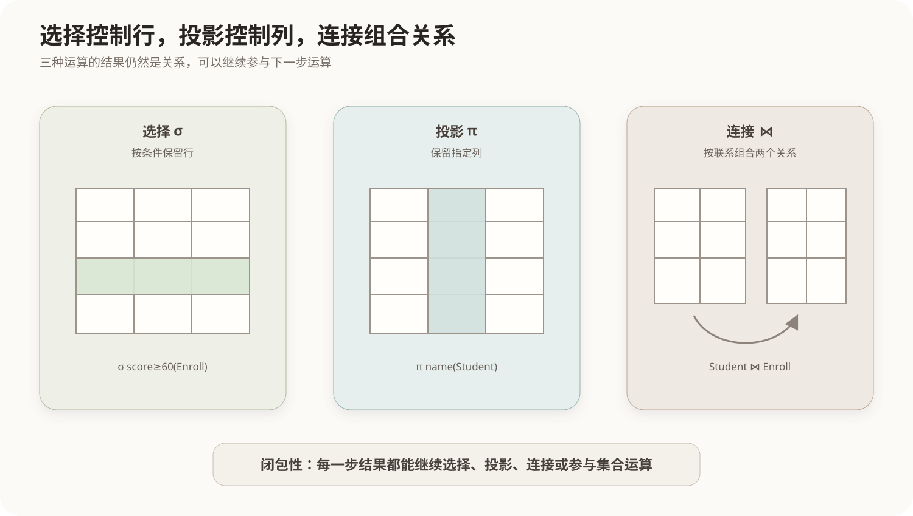

# 关系代数

## 1. 关系代数的定位

关系代数是一套以关系为输入、以关系为输出的过程化运算体系。它说明“通过哪些关系运算得到结果”，是SQL查询和查询优化的重要理论基础。

设有：

```text
Student(sid, name, major)
Course(cid, title)
Enroll(sid, cid, score)
```

## 2. 基本运算



### 2.1 选择

选择记作 `σ条件(R)`，从关系中保留满足条件的元组，相当于SQL的`WHERE`。

```text
σ major='计算机'(Student)
```

选择减少行，通常不改变属性集合。

### 2.2 投影

投影记作 `π属性列表(R)`，保留指定属性，相当于SQL的`SELECT`列清单。

```text
π name,major(Student)
```

投影减少列。经典关系代数的结果是集合，因此会消除重复元组；SQL默认保留重复，需要`SELECT DISTINCT`才具有相同效果。

### 2.3 并、差与交

`R ∪ S`、`R − S`和`R ∩ S`要求两个关系**并相容**：属性数量相同，对应属性的域兼容。

- 并：属于R或S的元组；
- 差：属于R但不属于S的元组；
- 交：同时属于R和S的元组。

交可以由差推导：`R ∩ S = R − (R − S)`。

### 2.4 笛卡尔积

`R × S`把R的每个元组与S的每个元组组合。若R有m行、S有n行，结果最多有`m × n`行。

笛卡尔积通常只是连接的中间基础。遗漏连接条件会产生大量无意义组合，是SQL查询的常见错误。

## 3. 连接运算

### 3.1 θ连接与等值连接

θ连接先做笛卡尔积，再按一般比较条件筛选。连接条件只使用等号时称为等值连接。

```text
Student ⋈ Student.sid=Enroll.sid Enroll
```

### 3.2 自然连接

自然连接自动按照同名属性相等进行连接，并去掉重复的同名连接列。它写法简洁，但如果出现业务含义不同的同名列，可能产生非预期连接，因此工程SQL通常明确写出`JOIN ... ON ...`。

### 3.3 外连接

内连接只保留匹配元组；左、右、全外连接还保留一侧或两侧未匹配元组，并用`NULL`补齐另一侧属性。

## 4. 除法运算

除法用于表达“满足全部条件”。如果`Take(sid, cid)`记录学生选修课程，`Required(cid)`记录全部必修课，那么：

```text
Take ÷ Required
```

得到选修了**所有**必修课的学生编号。关系除法所表达的语义通常包含“全部”“每一个”“所有”。

## 5. 重命名与组合

重命名运算 `ρ`用于修改关系名或属性名，尤其适合自连接。关系代数运算具有闭包性，因此可以嵌套组合：

```text
π name (Student ⋈ σ score≥60(Enroll))
```

先选出及格选课记录，再与学生连接，最后投影姓名。理解这种执行关系有助于读懂SQL，但DBMS不一定按照书写顺序逐步物化中间结果，优化器可以在保持语义不变的前提下改写执行计划。

## 6. 常见辨析

| 运算 | 主要改变 | SQL近似对应 |
|---|---|---|
| 选择 | 行 | `WHERE` |
| 投影 | 列 | `SELECT`列清单 |
| 连接 | 组合有关联的关系 | `JOIN ... ON` |
| 笛卡尔积 | 所有行组合 | `CROSS JOIN` |
| 并 | 合并两个并相容结果 | `UNION` |
| 差 | 排除另一结果中的元组 | `EXCEPT`或`MINUS` |
| 除 | 满足全部关联对象 | 常用双重`NOT EXISTS`表达 |

## 核心关系

```text
选择控制行，投影控制列，连接组合关系；
并、差、交要求并相容；
除法表达“对全部”；
所有运算结果仍是关系，因此可以继续组合。
```
