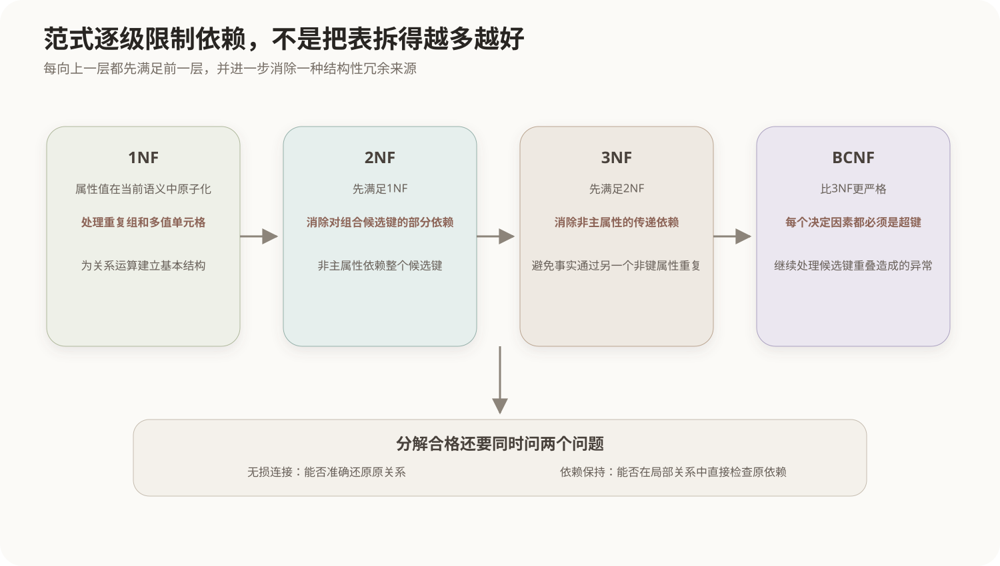

# 函数依赖与关系规范化

## 1. 规范化要解决的问题

如果把学生、专业和课程信息全部放进一张宽表，相同专业名称和课程信息会在多行重复。冗余本身会带来三类异常：

- **插入异常**：没有学生选课时无法单独登记新课程；
- **删除异常**：删除最后一条选课记录时意外丢失课程信息；
- **更新异常**：同一专业名称重复保存，多处修改不一致。

规范化依据属性之间的函数依赖分解关系，目标是减少冗余和异常，而不是机械地把表拆得越多越好。

## 2. 函数依赖

在关系模式R中，如果任意两个元组只要在属性集X上取值相同，就必然在属性集Y上取值相同，则称X函数决定Y，记作：

```text
X → Y
```

例如：

```text
student_id → student_name, major_id
major_id → major_name
(student_id, course_id) → score
```

函数依赖描述数据语义，不是从偶然出现的几行样本推断出来的统计相关性。

### 2.1 完全与部分函数依赖

如果`X → Y`，并且从X中删除任何属性后都不能决定Y，则Y完全函数依赖于X。若X的真子集已经能决定Y，则为部分函数依赖。

部分依赖只可能相对于组合决定因素出现。例如主键是`(student_id, course_id)`，而`student_name`只依赖`student_id`，就是对组合键的部分依赖。

### 2.2 传递函数依赖

如果`X → Y`、`Y → Z`，且Y不是候选键，通常称Z传递依赖于X。例如：

```text
student_id → major_id → major_name
```

## 3. 属性闭包与候选键

属性集X在函数依赖集F下能够推出的全部属性称为X的闭包，记作`X+`。计算方法是：

1. 初始令`X+ = X`；
2. 如果存在依赖`A → B`且A包含于当前闭包，就把B加入闭包；
3. 重复直到不能增加属性。

若`X+`包含关系模式的全部属性，则X是超键；如果X的任意真子集都不能决定全部属性，则X是候选键。

## 4. 范式的递进关系



### 4.1 第一范式 1NF

每个属性值在当前关系模型中应当是不可再分的原子值，不能在一个单元格内保存可重复的值组。原子性取决于应用语义，例如完整日期可以作为一个日期类型值，不必拆成年、月、日三列。

### 4.2 第二范式 2NF

在1NF基础上，每个非主属性都完全函数依赖于每个候选键，不存在对候选键真子集的部分依赖。

如果所有候选键都只有一个属性，关系天然不存在对组合键的部分依赖，因此满足2NF时主要继续检查3NF。

### 4.3 第三范式 3NF

在2NF基础上，非主属性不应传递依赖于候选键。更严格的定义是：对每个非平凡函数依赖`X → A`，X是超键，或者A是主属性。

### 4.4 BCNF

对每个非平凡函数依赖`X → Y`，X都必须是超键。BCNF比3NF更严格，消除某些由候选键相互重叠造成的异常。

```text
BCNF ⊂ 3NF ⊂ 2NF ⊂ 1NF
```

满足更高范式一定满足较低范式，反向不成立。

### 4.5 4NF与5NF

4NF主要处理非平凡多值依赖，5NF主要处理连接依赖。它们属于进一步规范化内容，软考基础题通常以识别概念为主，不必把所有表都追求到最高范式。

## 5. 分解的两个质量要求

### 5.1 无损连接

分解后的关系通过自然连接能够还原原关系，不产生错误的额外元组，也不丢失原有元组。无损连接保证分解没有改变信息含义。

### 5.2 保持函数依赖

原函数依赖能够只通过检查各个分解后的关系得到保证，而不必把它们重新连接。保持依赖有利于直接用局部约束维护数据。

理想分解同时无损连接并保持依赖；在某些高范式分解中二者不能兼得，需要根据一致性风险、查询成本和约束实现难度权衡。

## 6. 一个完整分解

原关系：

```text
Enrollment(student_id, student_name, major_id, major_name,
           course_id, course_name, score)
```

候选键为`(student_id, course_id)`，存在部分依赖和传递依赖。可以分解为：

```text
Student(student_id, student_name, major_id)
Major(major_id, major_name)
Course(course_id, course_name)
Enrollment(student_id, course_id, score)
```

学生、专业、课程和选课事实分别保存，减少重复并让每种事实由自己的键决定。

## 核心关系

```text
函数依赖 → 判断候选键与冗余来源
部分依赖 → 2NF处理
传递依赖 → 3NF处理
决定因素不是超键 → BCNF继续处理
正确分解还要检查无损连接与依赖保持
```

