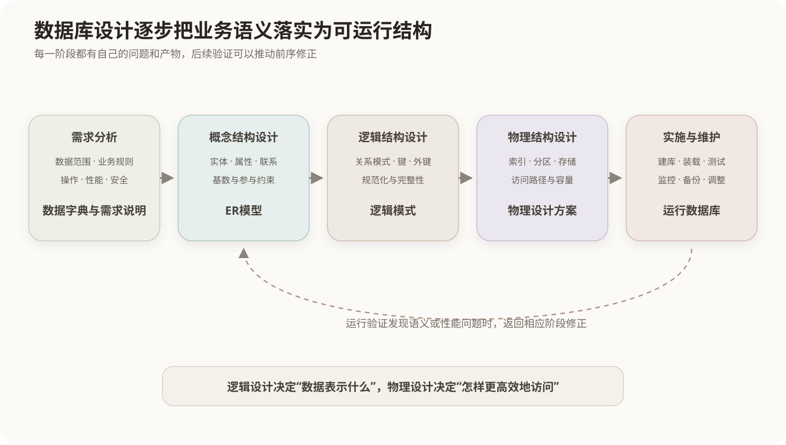

# 数据库设计过程

## 1. 从业务事实到物理结构

数据库设计不是直接从页面字段开始建表，而是逐步把业务语义转换为可实现、可约束和可维护的数据结构。



| 阶段 | 主要工作 | 主要产物 |
|---|---|---|
| 需求分析 | 明确数据范围、业务规则、操作和性能要求 | 数据字典、数据流和需求说明 |
| 概念结构设计 | 抽取实体、属性和联系 | ER模型 |
| 逻辑结构设计 | 转换为关系模式，确定键并规范化 | 关系模式与完整性约束 |
| 物理结构设计 | 选择索引、分区、存储和访问路径 | 物理设计方案 |
| 实施与运行维护 | 建库、装载、测试、监控和调整 | 可运行数据库及维护策略 |

设计过程允许根据验证结果反复修正，并不是只向前执行一次。

## 2. ER模型

ER模型用**实体、属性和联系**描述业务数据：

- 实体：可区分的业务对象，例如学生、课程；
- 属性：描述实体的特征，例如学生姓名；
- 联系：实体之间的关联，例如学生选修课程。

联系的基数包括一对一、一对多和多对多。还要区分联系是否必须参与，例如订单必须属于一个用户，而用户可以暂时没有订单。

弱实体不能仅凭自身属性唯一标识，需要依赖所有者实体的键和自己的部分键。

## 3. ER模型向关系模式转换

### 3.1 实体

通常一个实体型转换为一个关系，实体标识符转换为主键，简单属性转换为列。

### 3.2 一对多联系

把“一”端的主键作为外键放入“多”端关系。例如一个专业有多个学生，`major_id`放入`Student`。

### 3.3 一对一联系

可以把任意一端主键作为另一端外键，通常选择参与完全、访问更频繁或更适合合并的一侧，并用唯一约束维持一对一。

### 3.4 多对多联系

建立独立联系关系，把两端主键组合为主键或候选键，并保存联系自身属性。例如：

```text
Enrollment(student_id, course_id, score)
```

### 3.5 多值属性和复合属性

复合属性通常拆为组成部分；多值属性通常建立独立关系，不能把多个值简单拼接在一个字段中替代正常结构。

## 4. 逻辑设计的检查

- 候选键能否稳定唯一标识元组；
- 外键是否准确表达联系；
- 可空性与默认值是否符合业务语义；
- 函数依赖是否造成插入、删除和更新异常；
- 分解是否无损并尽量保持依赖；
- 约束应由数据库、应用还是二者共同维护。

## 5. 物理设计不是修改业务语义

索引、分区、聚簇、压缩和物化视图属于物理设计或性能设计。它们可以改变访问成本，但不应改变逻辑查询结果。

反规范化会有意识地引入冗余以减少连接或预先计算结果。它应建立在性能证据和明确同步机制之上，不能代替正常的逻辑设计。

## 核心关系

```text
需求说明业务规则
ER模型组织业务概念
关系模式落实结构、键和约束
规范化控制冗余和异常
物理设计提高访问效率
运行监控为后续调整提供证据
```

