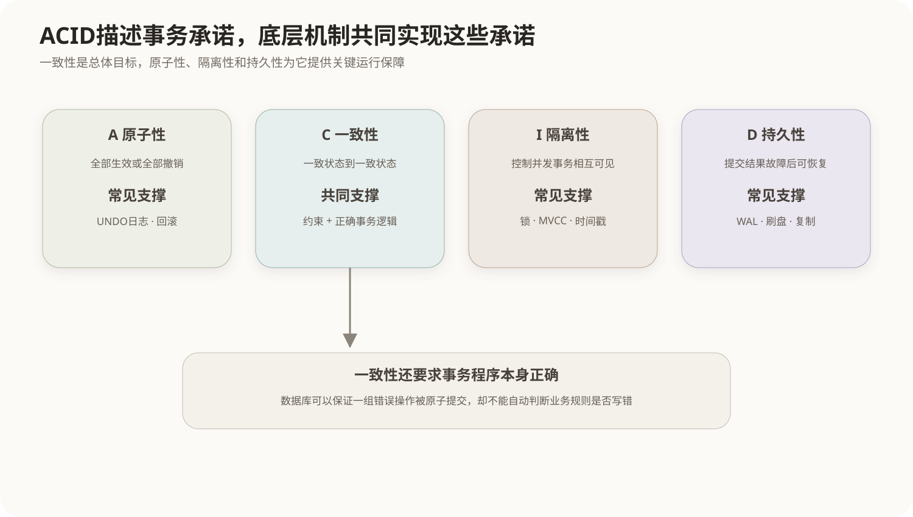
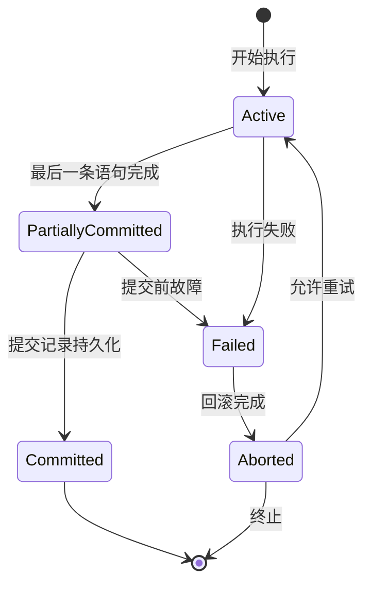

# 事务与ACID

## 1. 事务的定义

事务是数据库中作为一个逻辑工作单元执行的一组操作。事务边界由`BEGIN`、`COMMIT`和`ROLLBACK`等机制控制。

```sql
BEGIN;
UPDATE inventory SET quantity = quantity - 1 WHERE product_id = 10;
INSERT INTO shipment(order_id, product_id) VALUES (1001, 10);
COMMIT;
```

这里两条语句共同表达“占用库存并建立发货记录”。只完成其中一条会形成业务不一致，因此需要由一个事务约束。

## 2. ACID四项性质



### 2.1 原子性 Atomicity

事务中的操作要么全部生效，要么全部不生效。发生错误时，DBMS利用撤销信息回滚已执行但未提交的修改。

原子性不是说一条SQL在CPU上不可分割，而是说事务对数据库状态的影响不能只保留一部分。

### 2.2 一致性 Consistency

事务把数据库从一个满足规则的一致状态带到另一个一致状态。规则包括主键、外键、检查约束以及由业务逻辑维护的不变量。

一致性是事务执行的总体目标，既依赖数据库机制，也依赖事务程序本身正确。错误的业务代码即使原子提交，也可能产生业务上错误的数据。

### 2.3 隔离性 Isolation

并发事务的中间状态不应以不受控制的方式相互干扰。理想效果接近事务串行执行，但实际系统常通过隔离级别在正确性和并发性能之间权衡。

### 2.4 持久性 Durability

事务一旦成功提交，即使随后发生进程或系统故障，其结果也应能够恢复。日志、稳定存储、检查点和复制等机制共同提供持久性保障。

## 3. 事务状态



“最后一条语句已经执行”不等于事务已经提交；只有提交成功后，事务才进入已提交状态。

## 4. COMMIT、ROLLBACK与保存点

- `COMMIT`确认事务修改；
- `ROLLBACK`撤销当前事务尚未提交的修改；
- `SAVEPOINT`建立事务内部回退位置；
- 回滚到保存点通常不会结束整个事务。

不同DBMS对DDL是否隐式提交、自动提交默认值和保存点行为存在差异，工程使用时必须依据具体产品。

## 5. ACID不是四个独立按钮

数据库通过多个机制共同实现ACID：

- 日志和回滚支持原子性；
- 约束与正确事务逻辑维护一致性；
- 锁、时间戳和MVCC支持隔离性；
- 预写日志、刷盘、检查点和复制支持持久性。

这些机制会相互影响。例如更强隔离可能降低并发度，延迟刷盘可能提高吞吐量但必须仍满足所承诺的持久性语义。

## 核心关系

```text
原子性：失败时不留下半个事务
一致性：事务前后都满足数据规则
隔离性：控制并发事务相互可见的程度
持久性：提交结果在故障后仍可恢复
```

