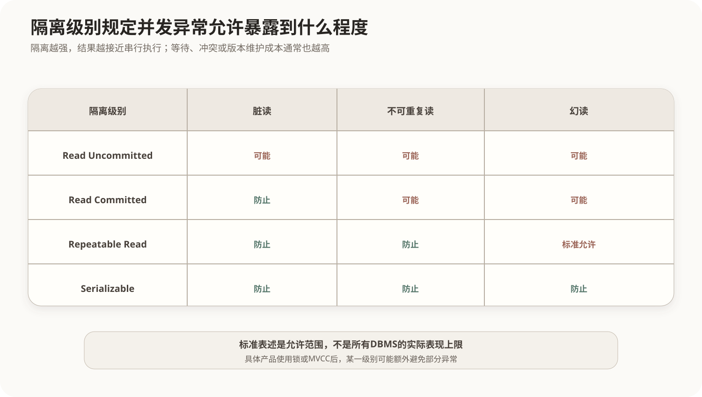

# 并发控制与隔离级别

## 1. 为什么允许事务并发

串行执行事务最容易理解，但会浪费CPU、磁盘和网络等待时间。并发执行可以提高吞吐量和资源利用率，代价是必须控制事务交叉执行造成的数据异常。

调度是多个事务操作的实际排列。若某个并发调度与某种串行执行顺序产生相同结果，则称其具有可串行化意义。**冲突可串行化**是常用判定方式：对同一数据项，至少一个为写操作的读写、写读和写写操作构成冲突。

## 2. 常见并发异常



### 2.1 丢失更新

两个事务读取同一旧值并分别写回，后写入者覆盖前写入者的结果。它通常需要写锁、原子更新、版本号或可串行化控制解决。

### 2.2 脏读

一个事务读取了另一个尚未提交事务的修改；后者若回滚，前者使用了从未真正成立的数据。

### 2.3 不可重复读

同一事务两次读取同一行，期间另一事务提交了修改或删除，导致两次结果不同。

### 2.4 幻读

同一事务两次执行相同范围条件查询，期间另一事务插入或删除满足条件的行，导致结果集合行数变化。

不可重复读主要关注已有行的值变化，幻读主要关注满足谓词的行集合变化。

## 3. SQL标准隔离级别

| 隔离级别 | 脏读 | 不可重复读 | 幻读 | 并发能力 |
|---|---|---|---|---|
| Read Uncommitted | 可能 | 可能 | 可能 | 高 |
| Read Committed | 防止 | 可能 | 可能 | 较高 |
| Repeatable Read | 防止 | 防止 | 标准语义下仍可能 | 中等 |
| Serializable | 防止 | 防止 | 防止 | 较低 |

表格表达的是标准允许范围。具体DBMS采用锁或MVCC后，实际表现可能强于标准下限。例如某些产品的可重复读还能避免一部分幻读，但不能据此改写标准考点。

## 4. 锁与两阶段锁协议

- **共享锁S**：用于读取，同一数据项可以存在多个共享锁；
- **排他锁X**：用于写入，与其他共享锁和排他锁冲突；
- **意向锁**：在表等较高层级声明事务准备在较低层级加锁，帮助多粒度锁快速判断冲突。

两阶段锁协议（2PL）要求事务分为：

1. 增长阶段：可以获得锁，不能释放锁；
2. 收缩阶段：可以释放锁，不能再获得锁。

基本2PL保证冲突可串行化，但仍可能死锁。严格2PL把排他锁保持到提交或回滚，有利于避免级联回滚并简化恢复。

## 5. 死锁

事务T1持有A等待B，T2持有B等待A时形成循环等待。数据库可采用：

- 统一加锁顺序或超时减少死锁；
- 等待图检测环路；
- 发现死锁后选择一个事务作为牺牲者回滚；
- 基于时间戳的等待策略预防死锁。

死锁是并发控制可能产生的运行状况，不等于数据库损坏。

## 6. MVCC

多版本并发控制为数据保留多个可见版本，读操作根据事务快照选择版本，从而减少读写互相阻塞。

MVCC不是“不加任何锁”，也不自动等于可串行化。写写冲突、唯一性检查和不同隔离级别仍需要相应控制；旧版本还需要回收。

## 核心关系

```text
并发提高吞吐量
→ 可能产生丢失更新、脏读、不可重复读和幻读
→ 隔离级别规定允许暴露到什么程度
→ 锁、2PL、时间戳和MVCC负责实现
```

