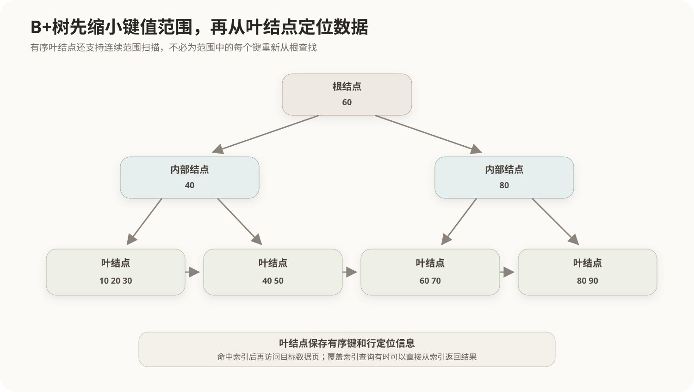

# 索引与查询优化

## 1. 索引的本质

索引是根据一个或多个搜索键组织的辅助访问结构，用额外空间和维护成本换取更低的查询代价。索引通常保存键值以及定位数据行的指针或主键，不等于把整张表重新复制一份。



没有合适索引时，DBMS可能扫描大量数据页；使用索引时，可以先在较小的索引结构中定位候选行，再访问数据页。

## 2. B+树索引

B+树是关系数据库常见的有序索引结构：

- 内部结点保存搜索键和子结点指针；
- 记录定位信息集中在叶结点；
- 叶结点按键值有序并通常形成链表；
- 树高较低，点查询、范围查询和有序遍历都较高效。

B+树适合`=`、范围条件、前缀匹配和排序。索引列上进行无法利用索引顺序的函数计算，可能降低可用性。

## 3. 哈希索引

哈希索引根据哈希值定位桶，适合等值查找；由于键值没有全局顺序，通常不适合范围查询和按键排序。

```text
B+树：等值 + 范围 + 排序
哈希：主要面向等值
```

## 4. 聚簇与非聚簇

- 聚簇索引或聚簇组织使数据行的物理组织与某个索引顺序密切相关；
- 非聚簇索引独立保存键值与行定位信息。

一张表只能有一种主要物理排列方式，但可以建立多个辅助索引。不同数据库产品对“聚簇索引”“索引组织表”等术语和实现不同。

## 5. 组合索引

组合索引`(a, b, c)`首先按a排序，再在相同a内按b排序，最后按c排序。因此通常可以有效支持从最左列开始的条件组合。

```text
(a)             通常可利用
(a, b)          通常可利用
(a, b, c)       通常可利用
(b)             通常不能完整利用该索引的有序入口
```

这不是说任何缺少最左列的查询都绝对无法使用索引，优化器可能采用跳跃扫描等产品特性；但“最左前缀”仍是理解组合索引的基本规则。

## 6. 索引的代价

- 占用存储空间；
- 插入、删除和更新索引列时必须同步维护；
- 低选择性条件可能返回大量行，使用索引反而比顺序扫描成本高；
- 过多索引增加优化选择和维护成本。

因此“经常查询的列都建索引”不是完整原则。应结合选择性、查询频率、排序和连接方式、写入成本以及实际执行计划判断。

## 7. 查询优化

DBMS通常把SQL解析为逻辑表达式，再选择物理执行计划。主要优化包括：

- 尽早执行选择和投影，减少中间数据；
- 调整连接顺序；
- 选择嵌套循环、哈希连接或排序合并连接；
- 在索引扫描和全表扫描之间选择；
- 利用统计信息估计行数和成本。

SQL是声明式语言，同一查询可以有多种等价执行方案。优化器选择的是预计成本较低的方案，不保证每次都得到理论最优方案；过期统计信息和参数分布差异可能导致估计错误。

## 核心关系

```text
索引减少定位数据的搜索范围
→ 读取可能更快
→ 但占用空间并增加写入维护

逻辑查询保持不变
→ 优化器选择连接顺序、访问路径和物理算法
```

