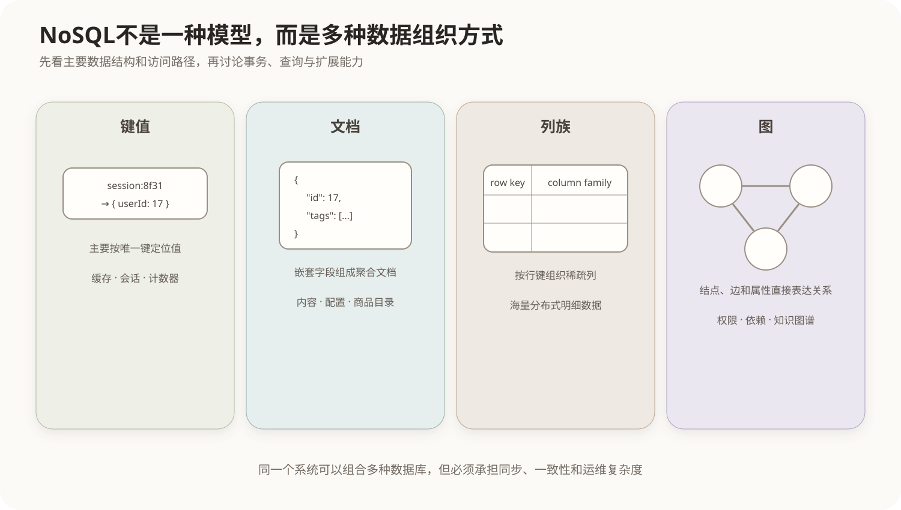

# 非关系型数据库

## 1. NoSQL的定位

NoSQL通常解释为“Not Only SQL”。它不是一种单一数据模型，而是一组不以传统关系表作为唯一核心抽象的数据库系统。

关系数据库与非关系数据库不是新旧替代关系。选择依据是数据形态、访问方式、事务边界、扩展规模和运维条件，而不是单纯比较谁“更先进”。



## 2. 键值数据库

以唯一键定位值：

```text
session:8f31 → {userId: 17, expireAt: ...}
```

优点是按键访问简单且通常延迟低；缺点是数据库通常不了解值内部的复杂关系，按非键属性查询能力有限。常用于缓存、会话、计数器和临时状态。

## 3. 文档数据库

以JSON或类似结构的文档为基本单元，文档可包含嵌套字段和数组。适合字段结构随对象类型变化、读取时常需要取得整个聚合的数据。

文档模型具有结构灵活性，但不等于没有模式。字段含义、类型、版本兼容和校验仍需由数据库或应用明确管理。

## 4. 列族数据库

按行键组织数据，把相关列划入列族，适合大规模、稀疏和分布式数据。不同记录可以拥有不同列，读取通常围绕行键和预先规划的访问路径进行。

列族数据库不要与分析系统中的列式存储混为一谈：前者是一类逻辑数据模型和分布式数据库体系，后者主要描述数据在存储层按列排列以利于扫描和压缩。

## 5. 图数据库

用结点、边和属性直接表达对象及关系，适合需要多跳遍历的关系网络，例如权限关系、依赖图、知识图谱和风险传播。

关系数据库也能保存图结构，但多层自连接可能复杂；图数据库把关系作为一等对象，并针对遍历进行优化。

## 6. 与关系数据库的比较

| 维度 | 关系数据库 | 非关系数据库 |
|---|---|---|
| 主要结构 | 关系、表、行、列 | 键值、文档、列族或图 |
| 模式 | 通常预先定义且约束明确 | 常更灵活，但仍需要模式治理 |
| 联系 | 主外键和连接 | 嵌套、引用、边或应用组合 |
| 查询 | SQL及关系运算体系 | 随模型和产品变化 |
| 事务 | 通常提供成熟的多行事务 | 支持范围依产品与数据模型而异 |
| 扩展 | 既可纵向也可分布式扩展 | 许多产品从设计上强调水平分布 |

不能把差异绝对化：现代关系数据库可以分片和保存JSON，许多非关系数据库也支持事务、索引和查询语言。

## 7. CAP与BASE

CAP讨论网络分区发生时，分布式系统无法同时保证所有节点上的强一致访问和持续可用响应：

- C：一致性，每次读取看到最新写入或错误；
- A：可用性，每个请求都获得非错误响应，但不保证是最新数据；
- P：分区容错，节点间网络丢失或延迟时系统仍按既定策略工作。

真实分布式系统必须面对分区，因此设计重点是在分区期间选择怎样的一致性和可用性语义，而不是平时静态地“任选两个字母”。

BASE强调基本可用、软状态和最终一致，是部分分布式系统采用的工程取舍，不表示所有NoSQL都只能最终一致，也不表示关系数据库只能采用强一致。

## 8. 选型原则

- 复杂事务、稳定结构和灵活关联查询：优先考虑关系数据库；
- 简单按键访问和高吞吐临时状态：考虑键值数据库；
- 聚合文档和灵活字段：考虑文档数据库；
- 海量稀疏、按行键访问的分布式数据：考虑列族数据库；
- 多跳关系遍历：考虑图数据库。

一个系统可以采用多种数据库分别服务不同数据模型，这称为多模型或多语言持久化，但会增加数据同步、一致性和运维成本。

## 核心关系

```text
数据形态 + 主要访问路径 + 事务边界 + 扩展要求
                         ↓
       关系 / 键值 / 文档 / 列族 / 图模型
                         ↓
              决定查询、约束和运维方式
```

