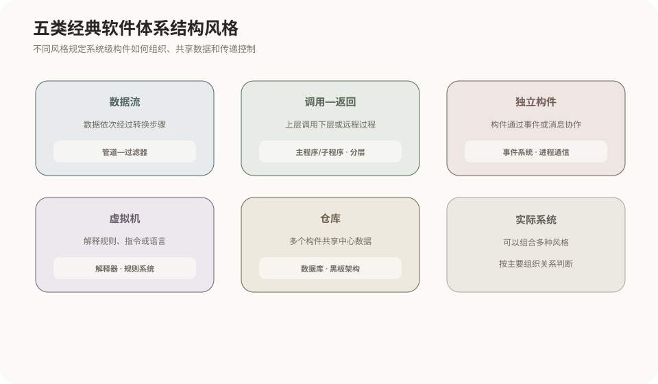
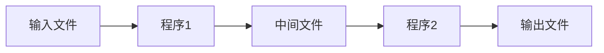
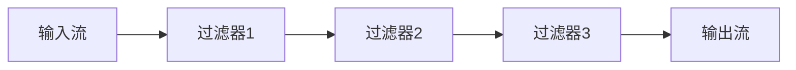
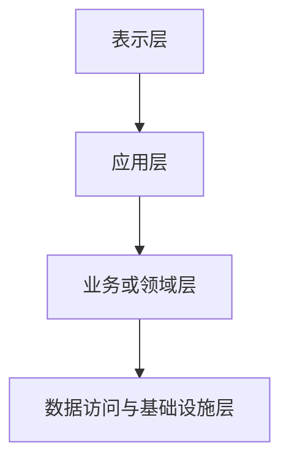
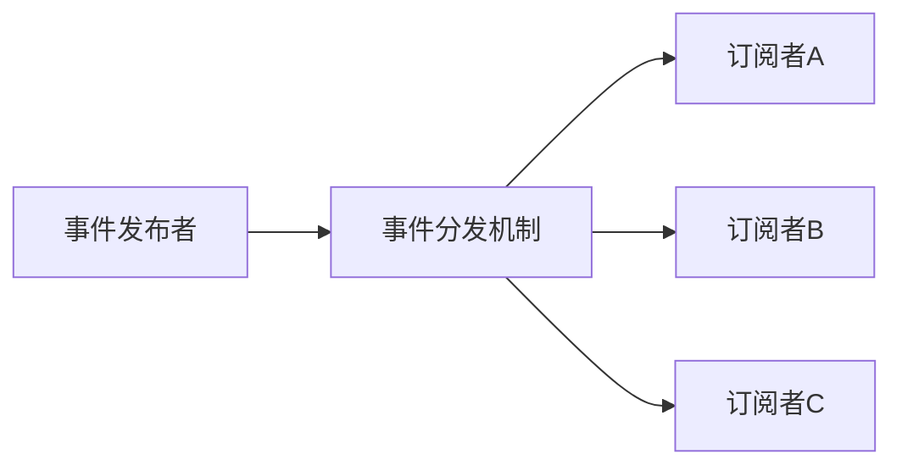
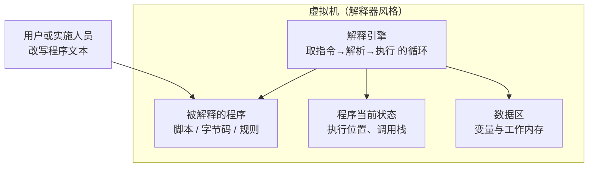
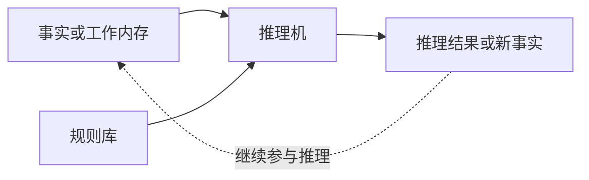
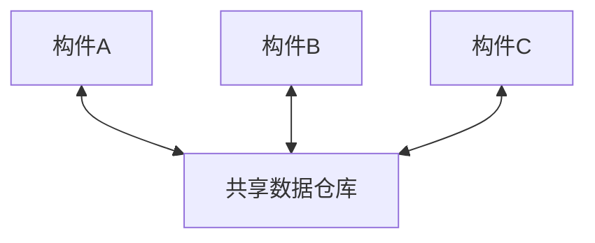
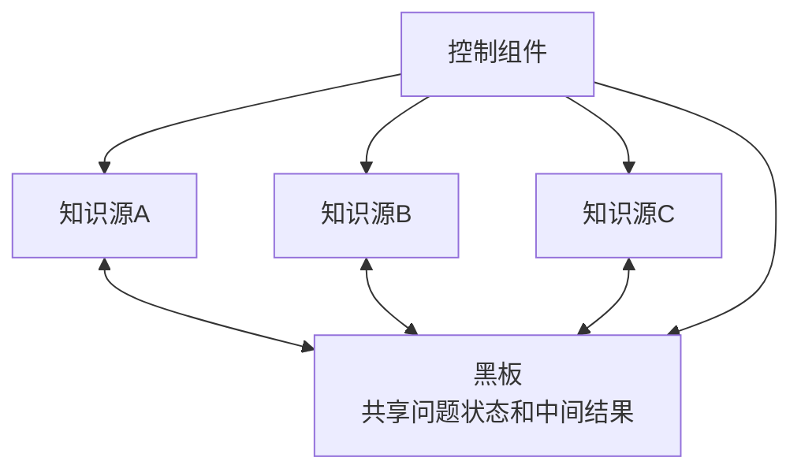
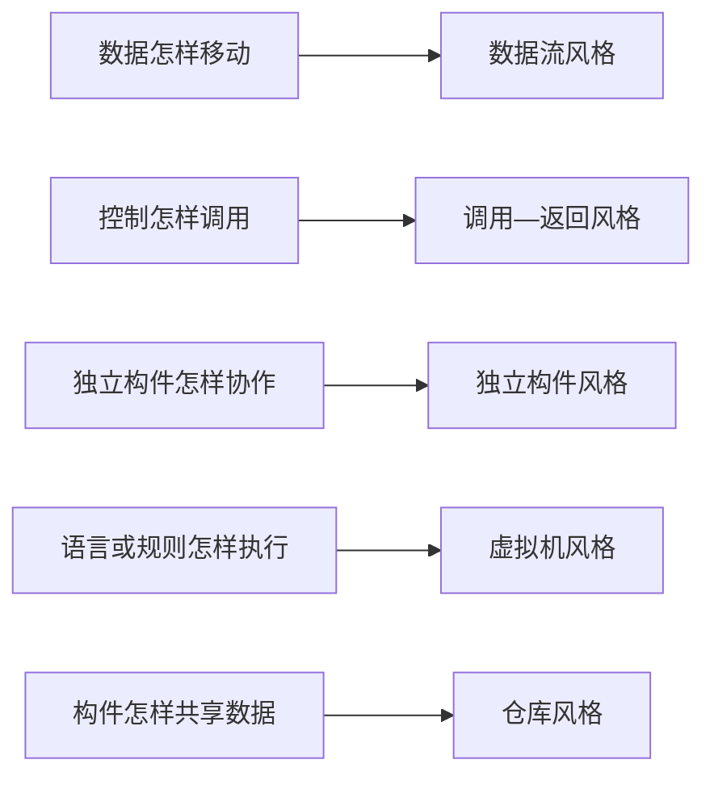

# 软件体系结构风格

## 1. 体系结构风格是什么

软件体系结构风格描述系统整体采用什么组织方式，以及构件之间怎样交互。它关注系统级结构，不是某个方法内部的具体算法。

| 层次 | 主要解决的问题 | 示例 |
|---|---|---|
| 体系结构风格 | 整个系统如何组织和通信 | 分层、管道—过滤器、仓库 |
| 架构模式 | 一类系统问题的可复用架构方案 | MVC、黑板、微内核 |
| 设计模式 | 类和对象怎样解决局部设计问题 | 工厂、观察者、适配器 |

教材有时会混用“体系结构风格”和“架构模式”，判断时以所描述的系统组织关系为准。

## 2. 五类经典体系结构风格



| 大类 | 核心组织方式 |
|---|---|
| 数据流 | 数据依次经过若干处理构件 |
| 调用—返回 | 构件通过调用关系组织控制 |
| 独立构件 | 构件独立运行，通过消息或事件协作 |
| 虚拟机 | 由解释机制执行中间表示或规则 |
| 仓库 | 多个构件围绕共享数据区协作 |

## 3. 数据流风格

### 批处理序列

批处理序列把任务拆成顺序执行的独立程序。前一程序处理完一批数据并写出完整结果，后一程序再读取处理。



它适合定期报表和离线数据转换，实时性与交互性较弱。

### 管道—过滤器

过滤器负责数据转换，管道负责把一个过滤器的输出传给下一个过滤器。



它可以边产生边传递数据，不必等待整个数据集处理完成。优点是构件容易替换、复用和组合；局限是需要统一数据格式，不适合大量共享状态和复杂交互控制。

## 4. 调用—返回风格

### 主程序—子程序

主程序控制整体流程，通过过程或函数调用子程序。控制关系清楚，但上层模块通常掌握较多流程细节。

### 面向对象

系统由封装状态和行为的对象组成，对象通过方法调用协作，重点是对象身份、职责、封装和关系。

### 层次结构

系统按层组织，每层主要使用下层服务并向上层提供服务：



优点是职责清楚、便于替换和维护；局限是跨层调用可能增加开销，强制分层也可能产生不自然的职责划分。

## 5. 独立构件风格

独立构件能够相对独立地运行，不以直接函数调用作为唯一协作方式。

- **进程通信**：不同进程通过消息、远程调用或通信协议显式交换数据。
- **事件系统**：构件发布事件，其他构件根据兴趣订阅并响应。



事件发布者通常不需要知道具体订阅者，有利于降低直接依赖；但事件顺序、失败处理、调试和最终一致性会更加复杂。

## 6. 虚拟机风格

虚拟机风格要解决的问题是：**系统的行为需要频繁改变，但系统本体不能跟着改**。例如一个工业控制软件交付给几十家工厂，每家产线流程不同且经常调整。如果把流程硬编码进程序，每次调整都要改代码、重新编译部署，维护成本不可接受。合理的思路逐层推进：先把流程从代码中抽成可配置数据；但纯数据表达不了条件和循环，于是为它设计一门"小语言"；硬件 CPU 不认识这门小语言，于是**用软件造一台认识这门语言的"机器"**——这就是虚拟机。

因此，虚拟机风格的核心定义是：系统内建一个软件模拟的执行引擎，解释执行某种非机器码的表示（自定义语言、字节码、规则），使系统行为可以通过改写这种表示来改变，而不必修改系统本身。

### 解释器

解释器是虚拟机风格的基本形态，由四部分组成：



- **被解释的程序**：用小语言书写的行为描述。它对 CPU 是数据、对虚拟机是指令，这个双重身份是整个风格的关键；
- **解释引擎**：虚拟机的 CPU，用软件实现取指令、译码、执行的循环；
- **程序当前状态**：相当于硬件中的程序计数器，记录执行位置；
- **数据区**：被解释程序操作的变量与内存。

以 JVM 对照，四者分别对应 `.class` 字节码、JVM 解释器与 JIT、线程的 PC 寄存器与栈帧、堆与方法区。Java"一次编写到处运行"正来自这层结构：硬件千差万别，但只要每个平台都实现同一台虚拟机，字节码就能原样执行。

解释执行用性能换来三样东西：

1. **灵活性**：改行为等于改脚本或规则文本，不必重新编译部署系统本体（游戏引擎用 Lua 写逻辑即为此）；
2. **可移植性**：行为描述与硬件解耦，跨平台只需移植虚拟机；
3. **隔离与安全**：脚本运行在软件模拟的机器中，够不着真实硬件，天然形成沙盒（浏览器中的 JavaScript 引擎）。

代价是解释执行慢于原生代码，且出错时调用栈横跨脚本层、虚拟机层和原生层，调试更困难。

### 基于规则的系统

基于规则的系统是虚拟机风格在"规则频繁变化"场景下的特化。它的"小语言"不是顺序指令，而是一条条"条件 → 动作"规则，通常包含规则库、事实或工作内存以及推理机：



推理机按**匹配—执行循环**工作：

```text
① 匹配：找出所有条件被当前事实满足的规则
② 冲突消解：多条规则同时满足时，按优先级等策略选一条
③ 执行：执行选中规则的动作，通常产生或修改事实
④ 回到 ①，直到没有规则可匹配或达到目标
```

以信用卡风控为例：规则一为"单笔金额超过五万则标记大额"，规则二为"大额且商户在海外则拒绝并告警"。当事实为"金额八万、海外商户"时，第一轮规则一触发并写入"大额"，第二轮这个新事实激活规则二完成拦截。业务人员只增减规则，执行顺序完全由事实驱动——这正是它与解释器的差别：解释器执行的程序有明确指令顺序，而规则之间**没有预定顺序**，哪条执行由当前事实决定。难点是规则冲突、执行顺序和推理性能。

### 与相邻风格的区分

- **与调用—返回**：普通程序的代码直接运行在 CPU 上；虚拟机风格在代码与 CPU 之间多了一层**软件实现的间接层**。这层间接既是全部意义（灵活、可移植、隔离），也是全部代价（性能与调试成本）。
- **与仓库风格（规则系统 vs 黑板）**：两者都有共享工作区和多个处理单元，但规则由**事实激活**，知识源由**控制组件挑选**；规则系统面向大量明确的条件—动作规则的批量执行，黑板面向没有固定算法的渐进式问题求解。看到"规则库＋推理机"归虚拟机，看到"知识源＋机会式求解"归仓库。

## 7. 仓库风格

仓库风格以共享数据区为中心，多个相对独立的构件读取或修改共同数据。



优点是数据集中，构件不必两两建立通信接口；局限是所有构件共同依赖数据模型，容易形成公共数据耦合，仓库也可能成为瓶颈或单点故障。

数据库系统和超文本系统强调共享数据的保存与访问，不一定具有动态选择求解步骤的机制。

### 黑板架构

黑板架构（Blackboard Architecture）是面向复杂问题求解的仓库风格。

| 组成 | 职责 |
|---|---|
| 黑板（Blackboard） | 保存问题、事实、假设、中间结果和最终解 |
| 知识源（Knowledge Source） | 封装不同领域知识和局部求解能力 |
| 控制组件 | 监视黑板状态并选择下一步执行的知识源 |



典型过程：

```text
写入初始问题
→ 检查黑板状态
→ 找出当前可用的知识源
→ 控制组件选择一个知识源
→ 知识源写回局部结果
→ 重复，直到形成可接受的最终解
```

关键特征：

- 最终解由多个局部结果逐步形成；
- 下一步由当前状态决定，具有机会式求解特点；
- 知识和求解职责分散在多个知识源中；
- 共享数据通常集中在黑板中，控制也可能集中。

因此，`decentralized framework`主要表示求解知识不集中于单一模块，并不表示系统完全不存在中央结构。

黑板架构适合没有固定完整算法、需要多种专门知识共同求解的问题，早期代表是Hearsay-II语音理解系统。

主要局限是黑板和控制策略设计困难、存在公共数据耦合、并发访问需要同步、执行过程和终止条件难以预测，以及黑板可能成为瓶颈或单点故障。

普通仓库主要负责共享数据；黑板架构还具有独立知识源、触发条件、控制策略和渐进求解过程。

## 8. 其他常见架构名称

| 名称 | 核心结构 |
|---|---|
| 客户端—服务器 | 客户端请求，服务器提供集中服务 |
| MVC | 模型、视图、控制器分离 |
| C2 | 构件通过连接件进行异步消息通信 |
| SOA | 通过明确服务合同组织业务能力 |
| 微服务 | 把系统拆成可独立部署的小型服务 |

这些名称与经典五类风格并非总能机械地一一对应。一个实际系统可以同时具有分层、客户端—服务器、事件驱动和仓库等多个特征。

## 9. 高频辨析

| 题干特征 | 对应风格 |
|---|---|
| 数据依次经过多个独立转换步骤 | 管道—过滤器 |
| 每一步处理完整批次并生成中间文件 | 批处理序列 |
| 上层调用下层服务 | 层次结构 |
| 发布者不知道具体接收者 | 事件系统 |
| 规则库与推理机 | 基于规则的系统 |
| 自定义脚本或字节码由内置引擎解释执行 | 解释器（虚拟机风格） |
| 多个构件围绕共享数据区工作 | 仓库风格 |
| 多个知识源向共享空间贡献局部解 | 黑板架构 |

```text
管道—过滤器：数据流经处理步骤
仓库：构件共同访问共享数据
事件系统：构件通过事件通知协作
黑板：多个知识源围绕共享问题状态渐进求解
虚拟机：软件模拟的执行引擎解释执行非机器码表示
```

## 10. 核心关系



## 相关章节

- [软件体系结构演化](../12-软件架构的演化与维护/01-软件体系结构演化.md)：风格描述架构交付时的组织形态（空间维度），演化描述架构交付后如何随需求变化而调整（时间维度）；本篇选定结构，演化篇讲如何改变结构
- [设计模式总览](../07-设计模式/01-设计模式总览.md)

- [模块内聚与耦合](../05-软件工程基础/05-模块内聚与耦合.md)
- [结构化分析与结构化设计](../05-软件工程基础/03-结构化分析与结构化设计.md)
- [Web Service与SOA](../17-面向服务架构SOA/03-Web Service与SOA.md)
- [英文阅读与完形填空](../82-专业英语/01-英文阅读与完形填空.md)

## 参考资料

- [MIT OpenCourseWare：An Introduction to Software Architecture](https://ocw.mit.edu/courses/16-355j-software-engineering-concepts-fall-2005/4b3577da7baf3801621e092a5fa32b92_intro_softarch.pdf)
- [Carnegie Mellon University：Organization of the Hearsay-II Speech Understanding System](https://iiif.library.cmu.edu/file/Newell_box00034_fld02331_doc0001/Newell_box00034_fld02331_doc0001.pdf)
- [Software Engineering Institute：AI and Ada](https://insights.sei.cmu.edu/documents/1108/1994_005_001_16298.pdf)


