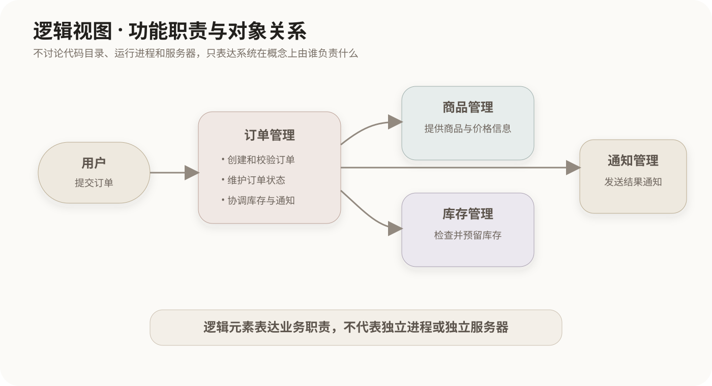
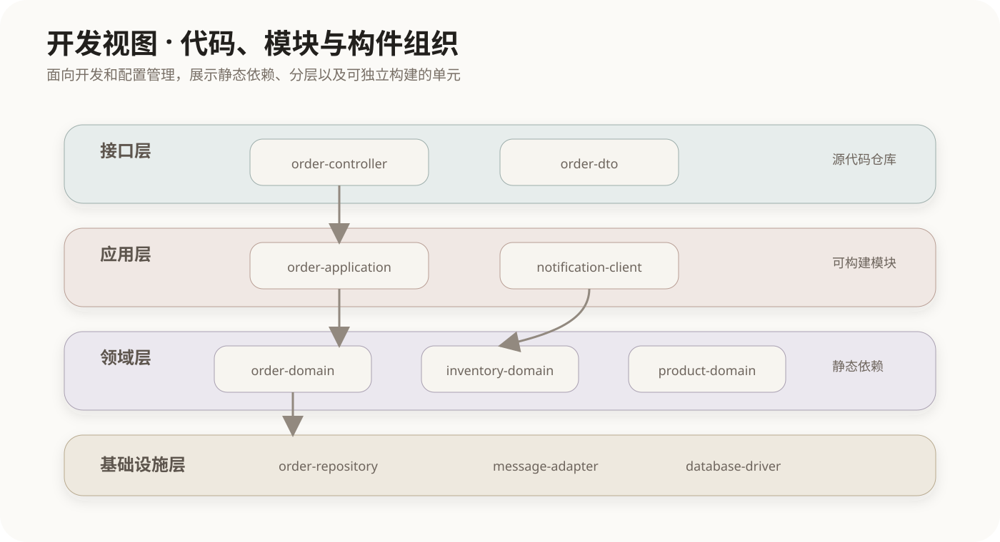
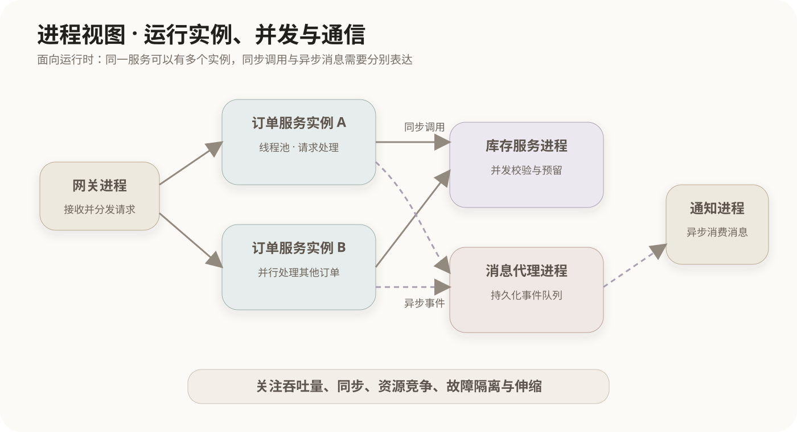
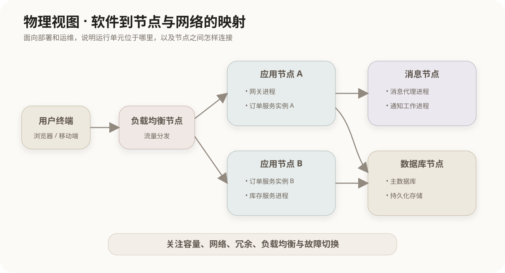
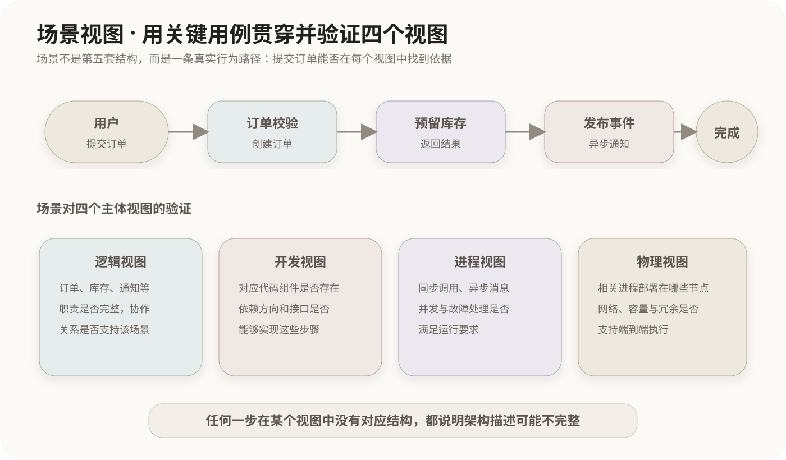

# 软件架构的4+1视图

## 1. 多视图描述的作用

Philippe Kruchten提出4+1视图模型，用多个相互关联的视图描述软件密集型系统的体系结构。单张图无法同时清楚表达业务功能、代码组织、运行时并发和物理部署；把不同关注点分开后，各类相关方可以阅读与自己工作直接相关的结构。

```text
4个主体视图：逻辑视图、开发视图、进程视图、物理视图
+1个验证视图：场景
```

这里的“视图”不是五套彼此独立的系统，而是对**同一个系统**进行五种观察。不同视图中的元素需要相互映射：逻辑职责由开发构件实现，开发构件运行成进程并部署到物理节点，场景则检验这些安排能否共同支持实际需求。

| 视图 | 主要问题 | 典型元素 | 重点相关方 |
|---|---|---|---|
| 逻辑视图 | 系统提供哪些功能，职责怎样分解 | 类、对象、领域模块、逻辑子系统 | 用户、分析人员、设计人员 |
| 开发视图 | 源代码和软件构件怎样组织 | 模块、程序包、组件、子系统、层 | 开发人员、配置管理人员 |
| 进程视图 | 软件运行时怎样并发、通信和同步 | 进程、线程、任务、消息、锁 | 架构师、集成人员、性能工程师 |
| 物理视图 | 软件怎样映射到硬件和网络节点 | 服务器、终端、网络、部署单元 | 系统工程师、运维人员 |
| 场景视图 | 代表性需求怎样贯穿并验证四个视图 | 用例、参与者、交互步骤 | 全体相关方 |

## 2. 逻辑视图

逻辑视图描述系统为满足功能需求而形成的对象模型和主要职责结构。它回答“系统在概念上由哪些功能单元组成，它们怎样协作”，但不直接决定这些单元位于哪个代码仓库、进程或服务器。



图中的订单、库存、商品和通知是逻辑职责。它们可以用类图、对象图或逻辑分层图表达。一个逻辑模块以后可以由多个开发构件实现，也可能与其他逻辑模块共同打包在同一个构件中。

逻辑视图重点关注：

- 功能分解和职责边界；
- 主要抽象、类、对象及其关系；
- 功能需求如何落实到设计元素；
- 可理解性、可修改性和复用等设计质量。

## 3. 开发视图

开发视图描述软件在开发环境中的静态组织，回答“开发人员实际维护哪些模块、程序包、组件和子系统”。它把逻辑设计落实为可编译、可版本管理和可分工开发的软件构件。



开发视图也常译作**实现视图**或模块视图。原模型使用Development View，教材出现“开发视图”和“实现视图”时，通常是在指同一维度，而不是两个独立视图。

开发视图重点关注：

- 源代码目录、程序包和组件之间的依赖；
- 分层、子系统划分和公共库复用；
- 团队分工、配置管理、构建和发布边界；
- 开发环境中的静态结构，而不是运行时进程。

## 4. 进程视图

进程视图描述系统运行时的动态结构，回答“有哪些进程、线程或任务同时运行，它们怎样通信和同步”。同一个开发组件可以启动多个运行实例；多个开发组件也可能装入同一个进程，因此进程视图不能从开发视图直接照抄。



进程视图重点关注：

- 并发、并行和任务调度；
- 进程间通信、消息传递和同步；
- 吞吐量、响应时间和资源竞争；
- 运行时可伸缩性、可用性和故障隔离。

这里的Process指操作系统意义上的运行进程或并发任务，不是软件生命周期中的“开发过程”。

## 5. 物理视图

物理视图描述软件元素向硬件和网络拓扑的映射，回答“运行单元最终部署到哪些机器、容器、终端和网络节点”。它把进程视图中的运行单元分配到具体执行环境。



物理视图也常称为**部署视图**。两者都关注软件到物理节点的映射，通常不能在4+1的名称组合中重复计算成两个主体视图。

物理视图重点关注：

- 节点、网络区域和通信链路；
- 软件进程或部署单元在节点上的分配；
- 容量、负载均衡、冗余和故障切换；
- 安装、运维及分布式系统的物理拓扑。

## 6. 场景视图

“+1”是场景，也常称为用例视图。它选择具有代表性的用例或业务场景，描述参与者与系统的交互步骤，并用这些步骤发现和验证四个主体视图中的架构元素。



场景不是简单再增加一张静态结构图。它具有三项作用：

1. 从需求出发发现需要哪些逻辑职责和协作；
2. 演示某个需求在四个主体视图中怎样实现；
3. 检查四个视图之间是否一致，架构能否支持关键用例。

例如“用户提交订单”会同时要求：

- 逻辑视图中存在订单、库存等职责；
- 开发视图中存在实现这些职责的构件；
- 进程视图中明确同步调用、消息传递和并发处理；
- 物理视图中为相关运行单元安排部署节点。

## 7. 五种视图之间的映射

```text
业务场景提出行为要求
        ↓ 验证
逻辑职责 ──由──→ 开发构件实现
                       ↓ 运行时实例化
                  进程与线程
                       ↓ 部署
                  物理节点与网络
```

这种映射不是严格的一一对应：

- 一个逻辑职责可能拆成多个开发组件；
- 一个组件可能启动多个进程实例；
- 一个进程可以在多个物理节点上部署副本；
- 一个场景通常会经过多个逻辑单元、组件、进程和节点。

4+1视图的价值就在于把这些不同维度分开表达，再通过映射和场景保持一致。

## 8. 常见名称辨析

| 名称组合 | 实际关系 |
|---|---|
| 开发视图与实现视图 | 通常是Development View的不同译名 |
| 物理视图与部署视图 | 都关注软件到硬件节点的映射，通常是同一维度 |
| 场景视图与用例视图 | 场景常通过用例表达，通常指“+1” |
| 逻辑视图与开发视图 | 前者描述功能职责，后者描述代码和构件组织 |
| 开发视图与进程视图 | 前者是静态代码组织，后者是运行时动态组织 |
| 进程视图与物理视图 | 前者描述运行单元，后者描述这些单元部署在哪里 |

识别4+1视图的名称组合时，可以先固定四个互不重复的主体维度：

```text
功能职责：逻辑
代码组织：开发
运行并发：进程
节点部署：物理
需求验证：场景（+1）
```

## 参考资料

- Philippe Kruchten, [Architectural Blueprints—The “4+1” View Model of Software Architecture](https://www3.software.ibm.com/ibmdl/pub/software/rational/web/whitepapers/2003/Pbk4p1.pdf), IEEE Software, 1995.

