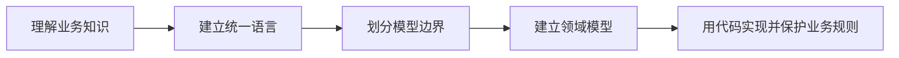
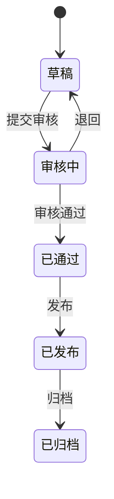
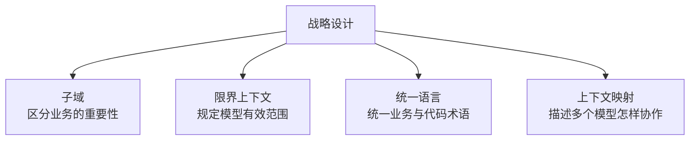
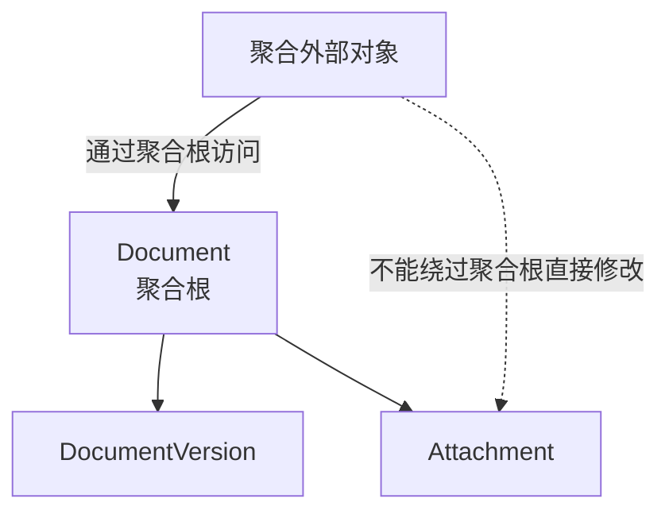
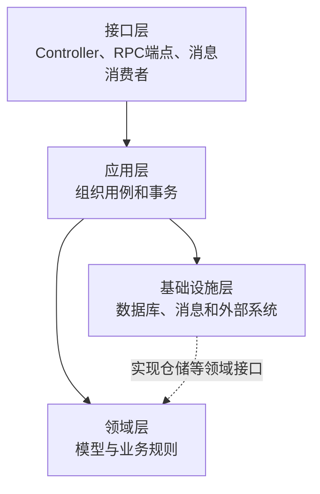
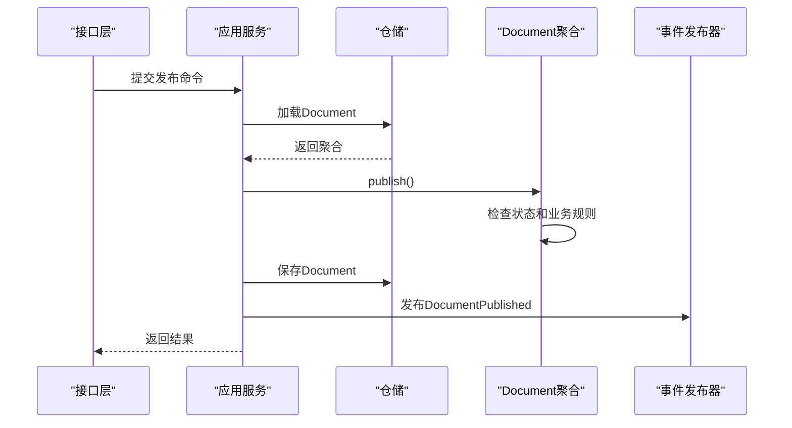
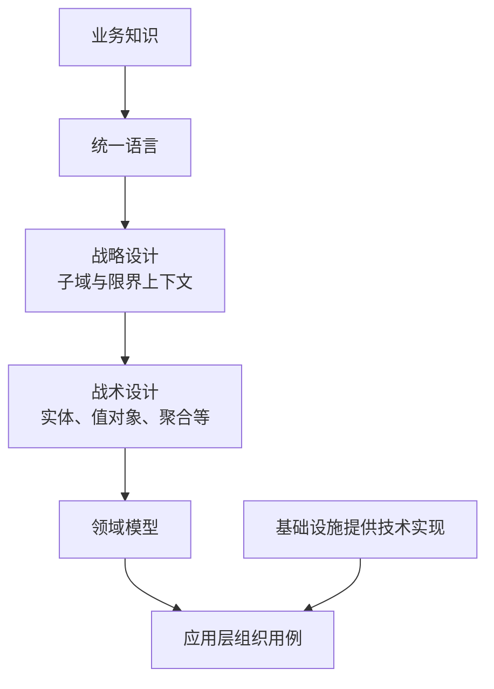

# 领域驱动设计DDD

## 1. 定位与核心思想

DDD（Domain-Driven Design，领域驱动设计）是一套围绕复杂业务知识建立软件模型的设计方法。“领域”是软件所服务的业务范围，例如医院诊疗、仓库库存、文档审核和生产管理。

DDD的核心过程是：



DDD首先关心业务概念、状态、行为和约束怎样进入软件模型。UML、数据库、Spring等可以帮助实现这个模型，但不能代替领域模型。

## 2. 领域模型

领域模型是业务概念、状态、行为和规则在软件中的表达。它不仅说明系统保存什么数据，还说明数据允许怎样变化。

文档管理可能存在以下规则：

```text
草稿可以提交审核
审核通过后才能发布
已归档的文档不能重新发布
```

领域对象可以集中维护这些规则：

```java
public class Document {
    private DocumentStatus status;

    public void publish() {
        if (status != DocumentStatus.APPROVED) {
            throw new IllegalStateException("只有审核通过的文档可以发布");
        }
        status = DocumentStatus.PUBLISHED;
    }
}
```



`Document`不是只保存字段，还负责阻止非法状态变化。

### 贫血模型与充血模型

| 模型 | 特点 | 主要问题或价值 |
|---|---|---|
| 贫血模型 | 对象主要包含字段和getter/setter，规则集中在Service | 规则容易散落在多个Service、Controller和任务中 |
| 充血领域模型 | 对象同时包含状态及与自身职责有关的行为 | 业务规则与数据集中，非法操作更难绕过 |

充血模型不等于把所有代码放进实体。流程协调、数据库访问和外部系统调用仍然属于其他组件。

## 3. 战略设计

战略设计用于划分业务范围和模型边界。



### 子域

| 类型 | 含义 |
|---|---|
| 核心域 | 体现主要业务价值和差异化能力 |
| 支撑域 | 支持核心业务，但不是主要差异来源 |
| 通用域 | 多个行业都需要、适合采用成熟方案的能力 |

核心域由业务价值决定，不是技术实现最复杂的部分。

### 统一语言

业务人员和开发人员在同一模型边界中使用一致的术语。例如业务称某项行为为“归档”，需求、模型和代码也使用“归档”与`archive()`，避免同一概念出现多套名称。

### 限界上下文

限界上下文（Bounded Context）规定一套模型和统一语言在哪个边界内有效。同一个词在不同上下文中可以表示不同模型：

| 上下文 | “用户”主要表示 |
|---|---|
| 身份认证 | 账号、凭证、登录和锁定状态 |
| 文档协作 | 姓名、部门和协作权限 |
| 消息通知 | 邮箱、手机号和通知偏好 |

不同上下文不必共享一个包含全部字段和行为的巨大`User`类。

### 上下文映射

上下文映射描述多个限界上下文的协作关系。常见关系包括合作关系、共享内核、客户方—供应方、遵奉者、防腐层、开放主机服务和发布语言。

其中，防腐层（Anti-Corruption Layer，ACL）通过适配和翻译，防止外部模型直接污染本地领域模型：


## 4. 战术设计

战术设计使用一组构件实现某个限界上下文内部的领域模型。

| 构件 | 主要含义 |
|---|---|
| 实体（Entity） | 通过身份区分并跟踪生命周期的对象 |
| 值对象（Value Object） | 主要通过属性值定义、通常不可变的对象 |
| 聚合（Aggregate） | 需要共同维护业务一致性的一组对象 |
| 聚合根（Aggregate Root） | 聚合对外访问和修改的入口 |
| 领域服务（Domain Service） | 无法自然归属于单个实体的领域行为 |
| 仓储（Repository） | 获取和保存聚合，隐藏持久化细节 |
| 领域事件（Domain Event） | 领域中已经发生且值得其他部分关注的事实 |

### 实体与值对象

两个文档即使标题相同，只要文档编号不同，仍是两个实体；两个属性完全相同的文件大小值对象可以视为相同的值。

| 对比项 | 实体 | 值对象 |
|---|---|---|
| 相同判断 | 身份 | 属性值 |
| 生命周期 | 通常需要跟踪 | 通常不单独跟踪 |
| 可变性 | 状态可以变化 | 通常设计为不可变 |
| 示例 | 文档、审批单、用户账号 | 金额、地址、日期范围、文件大小 |

### 聚合与聚合根



聚合根负责维护聚合内部必须始终成立的业务规则。外部对象通常只引用聚合根，不直接修改内部对象。聚合不宜无限扩大，否则会扩大事务范围并增加并发冲突。

### 仓储与领域事件

仓储为领域层提供面向聚合的访问接口：

```java
public interface DocumentRepository {
    Optional<Document> findById(DocumentId id);
    void save(Document document);
}
```

领域事件使用过去式表示已经发生的事实，例如`DocumentPublished`。其他组件可以订阅事件，更新搜索索引、发送通知或记录审计信息，从而减少聚合对后续处理者的直接依赖。

## 5. 分层与职责

一种常见的DDD分层结构如下：



| 层次 | 主要职责 |
|---|---|
| 接口层 | 解析协议、转换DTO、返回结果 |
| 应用层 | 组织一次业务用例、控制事务、协调组件 |
| 领域层 | 保存业务状态，执行并保护业务规则 |
| 基础设施层 | 实现数据库、消息队列、缓存和第三方接口 |

应用服务负责“先做什么、再做什么”；领域对象和领域服务负责“业务上允许做什么以及怎样做”。

三类Service需要区分：

| 类型 | 职责 |
|---|---|
| 领域服务 | 表达不适合归属于单个实体的领域规则 |
| 应用服务 | 编排用例、事务和组件调用 |
| 基础设施服务 | 提供邮件、数据库、文件和消息等技术能力 |

## 6. 与相邻概念的区别

### 领域模型与数据模型

| 模型 | 主要目标 | 典型内容 |
|---|---|---|
| 领域模型 | 表达业务概念、行为和约束 | 实体、值对象、聚合、领域事件 |
| 数据模型 | 持久化和查询数据 | 表、字段、主键、外键、索引 |
| 接口模型 | 与外部系统交换数据 | 请求DTO、响应DTO、消息结构 |

三者不必一一对应：一个聚合可以保存到多张表，一个领域对象也可能不需要持久化。

### DDD与UML

UML是表示结构和行为的建模语言，DDD是建立业务模型的方法。DDD可以使用UML，但使用UML不等于采用DDD，DDD也不要求必须产出完整UML模型。

### DDD与技术架构

Spring、MyBatis、数据库、缓存和消息队列用于实现系统。性能和可靠性要求会限制实现方案，但技术组件不能代替业务概念和业务规则。

### DDD与结构化分析

| 对比项 | 结构化分析 | DDD |
|---|---|---|
| 主要视角 | 数据怎样流动和被处理 | 业务概念怎样协作并维护规则 |
| 分解方式 | 处理逐层分解 | 子域、限界上下文、聚合 |
| 典型产物 | DFD、数据字典、加工说明 | 领域模型、上下文映射、聚合和领域事件 |

## 7. 一次业务流程



领域规则由聚合执行，应用服务只负责组织加载、调用、保存和事件发布的顺序。

## 8. 常见失误与适用范围

- 只把目录改名为`domain`、`application`，业务规则仍全部堆在Service中；
- 按数据库表机械生成领域实体；
- 建立包含大量对象的巨大聚合，导致事务和并发问题；
- 把流程协调、SQL和外部调用全部塞入实体；
- 让领域层直接依赖HTTP、SQL或具体框架；
- 在只有简单增删改查的系统中引入完整DDD，增加不必要的建模成本。

DDD更适合业务概念复杂、规则变化频繁，并且业务人员和开发人员需要长期共同维护模型的系统。

## 9. 核心关系



```text
先理解业务，再建立模型
使用统一语言连接业务讨论、模型和代码
使用限界上下文明确模型的适用边界
由领域对象保护业务状态和规则
由应用层组织用例，由基础设施提供技术实现
数据库、框架和UML可以为模型服务，但不能替代领域模型
```

## 相关章节

- [结构化分析与结构化设计](../05-软件工程基础/03-结构化分析与结构化设计.md)
- [模块内聚与耦合](../05-软件工程基础/05-模块内聚与耦合.md)
- [设计模式总览](../07-设计模式/01-设计模式总览.md)
- [软件生命周期与过程模型](../05-软件工程基础/01-软件生命周期与过程模型.md)
- [敏捷开发方法](../05-软件工程基础/02-敏捷开发方法.md)

## 参考资料

- Eric Evans：《Domain-Driven Design: Tackling Complexity in the Heart of Software》
- Vaughn Vernon：《Implementing Domain-Driven Design》
- Martin Fowler：[Anemic Domain Model](https://martinfowler.com/bliki/AnemicDomainModel.html)


