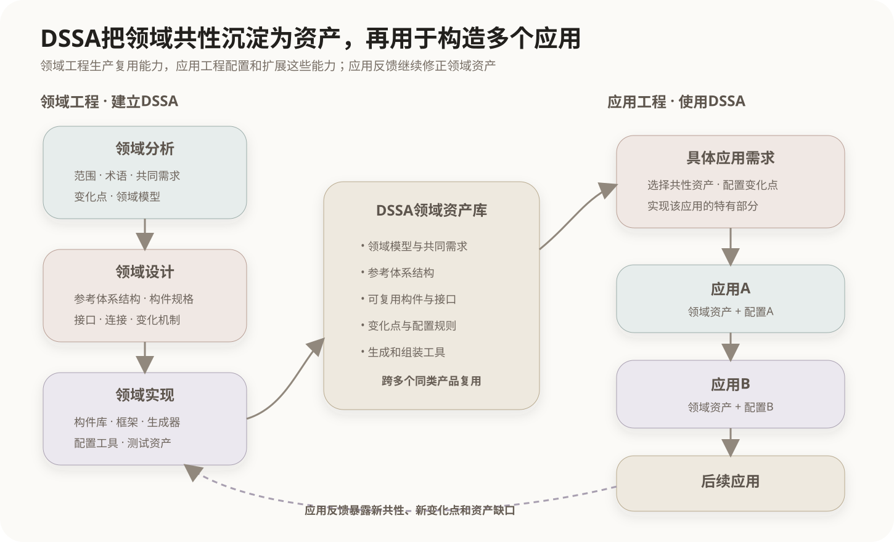

# 特定领域软件体系结构DSSA

## 1. DSSA的定位

DSSA是Domain-Specific Software Architecture的缩写，通常译为**特定领域软件体系结构**或领域特定软件体系结构。它面向某个明确领域中的一系列应用，提取这些应用稳定的共同需求、共同结构和变化规律，并形成能够反复用于构造新应用的领域级架构资产。

普通项目架构主要解决一个具体系统怎样设计；DSSA关注的是一类相似系统怎样共享架构知识和实现资产。

```text
单个项目架构：为一个具体系统组织构件和关系
DSSA：为一个领域中的多个同类系统建立可复用的参考体系
```

DSSA中的复用不仅是复制代码，还包括领域术语、需求模型、业务约束、参考体系结构、构件接口、变化点、构件库和应用生成方法。

## 2. 领域工程与应用工程

DSSA把“生产可复用资产”和“使用资产构造产品”区分为两个相互反馈的过程。



### 2.1 领域工程

领域工程分析多个现有或潜在应用，提取领域共性与变化点，并建立可复用资产。其目标不是立即交付某一个最终系统，而是形成后续应用可以使用的平台。

主要产出包括：

- 领域范围与领域术语；
- 共同需求和可变需求；
- 领域模型或特征模型；
- 参考体系结构；
- 可复用构件、框架、生成器和配置规则。

### 2.2 应用工程

应用工程针对一个具体产品选择和配置领域资产，实现该产品独有的需求，并完成集成、测试和交付。

```text
具体应用需求
    +
选择并配置DSSA中的共性资产和变化点
    +
实现该应用独有部分
    ↓
形成具体应用系统
```

应用工程的实践结果还会反向暴露领域资产的缺口，推动DSSA继续修订。

## 3. 领域分析

领域分析确定研究对象和边界，并识别领域中多个应用的共同点与变化点。它回答“这个领域包含什么，以及哪些部分在不同产品间保持稳定或发生变化”。

主要活动包括：

- 确定领域范围和边界；
- 调查已有系统、业务资料和潜在需求；
- 建立统一术语；
- 识别共同需求、可变需求及领域约束；
- 建立领域模型、需求模型或特征模型。

领域分析的主要产出是领域知识和需求模型，不是已经可以直接运行的构件。

## 4. 领域设计

领域设计根据分析结果建立领域参考体系结构，决定共同需求如何映射到架构结构，以及变化点如何被配置和扩展。

主要活动包括：

- 选择适合领域的体系结构风格；
- 划分构件、职责和接口；
- 定义构件之间的连接和交互规则；
- 确定固定部分与可变部分；
- 设计参数化、替换、扩展或生成机制；
- 分析领域中反复出现的质量属性要求。

领域设计的主要产出是参考体系结构、构件规格和组合约束。它描述构件应当怎样组织，但不等于所有构件已经实现。

## 5. 领域实现

领域实现把领域模型和参考体系结构落实为可操作的复用资产，使应用工程能够利用这些资产构造具体产品。

主要活动包括：

- 开发通用构件和领域框架；
- 建立构件库；
- 实现配置工具、代码生成器或领域专用语言；
- 编写复用指南、测试资产和组装脚本；
- 验证构件能否覆盖已经识别的变化点。

“增加构件，使DSSA能够产生领域中的新应用”主要属于领域实现，而不是领域设计的核心目标。

## 6. 并发、递归与反复进行

领域分析、领域设计和领域实现可以按顺序理解，但实际建立DSSA不是只执行一次的严格直线过程。

```text
领域分析 ⇄ 领域设计 ⇄ 领域实现
    ↑                         ↓
    └──── 具体应用反馈 ────────┘
```

- **并发**：某些领域构件可以在其他领域问题仍在分析时开始设计或实现；
- **递归**：一个大型领域可以继续分解为子领域，并对其重复进行分析、设计和实现；
- **反复**：实现或应用中发现的新问题会促使前面的模型和体系结构重新调整。

因此，三个活动是逻辑职责的划分，而不是不可返回的三个封闭阶段。

## 7. 共性与变化点

DSSA能够跨多个产品复用的前提，是同时处理共性和差异。

| 内容 | 含义 | 处理方式 |
|---|---|---|
| 共性 | 领域内大多数应用稳定具有的需求和结构 | 固化为参考架构、公共接口和通用构件 |
| 变化点 | 不同应用之间允许或必须变化的部分 | 参数配置、构件替换、插件、继承或生成 |
| 应用特有部分 | 只属于一个具体产品的需求 | 在应用工程中单独实现 |

如果只提取共性而没有设计变化机制，领域资产可能僵化，无法覆盖不同产品；如果所有部分都允许随意变化，参考体系结构又无法提供稳定约束。

## 8. DSSA与DDD

DSSA和领域驱动设计DDD都使用领域知识，但关注范围和产出不同。

| 维度 | DDD | DSSA |
|---|---|---|
| 主要对象 | 复杂业务系统及其领域模型 | 一个领域中的一系列相似系统 |
| 核心问题 | 软件模型怎样准确表达业务并划清模型边界 | 多个系统的共同结构怎样提取和复用 |
| 主要产出 | 子域、限界上下文、聚合、实体、值对象和领域服务 | 领域需求、领域模型、参考体系结构、复用构件和生成工具 |
| 复用范围 | 主要组织具体系统内部的领域逻辑 | 跨多个同类应用复用架构与资产 |
| 典型过程 | 战略设计与战术设计 | 领域分析、领域设计、领域实现和应用工程 |

两者都出现“领域模型”，但目的不同：DDD强调模型与业务语义一致；DSSA强调从多个应用中抽取共性和变化点。DSSA不要求必须使用DDD，DDD也不要求必须建立DSSA。

在同一组织中，两者可以配合：DSSA为一系列产品提供参考体系结构和共用资产，具体产品再用DDD划分子域、限界上下文并设计内部领域模型。多个DDD项目沉淀出的稳定经验，也可能成为建立DSSA的输入。

相关章节：[领域驱动设计DDD](03-领域驱动设计DDD.md)。

## 9. 相邻概念辨析

| 概念 | 主要区别 |
|---|---|
| DSSA与单个项目架构 | DSSA面向一个领域的多个应用，项目架构面向一个具体系统 |
| DSSA与体系结构风格 | 风格是通用组织方式；DSSA包含领域知识、参考架构和复用资产 |
| DSSA与软件产品线 | 两者都管理共性和变化；产品线更强调一组相关产品及其系统化生产，DSSA可作为其核心架构基础 |
| 领域模型与参考体系结构 | 领域模型表达领域概念和需求，参考体系结构表达软件元素及其组织关系 |
| 领域设计与领域实现 | 前者设计参考架构和构件规格，后者开发实际构件和生成工具 |

不同领域可以采用相似的DSSA方法框架，但领域范围、模型、构件、质量约束和变化机制不同，因此创建与使用过程不可能在所有领域完全相同。

## 核心关系

```text
领域工程
├── 领域分析：范围、共性、变化点、领域模型
├── 领域设计：参考体系结构、构件规格、组合规则
└── 领域实现：构件库、框架、生成器、配置工具
        ↓ 提供可复用资产
应用工程
└── 选择、配置、扩展和组装资产，形成具体应用

多个具体应用的反馈继续修正领域资产，
所以DSSA的建立过程具有并发、递归和反复进行的特征。
```

