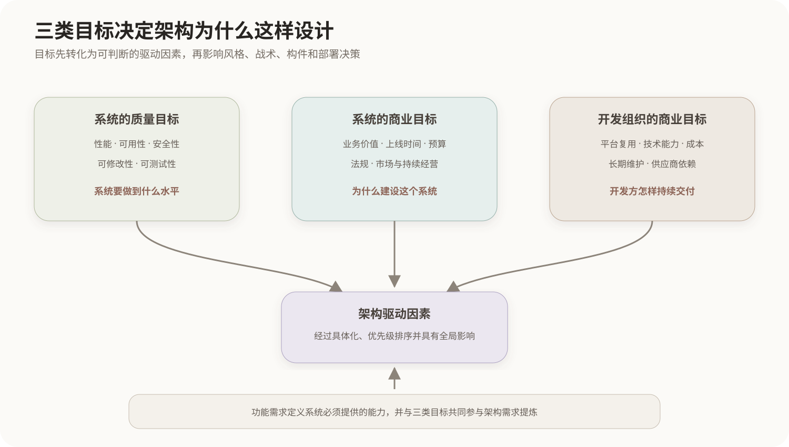
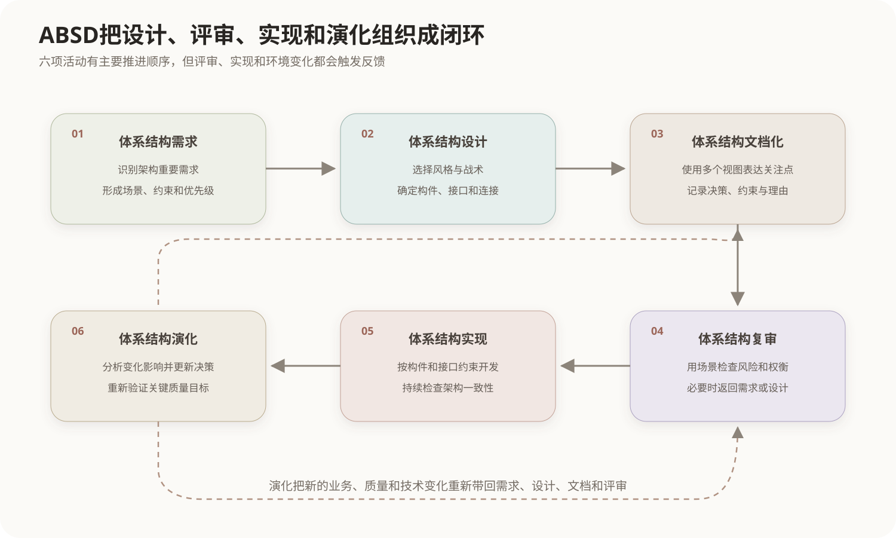

# 软件体系结构设计方法

## 1. 体系结构设计解决什么问题

详细设计关注类、函数和局部算法，体系结构设计先处理对整个系统具有广泛影响的决定，例如怎样划分主要构件、构件如何通信、数据和职责怎样分配，以及系统怎样达到性能、可用性和可修改性目标。

并非所有需求都具有同等的体系结构影响。能够显著影响主要结构、技术机制、部署方式或者高风险决策的需求，称为**架构重要需求**（Architecturally Significant Requirements，ASR）。常见来源包括：

- 关键业务功能，例如核心业务流程和外部系统集成；
- 质量属性要求，例如延迟、吞吐量、可用性和可修改性；
- 业务目标和组织约束，例如上线时间、预算、法规和既有技术资产；
- 技术及环境约束，例如必须采用的平台、协议和部署环境。

体系结构设计的核心不是把全部需求原样抄进架构文档，而是识别其中会改变整体设计方向的驱动因素，并为重要决策保留可追溯的理由。

## 2. ABSD的定位

ABSD通常解释为 **Architecture-Based Software Design**，即基于体系结构的软件设计。它以体系结构为中心组织需求、设计、描述、评审、实现和演化，使系统开发不只依靠局部模块逐渐拼接。

相关的SEI原始方法常写作 **ABD（Architecture Based Design）**。ABD用于在较高抽象层次上设计产品线或长期演化系统的体系结构，并同时考虑功能、质量和商业需求。后续的 **ADD（Attribute-Driven Design）**进一步突出质量属性和架构驱动因素对递归分解的指导作用。

软考资料中的ABSD可以理解为一套更广义的“以体系结构为中心的开发过程”；ABD和ADD则是具有具体步骤和术语的设计方法。三者有关联，但缩写和版本不宜机械地视为完全相同。

## 3. 体系结构需求的三类目标来源



### 3.1 系统的质量目标

质量目标描述系统需要达到怎样的运行和演化水平，例如：

- 高峰期查询的95百分位响应时间不超过2秒；
- 单个节点失效后，核心服务在30秒内恢复；
- 增加一种业务规则时，不修改已有核心构件；
- 敏感操作必须经过身份鉴别、授权和审计。

“性能良好”“容易修改”只是质量名称，不足以直接指导设计。质量目标应进一步写成包含刺激、环境、响应和响应度量的场景，具体方法见[质量属性场景与效用树](../10-系统质量属性与架构评估/01-质量属性场景与效用树.md)。

### 3.2 系统的商业目标

系统商业目标说明建设系统的业务理由和成功标准，例如控制运营成本、在规定日期前进入市场、满足监管要求、支持新的服务渠道或者形成可持续收入。

商业目标不是架构之外的背景介绍，它会产生实际的架构约束：较短上市周期可能推动成熟构件复用；业务连续性要求会产生可用性和恢复要求；多渠道经营可能要求统一服务接口和可扩展的集成方式。

### 3.3 开发组织的商业目标

这里的“开发人员商业目标”不是某个程序员的个人收入目标，而是开发组织自身的成本、能力和长期收益目标，例如：

- 复用已有认证、日志和消息平台；
- 使用团队已经掌握并能够长期维护的技术；
- 控制开发、交付和后续运维成本；
- 把通用能力沉淀为后续产品可以复用的资产；
- 降低对单一供应商或稀缺人员的依赖。

开发组织目标会影响技术选型、构件边界、平台复用和部署策略，因此也是体系结构需求的重要来源。

### 3.4 功能需求并未被排除

三类目标来源是特定教材对体系结构需求驱动力的归纳，不表示ABSD不考虑功能需求。功能需求规定系统必须提供哪些能力，质量和商业目标则决定这些能力应以怎样的整体结构实现。

```text
功能需求：系统做什么
质量目标：做到什么水平
商业目标：为什么做、受什么经营约束
开发组织目标：怎样在组织能力和长期成本范围内完成
```

## 4. 从目标到体系结构决策

目标不能直接生成架构，需要经过逐层转化：

1. 识别利益相关者及其目标；
2. 找出关键功能、质量属性和约束；
3. 将宽泛质量目标具体化为可判断的场景；
4. 确定架构驱动因素及优先级；
5. 选择适合的体系结构风格和架构战术；
6. 形成构件、连接件、接口、数据和部署决策；
7. 用场景、原型或分析方法验证关键风险。

同一目标可能对应多种设计方案。例如提高可用性可以采用冗余、故障检测、状态复制和恢复等不同战术组合。设计方法负责形成候选结构，评估方法负责识别风险和权衡，二者不能互相替代。

## 5. ABSD的六个活动



### 5.1 体系结构需求

收集并整理功能、质量、商业和技术约束，识别真正影响体系结构的驱动因素。结果不是全部需求的简单列表，而是经过优先级排序、能够指导设计和验证的架构需求集合。

### 5.2 体系结构设计

选择[体系结构风格](01-软件体系结构风格.md)和架构战术，划分主要构件，确定职责、接口、连接方式、数据流和部署原则。设计通常反复分解，而不是一次得到完整结构。

### 5.3 体系结构文档化

体系结构需要从不同关注点进行描述。[4+1视图](02-软件架构的4加1视图.md)可以分别呈现逻辑结构、开发组织、运行进程、物理部署和关键场景。文档还应记录重要决策、约束和采用该方案的理由。

### 5.4 体系结构复审

利益相关者根据关键场景检查架构是否满足目标，识别风险、敏感点和质量属性之间的权衡。复审可以采用走查、原型和场景分析；对复杂体系结构可以使用[ATAM](../10-系统质量属性与架构评估/03-ATAM体系结构权衡分析.md)等专门方法。

### 5.5 体系结构实现

开发团队按照体系结构规定实现构件、接口和连接机制，并建立自动化检查、代码结构约束和集成测试，避免实现逐渐偏离已批准的体系结构。

### 5.6 体系结构演化

需求、业务环境和技术条件发生变化时，应分析变更对体系结构的影响，更新决策、文档和实现，并重新验证关键质量目标。体系结构演化的完整过程见[软件体系结构演化](../12-软件架构的演化与维护/01-软件体系结构演化.md)。

六项活动存在反馈关系：评审可能迫使设计调整，实现可能暴露接口或性能问题，演化则可能重新触发需求分析。因此它们不是只能执行一次的瀑布式阶段。

## 6. ABSD、ADD与架构评估的职责边界

| 方法或活动 | 核心问题 | 主要输出 |
|---|---|---|
| ABSD | 怎样围绕体系结构组织整个开发过程 | 需求、架构、文档、评审和演化闭环 |
| ABD | 怎样在高层形成满足功能、质量和商业需求的架构 | 高层构件、连接和设计模板 |
| ADD | 怎样由架构驱动因素递归分解系统 | 分解后的构件、职责、接口和战术决策 |
| ATAM等评估方法 | 候选或现有架构存在哪些风险与权衡 | 风险、敏感点、权衡点和改进依据 |

架构设计和架构评估应当反复配合：设计产生需要验证的结构，评估结果又成为下一轮设计输入。

## 7. 常见混淆

- **质量目标与质量要求**：二者不是相互独立的两个来源；质量要求是质量目标被具体化后的约束或场景。
- **开发任务与开发组织目标**：开发任务说明要执行什么工作，组织目标说明复用、成本、能力和长期维护方面的利益。
- **体系结构风格与设计方法**：风格是可复用的组织方案，ABSD和ADD是运用需求、风格和战术产生具体架构的方法。
- **设计方法与评估方法**：ABSD、ABD和ADD主要产生架构；ATAM、SAAM和CBAM主要分析架构。

## 核心关系

```text
系统质量目标 + 系统商业目标 + 开发组织商业目标
                         ↓
      关键功能、质量场景和约束被提炼为架构驱动因素
                         ↓
       架构风格 + 架构战术 + 构件和连接决策
                         ↓
          多视图文档化 → 复审 → 实现 → 演化
                         ↑                   ↓
                         └────反馈与重新验证────┘
```

## 参考资料

- Carnegie Mellon University Software Engineering Institute, *The Architecture Based Design Method*.
- Carnegie Mellon University Software Engineering Institute, *Relating Business Goals to Architecturally Significant Requirements for Software Systems*.

