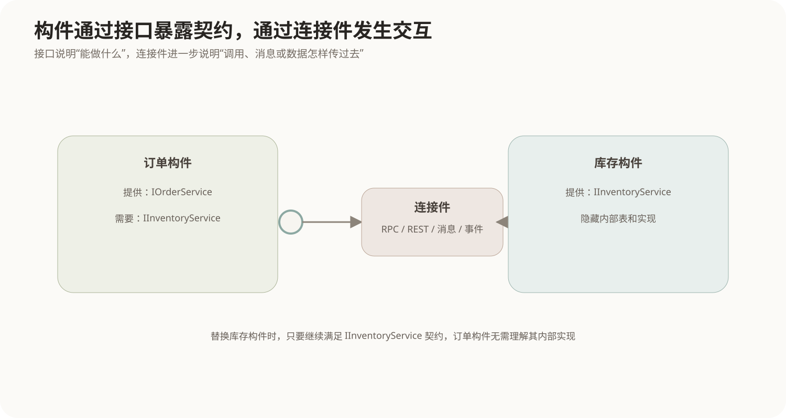
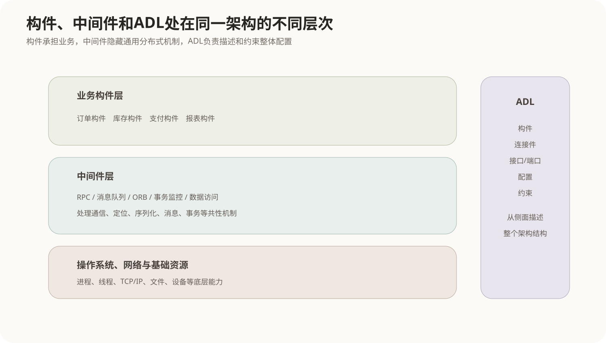

# 构件、中间件与 ADL

## 1. 为什么架构设计不能只停留在“模块划分”

大型软件最终需要把功能落实到可以开发、部署、替换和协作的实现单元。单纯说“系统分成订单模块、库存模块、支付模块”还不够，架构还需要进一步说明：

- 每个单元向外提供什么能力；
- 它依赖哪些外部能力；
- 单元之间通过什么机制连接；
- 通信、事务、序列化、位置和并发等通用问题由谁处理；
- 整体结构怎样被准确描述和检查。

构件、中间件和ADL分别从**实现单元、运行基础设施、架构描述语言**三个层次回答这些问题。

## 2. 构件是什么

软件构件（Component）是具有明确接口、可独立开发或替换、能够与其他构件组装的软件单元。不同构件模型对“独立部署”的要求不同，但共同思想是：构件内部实现被封装，外部通过契约明确的接口使用它。



一个订单构件可以：

```text
提供：IOrderService
需要：IInventoryService、IPaymentService
```

只要外部仍然满足这些接口契约，订单构件内部可以从一种实现替换为另一种实现，而不要求所有调用者理解内部代码。

## 3. 构件、模块、对象有什么区别

三者都在做分解，但所处层次不同。

### 3.1 模块 Module

模块主要是源代码组织和职责划分单位，例如一个包、命名空间或源代码子系统。模块可以没有明确的运行时接口，也不一定能够独立部署。

### 3.2 对象 Object

对象是面向对象程序运行时的实例，具有状态、身份和行为。大量对象可能共同组成一个构件。

### 3.3 构件 Component

构件更强调可组装边界、明确接口以及相对独立的替换或部署能力。

可以理解为：

```text
对象：运行时细粒度实体
模块：开发时的代码组织
构件：架构与实现之间的可组装单元
```

这些概念不是严格按大小排序。关键是它们关注的问题不同。

## 4. 接口把构件内部与外部隔开

一个构件通常有两类接口概念：

- **提供接口（Provided Interface）**：构件对外承诺提供的能力；
- **需要接口（Required Interface）**：构件正常工作所依赖的外部能力。

如果订单构件需要库存能力，它不应该把“库存服务内部使用哪张表”写成自己的依赖，而应该依赖一个稳定的库存接口。

这带来两个重要结果：

1. 构件内部实现可以变化，只要提供接口契约不变；
2. 需要接口可以由不同实现满足，从而支持替换、测试桩和多种部署。

接口隔离的是**实现知识**，不是让系统完全没有依赖。构件仍然依赖接口规定的语义和行为。

## 5. 连接件不是简单的一条线

在架构模型中，构件之间的交互机制常抽象为**连接件（Connector）**。连接件可以代表：

- 过程或方法调用；
- RPC / REST调用；
- 消息队列；
- 事件总线；
- 数据流管道；
- 共享数据访问等。

画一条“订单 → 库存”的箭头时，如果不说明连接件语义，就无法判断它是同步调用还是异步消息、是否有重试、是否要求事务一致性、失败怎样传播。

因此在体系结构层，**构件描述计算和状态，连接件描述交互规则**。

## 6. 中间件为什么会出现在构件之间

分布式系统中，业务构件如果自己处理所有通信细节，需要反复编写：

- 建立网络连接；
- 编解码和序列化；
- 服务定位；
- 超时和重试；
- 消息传递；
- 事务协调；
- 身份认证等通用机制。

中间件（Middleware）位于应用与底层操作系统/网络之间，把这些通用分布式能力做成可复用基础设施，使业务构件可以通过更稳定的抽象协作。



## 7. 常见中间件类型解决不同交互问题

### 7.1 远程调用类中间件

RPC等机制让程序以类似本地调用的方式使用远端服务，中间件负责参数编码、网络发送和返回值处理。

它改善了通信抽象，但远程调用仍然具有网络延迟、超时和部分失败，不能真的把远程调用当成本地函数调用。

### 7.2 消息中间件 MOM

消息中间件通过消息队列、主题等方式让发送方和接收方相对解耦：

```text
生产者 → 消息中间件 → 消费者
```

发送方不必等待接收方同时在线，适合异步处理、削峰和事件分发。代价是需要处理消息重复、顺序、积压和最终一致性等问题。

### 7.3 对象请求代理 ORB

CORBA等分布式对象技术通过ORB（Object Request Broker）定位对象、完成参数封送和跨语言/跨平台调用，使客户端通过接口调用远程对象。

### 7.4 事务处理中间件

事务监控器等中间件帮助大量并发事务管理资源、连接和事务边界，在传统企业系统中用于协调可靠的事务处理。

### 7.5 数据访问中间件

ODBC、JDBC等提供统一的数据访问接口，把应用与具体数据库协议和驱动细节隔开。

这些技术都叫“中间件”，但并不是同一类产品。判断一个中间件时，应先问它主要隐藏和管理的是**通信、消息、对象定位、事务还是数据访问**。

## 8. ADL要把架构从示意图变成可分析描述

ADL（Architecture Description Language，体系结构描述语言）用于以形式化或半形式化方式描述软件体系结构。

一套ADL通常关注：

- **构件**：承担计算和数据职责的单元；
- **连接件**：构件之间的交互机制；
- **接口/端口/角色**：构件和连接件可以怎样连接；
- **配置**：具体系统中有哪些构件和连接关系；
- **约束**：哪些组合是允许或禁止的；
- **属性**：性能、部署等附加信息。

普通框图也能告诉人“这里有三个服务”，但ADL希望进一步让工具或分析方法理解：谁提供什么接口、谁必须连接到谁、结构是否满足规则。

## 9. ADL和UML不是简单替代关系

UML是通用建模语言，可以描述类、构件、部署和行为；ADL则专门面向软件体系结构，通常更强调构件、连接件、配置和可分析的架构约束。

有些项目完全可以用UML构件图和部署图表达足够的架构信息；在需要更强形式分析、特定架构风格检查或自动生成时，专门ADL会更有价值。

所以不能因为某张图“画了构件和箭头”就自动称为ADL。ADL的重点在于它有明确的语言语义和架构描述元素。

## 10. 构件技术与体系结构风格的关系

体系结构风格规定整体组织约束，构件技术负责把其中的计算单元实现出来，中间件则经常承担连接机制。

例如事件驱动架构：

```text
业务构件：订单、库存、通知
连接件：事件发布/订阅
中间件：消息代理或事件总线
ADL/架构模型：描述谁发布、谁订阅、有哪些约束
```

因此它们不是四个互不相关的术语，而是同一套架构从抽象到运行的不同层次。

## 11. 核心关系

```text
体系结构风格
    ↓ 规定整体组织方式
构件
    ↓ 提供/需要明确接口
连接件
    ↓ 定义构件怎样交互
中间件
    ↓ 提供可复用的通信、消息、事务等运行机制
具体系统配置
    ↓
ADL可以用统一语义描述和检查上述架构结构

对象 ≠ 模块 ≠ 构件
接口 ≠ 连接件
构件承担计算职责
连接件承担交互语义
```
