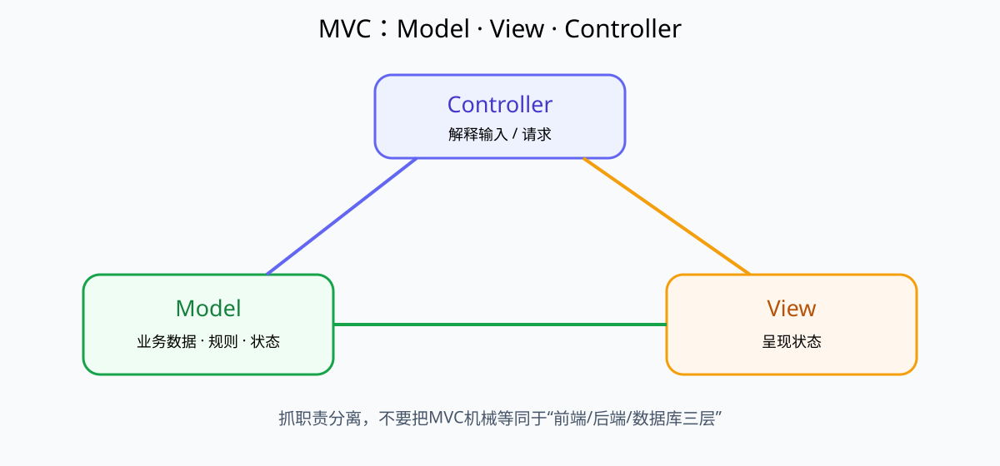
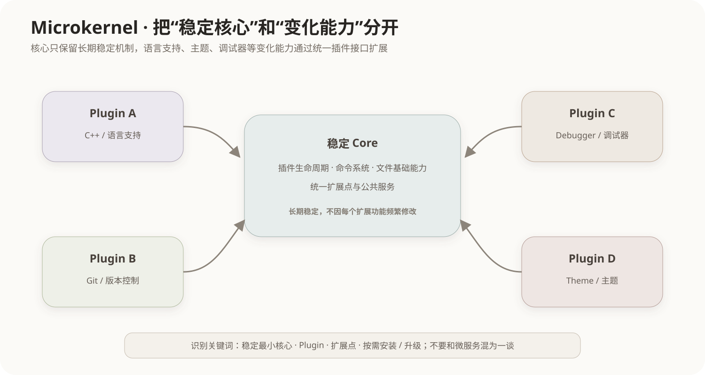

# MVC 与微内核架构模式

## 1. 架构模式在解决什么

架构模式不是某个类的写法，而是反复出现的一类系统级组织问题的可复用结构。MVC和微内核都属于常见架构模式，但它们解决的问题完全不同：

```text
MVC：界面、交互控制和业务状态如何分离
微内核：稳定核心与不断变化的扩展功能如何分离
```

## 2. MVC：Model、View、Controller

MVC把交互型应用分为三个主要职责：

- **Model（模型）**：保存和处理业务数据、业务规则或领域状态；
- **View（视图）**：把模型状态呈现给用户；
- **Controller（控制器）**：接收用户输入/请求，解释为对模型或应用行为的操作。



典型流程可以理解为：

```text
用户操作
→ Controller解释请求
→ Model执行业务逻辑并改变状态
→ View读取/接收Model状态
→ 向用户呈现结果
```

不同框架对View如何观察Model、Controller是否直接选择View等细节可能不同，判断MVC时应抓住**职责分离**而不是死记一条唯一箭头。

## 3. MVC为什么有价值

如果界面代码、业务规则和输入处理全部揉在一个模块里，任何界面改版都可能触碰业务逻辑。MVC通过职责分离带来：

- 同一模型可以有不同视图；
- 界面变化不必大规模修改业务规则；
- Controller可以集中处理交互输入；
- 不同职责更容易独立测试和维护。

代价是构件数量和交互关系增加，小型简单程序使用完整MVC可能显得过重。

## 4. MVC与三层架构不是一回事

三层/分层架构常写成：

```text
表示层 → 业务层 → 数据访问层
```

MVC描述的是交互应用内部Model/View/Controller的职责协作。二者可以同时存在，例如Web系统的表示层内部使用MVC，而Controller再调用业务服务层。

因此：

```text
MVC ≠ 三层架构
但 MVC 可以存在于分层架构中
```

## 5. 微内核：稳定核心 + 可插拔扩展

微内核（Microkernel，也常称Plugin Architecture）把系统分成：

1. **最小而稳定的核心**：提供所有扩展都依赖的基础机制；
2. **可插拔模块/插件**：实现容易变化、面向不同场景的功能。



例如一个IDE：

```text
核心：文件、编辑器基础、插件生命周期、命令系统
插件：C++支持、Python支持、Git集成、主题、调试器
```

增加一种语言支持时，不必修改整个核心，只需新增或替换插件。

## 6. 微内核为什么适合“核心稳定、外围变化大”的系统

假设系统要服务几十类客户，每个客户都需要不同扩展。如果全部写进一个核心：

```text
Core = 基础功能 + 客户A逻辑 + 客户B逻辑 + 客户C逻辑 + ...
```

核心会越来越难维护。

微内核把变化推到插件：

```text
稳定Core
 ├─ Plugin A
 ├─ Plugin B
 ├─ Plugin C
 └─ Plugin D
```

优势：

- 核心稳定，扩展边界清晰；
- 功能可以按需安装、升级或移除；
- 第三方可以基于插件接口扩展系统。

代价：

- 插件接口必须长期稳定；
- 插件版本兼容和生命周期管理复杂；
- 插件之间的依赖、隔离和故障传播需要治理；
- 过度插件化会增加调试难度。

## 7. 软件微内核与操作系统微内核的关系

“微内核”也常用于操作系统体系结构，表示把操作系统内核保留为少量核心机制，把更多服务放到用户态服务器。软件架构考试中出现“稳定核心 + 插件扩展”时，通常讨论的是更广义的微内核/插件架构模式。

二者共享“最小核心、外围扩展”的思想，但不要把IDE插件架构和OS进程隔离机制完全等同。

## 8. MVC与微内核怎样快速区分

| 模式 | 主要问题 | 识别关键词 |
|---|---|---|
| MVC | 交互应用职责分离 | Model、View、Controller、界面与业务分离 |
| 微内核 | 稳定核心与可变扩展分离 | Core、Plugin、扩展点、动态加载 |

如果题目说：

> “系统只有一个稳定的最小核心，语言支持等功能通过插件动态加入”

优先想到微内核，而不是MVC。

如果题目说：

> “把业务模型、界面展示和用户输入控制分开”

优先想到MVC。

## 9. 与其他架构风格的关系

体系结构风格的整体分类见[软件体系结构风格](01-软件体系结构风格.md)。一个真实系统可以同时使用多种模式，例如：

```text
整个系统：分层架构
表示层：MVC
IDE客户端：微内核插件结构
服务间：事件驱动
```

架构模式不是互斥标签。

## 10. 常见考查方式

- Model负责业务状态/规则，View负责呈现，Controller负责解释输入；
- MVC不是“数据库、后端、前端”的机械三层；
- “稳定核心 + 大量可选插件” → 微内核；
- 微内核不等于“微服务”；
- 微内核的优势是扩展性，代价之一是插件接口和版本治理复杂。

## 核心关系

```text
MVC：把交互职责拆开
Model ↔ Controller ↔ View（具体箭头依框架而异）

微内核：把稳定与变化拆开
Core = 稳定机制
Plugins = 可变能力
```
