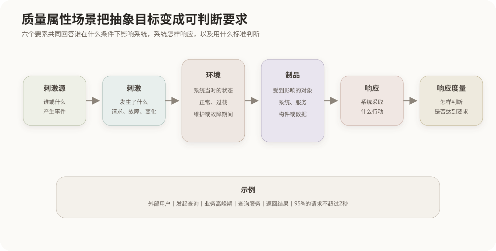

# 质量属性场景与效用树

本页承接[SEI架构质量属性体系](05-SEI架构质量属性体系.md)，讨论怎样把已经识别的重要架构质量属性转化为可判断的具体要求。

## 1. 从质量名称到可评价要求

“高性能”“高可用”“容易修改”只是质量方向，不能直接判断架构是否合格。同一名称在不同系统中可能代表完全不同的目标，因此需要用场景明确系统在特定条件下应当怎样响应。

```text
抽象目标：系统性能要好
具体场景：业务高峰期有1000个并发查询时，95%的请求在2秒内返回
```

场景不只用于性能。故障恢复、安全攻击、功能修改和测试定位都可以写成具有明确刺激与响应的质量属性场景。

## 2. 质量属性场景的六个要素



| 要素 | 含义 | 查询场景中的内容 |
|---|---|---|
| 刺激源 | 谁或什么产生事件 | 外部用户 |
| 刺激 | 发生了什么 | 发起查询请求 |
| 环境 | 事件发生时系统所处状态 | 业务高峰期、系统正常运行 |
| 制品 | 被刺激影响的系统部分 | 查询服务和数据库 |
| 响应 | 系统采取什么行动 | 接收请求并返回结果 |
| 响应度量 | 用什么标准判断响应 | 95%的请求不超过2秒 |

六要素不是要求每句话必须机械套用六个标题，而是检查场景是否具备足够信息。缺少环境或度量时，“快速响应”仍然无法验证；缺少制品时，也难以把要求映射到具体架构元素。

## 3. 通用场景与具体场景

通用场景描述某类质量属性普遍存在的刺激和响应。例如可修改性的通用形式是“有人提出变化，系统在限定成本内完成修改并通过验证”。具体场景则把人员、变化内容、系统部位和成本指标落实到当前项目。

```text
通用场景：开发人员修改系统功能，系统以有限工作量完成变化
具体场景：增加一种报表格式，在3个人日内完成且不修改计费模块
```

通用场景用于启发和检查遗漏，具体场景才能直接用于某个架构的分析。

## 4. 效用树

效用树把业务目标逐层分解为质量属性、属性细分和具体场景，树叶是可以评价的场景。

```text
系统效用
├── 性能
│   └── 查询延迟
│       └── 高峰期95%的查询在2秒内返回
├── 可用性
│   └── 故障恢复
│       └── 单节点失效后30秒内恢复服务
└── 可修改性
    └── 功能扩展
        └── 新增报表格式不超过3个人日
```

每个叶节点通常从两个维度排序：

- 重要性：该场景对业务成功有多重要；
- 实现难度或风险：当前架构满足它的不确定性有多高。

高重要性、高风险的场景应优先进入深入架构分析。效用树不是客观计算公式，而是让关键利益相关者显式表达优先级并形成共同分析范围。

## 5. 场景与架构的映射

场景确定“需要检验什么”，随后应沿场景执行路径或变化影响范围找到相关构件、连接件、部署节点和架构决策。运行时场景通常追踪请求、故障或攻击经过的路径；修改场景通常分析需要增加、删除或改变哪些架构元素。

## 核心关系

```text
质量属性名称
→ 只能表达方向

质量属性场景
= 刺激源 + 刺激 + 环境 + 制品 + 响应 + 响应度量
→ 形成可判断的架构要求

效用树
→ 把业务目标分解成具体场景
→ 按重要性和风险确定分析优先级
```
