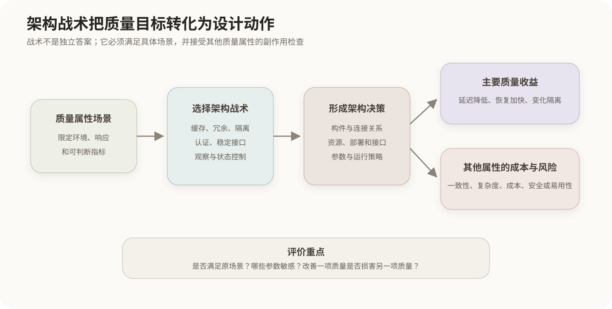

# 架构战术与质量属性实现

## 1. 架构战术的定位

架构战术是为影响某项质量属性而作出的基本设计决策。体系结构风格决定系统的大范围组织形式，战术更关注“为了改善某项质量，具体改变什么”。多个战术可以组合成一种架构方案，同一战术也可能出现在不同风格中。



## 2. 性能战术

性能关注延迟、吞吐量、截止时间和资源利用率。常见战术包括：

- 控制资源需求：缓存、减少计算、限制事件频率、提高算法效率；
- 管理资源：增加并行资源、连接池、线程池和负载均衡；
- 管理调度：优先级调度、资源仲裁和并发控制。

缓存可以减少访问延迟，却增加一致性、失效和容量管理成本；并行处理可以提高吞吐量，却可能引入竞争、同步和调度开销。

## 3. 可用性战术

可用性关注故障发生后服务能否继续提供以及多久恢复。常见战术包括：

- 故障检测：心跳、超时、健康检查和异常监控；
- 故障恢复：冗余、故障转移、重试、回滚、检查点和状态同步；
- 故障预防：隔离、资源配额、滚动升级和预测性维护。

冗余并不自动等于高可用。如果故障无法检测、备用节点没有一致状态或切换过程本身失效，增加副本仍不能满足恢复场景。

## 4. 安全性战术

安全战术围绕识别威胁、抵抗攻击、检测异常和恢复可信状态展开，包括身份认证、授权、最小权限、加密、完整性校验、隔离、审计、限流和密钥管理。安全控制往往增加计算、交互步骤或运维复杂度，因此需要同时检查性能和易用性影响。

## 5. 可修改性战术

可修改性关注变化影响的范围、工作量和引入缺陷的风险。常见战术包括：

- 局部化变化：高内聚、低耦合、信息隐藏和职责分离；
- 防止连锁影响：稳定接口、适配器、中介者和事件机制；
- 延迟绑定：配置、插件、依赖注入和运行时注册。

增加抽象层可以隔离变化，但抽象过多也会提高理解难度、调用开销和调试成本。

## 6. 可测试性与易用性战术

可测试性战术包括可观察接口、日志与追踪、状态控制、依赖替换、测试替身和自动化部署环境。易用性战术包括保持一致交互、撤销操作、及时反馈、错误预防、用户模型与系统状态分离。

这些战术仍需由场景限定。例如“便于测试”应进一步说明需要观察什么状态、怎样控制输入以及多长时间内定位故障。

## 7. 战术组合与副作用

架构决策常同时影响多个属性：

| 决策 | 主要收益 | 可能代价 |
|---|---|---|
| 缓存 | 降低延迟、减少后端负载 | 一致性和恢复复杂度增加 |
| 冗余副本 | 提高可用性和读取吞吐量 | 成本、同步和运维复杂度增加 |
| 加密与完整性校验 | 提升机密性和完整性 | 延迟和密钥管理成本增加 |
| 分层与稳定接口 | 隔离变化 | 调用链和转换开销增加 |
| 详细日志 | 提高可测试性和可审计性 | 存储开销及敏感信息泄露风险 |

战术本身不是固定答案。必须把战术放回具体场景，检查它是否满足响应度量，并分析由此产生的副作用。

## 核心关系

```text
质量属性场景
→ 明确需要达到的结果

架构战术
→ 控制影响质量属性的因素
→ 形成具体架构决策

一个决策可能改善某项质量
同时增加另一项质量的成本或风险
→ 需要架构权衡分析
```
