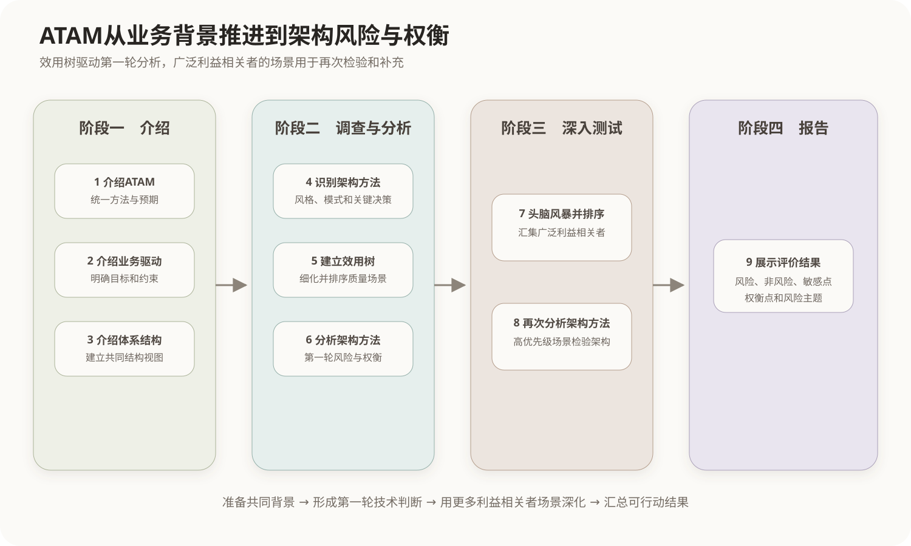
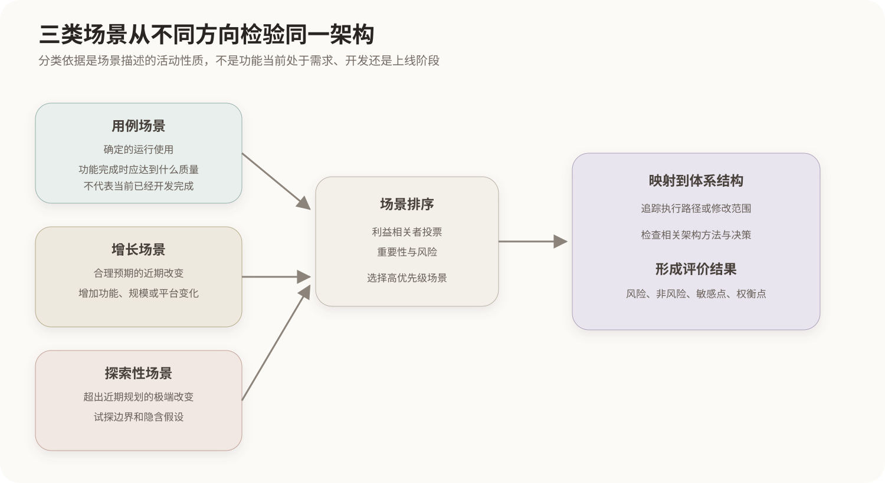

# ATAM体系结构权衡分析

## 1. ATAM的目标

ATAM全称Architecture Tradeoff Analysis Method，即体系结构权衡分析方法。它以业务目标和质量属性要求为依据，评价架构决策能否满足多个重要质量目标，并识别技术风险、敏感点和属性之间的权衡。

ATAM既包含单项质量分析，也包含多属性综合分析：单个场景把某项性能、可用性、安全性或可修改性要求说清楚；多个高优先级场景映射到同一组架构决策后，才能发现这些质量属性如何相互影响。

```text
具体场景 → 分析某项质量要求是否得到满足
多个场景 + 共同架构决策 → 分析质量属性之间的权衡
```

ATAM主要在架构层面进行推理，不等同于系统建成后的压力测试或验收测试。它可以评价候选架构、在建系统或已有系统的架构。

## 2. 输入与输出

主要输入包括业务目标、质量属性要求、体系结构描述、关键架构方法以及利益相关者的关切。典型输出包括：

- 高优先级质量属性场景和效用树；
- 架构方法及其分析记录；
- 风险点与非风险点；
- 敏感点与权衡点；
- 风险主题和需要进一步验证的问题。

非风险点只表示在当前场景和已知信息下，架构决策具有合理依据；它不是对整个系统“绝对安全”的保证。

## 3. 四个阶段与九个步骤



| 阶段 | 步骤 | 主要任务 |
|---|---|---|
| 介绍 | 1. 介绍ATAM；2. 介绍业务驱动因素；3. 介绍体系结构 | 建立共同背景和评价边界 |
| 调查与分析 | 4. 识别架构方法；5. 建立质量属性效用树；6. 分析架构方法 | 从关键人员视角形成第一轮优先场景和风险分析 |
| 深入测试 | 7. 头脑风暴并确定场景优先级；8. 再次分析架构方法 | 引入更广泛利益相关者并用高优先级场景检验架构 |
| 报告 | 9. 展示结果 | 汇总风险、敏感点、权衡点和后续行动 |

两次分析架构方法不是重复工作。第一次由效用树中的高优先级场景驱动；第二次使用更广泛利益相关者头脑风暴产生的高优先级场景，既验证第一次分析，也可能发现新的架构风险。

## 4. 效用树与场景头脑风暴

效用树主要由架构师、关键开发人员和主要决策者建立，把业务目标分解为质量属性和具体场景。场景头脑风暴则让用户、运维、开发、安全、管理等更广泛的利益相关者共同提出实际关切。

头脑风暴是ATAM的正式步骤，不是脱离评价流程的自由讨论。场景产生后，利益相关者通过投票或排序确定优先级；高优先级场景随后被映射到架构上继续分析。

```text
效用树：关键人员理解的架构驱动因素
头脑风暴：更广泛利益相关者提出的运行和变化场景
二者对照：确认共识并发现遗漏
```

## 5. 三类场景



### 5.1 用例场景

用例场景描述利益相关者如何使用完成并运行时的系统执行某项功能，以及系统应达到怎样的质量表现。这里的“完成并运行”是场景采用的观察视角，不代表评价发生时功能已经开发完成。

以产品规划视角理解，用例场景可以看作已经确定需要支持的功能及其运行质量要求：

```text
远程用户在业务高峰期查询报告，系统应在5秒内返回。
```

“用户查询报告”是功能交互，“业务高峰期”和“5秒内”把性能要求具体化。用例场景按照场景内容分类，不按照当前开发进度分类。

### 5.2 增长场景

增长场景描述合理预期的近期变化，包括增加功能、扩大数据和用户规模、迁移平台、集成其他系统等。它评价当前架构适应计划内或具有现实可能性的变化需要多少成本，以及变化后能否继续满足质量目标。

```text
预计数据量翻倍后，平均查询时间仍保持在2秒以内。
```

### 5.3 探索性场景

探索性场景使用明显超出近期规划的重大或极端变化，对架构进行压力式推演，用于暴露设计边界、隐含假设和潜在权衡。

```text
假设数据量扩大100倍，仍要求平均查询时间不超过2秒。
```

它不表示该需求已经进入开发计划，而是在询问如果未来发生这种变化，当前架构会在哪些位置失效、需要怎样重构。

三者的分类轴是场景对系统描述的活动性质：

```text
用例场景：确定的运行使用
增长场景：合理预期的改变
探索性场景：试探边界的极端改变
```

## 6. 场景映射与分析结果

高优先级场景选出后，评价人员把它映射到架构。用例场景通常追踪执行路径和运行资源；增长、探索性场景通常分析需要增加、删除或修改哪些构件、连接件、接口和部署节点。

- 风险点：某项架构决策可能使重要场景无法满足；
- 非风险点：架构决策在当前场景下具有充分、合理的处理方式；
- 敏感点：某个决策或参数的小幅变化会显著影响某项质量属性；
- 权衡点：同一个敏感点同时影响多个质量属性。

例如缓存容量是性能敏感点；如果它同时影响故障恢复、一致性和内存成本，就可能成为权衡点。敏感点不必然是缺陷，权衡点也不表示设计错误，它们提示决策需要明确依据和重点验证。

## 核心关系

```text
业务目标
→ 效用树与利益相关者头脑风暴
→ 用例场景、增长场景、探索性场景
→ 确定优先级并映射到架构
→ 分析架构方法和决策
→ 风险、非风险、敏感点、权衡点

单个场景：具体评价一个或若干质量要求
多个场景：发现共同架构决策对多种质量属性的影响
ATAM整体：评价架构的技术风险与质量属性权衡
```
