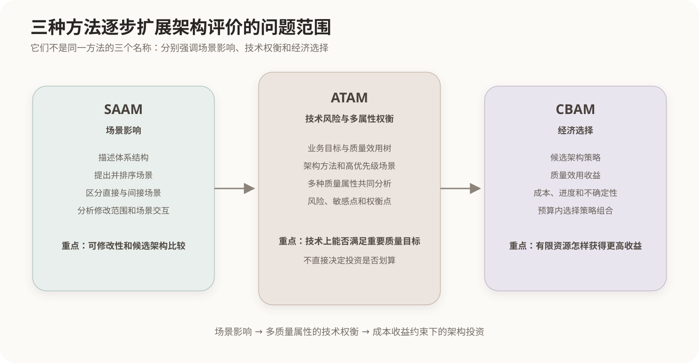

# SAAM与CBAM架构评估方法

## 1. 场景化架构评估方法

架构图只能说明系统由哪些元素构成，不能自动证明它容易修改、能够恢复或具有合理投资回报。SAAM、ATAM和CBAM都把场景或质量目标与架构决策联系起来，但解决的问题逐步扩展。



## 2. SAAM

SAAM全称Software Architecture Analysis Method，即软件体系结构分析方法。它以场景为基础分析体系结构，早期应用尤其重视可修改性，也可用于比较候选架构。

典型分析过程可以概括为：

1. 描述候选体系结构；
2. 提出并分类场景；
3. 为场景确定优先级；
4. 将场景映射到架构，分析直接场景和间接场景；
5. 评价场景之间的相互作用并形成总体判断。

直接场景不需要修改架构就能够支持；间接场景需要改变架构。若许多场景都要求修改同一构件，说明该构件集中了变化压力；若一个场景影响大量构件，则可能暴露较大的修改成本和耦合范围。

## 3. ATAM相对SAAM的扩展

ATAM继承了场景驱动的分析方式，并把重点扩展到多个质量属性、架构方法以及属性之间的权衡。它不仅询问“这个变化影响哪些构件”，还询问：

- 哪些业务目标驱动质量要求；
- 架构采用了什么方法满足这些要求；
- 哪些决策是风险点、敏感点或权衡点；
- 性能、安全、可用性和可修改性之间如何相互影响。

因此，SAAM更适合形成场景影响和可修改性分析的基础认识；ATAM适合对复杂系统进行多质量属性的技术风险和权衡评价。

## 4. CBAM

CBAM全称Cost Benefit Analysis Method，即成本效益分析方法。ATAM说明架构方案的技术收益、风险和质量影响，但资源有限时仍需决定哪些改进值得优先投资。CBAM把成本、收益、进度、风险和不确定性加入架构选择。

CBAM通常围绕以下对象展开：

- 业务目标和高优先级质量场景；
- 可选的架构策略；
- 每种策略对不同场景带来的效用变化；
- 实施成本、进度约束和估计的不确定性；
- 在预算范围内应选择的策略组合。

简化理解时，可以用收益成本比比较候选策略：

```text
收益成本比 = 预期效用收益 / 实施成本
```

真实CBAM还会考虑不同利益相关者对效用的判断、估算区间、风险和策略之间的依赖，并不是只按一个除法结果机械排序。

## 5. 三种方法的适用重点

| 方法 | 核心问题 | 主要分析对象 | 典型结果 |
|---|---|---|---|
| SAAM | 架构怎样响应使用和修改场景 | 场景对构件的影响、场景交互 | 修改范围、可修改性判断、候选架构比较 |
| ATAM | 架构能否满足多个质量目标，它们如何权衡 | 质量场景、架构方法和决策 | 风险、非风险、敏感点、权衡点 |
| CBAM | 有限预算下哪些架构策略更值得投入 | 策略的成本、收益、风险和进度 | 投资优先级和策略组合 |

三种方法不是同一问题的三个名称，也不要求每个项目依次完整执行。项目应根据评价目的、架构成熟度、参与者和成本选择适合的方法。

## 核心关系

```text
SAAM
→ 用场景观察架构影响
→ 重点理解修改范围和场景交互

ATAM
→ 扩展到多个质量属性
→ 识别技术风险、敏感点和权衡点

CBAM
→ 在技术分析上加入成本、收益、进度和不确定性
→ 支持有限资源下的架构投资选择

场景影响 → 技术权衡 → 经济选择
```
