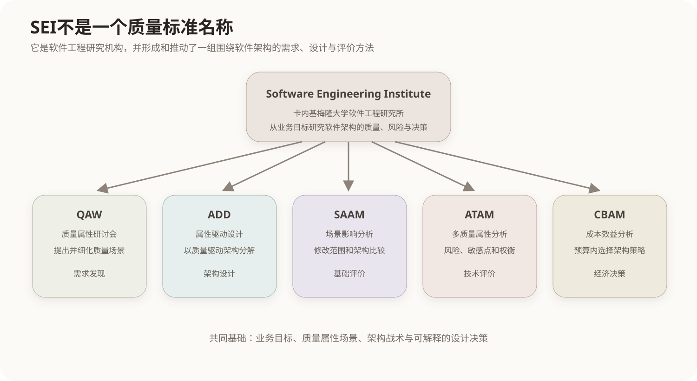
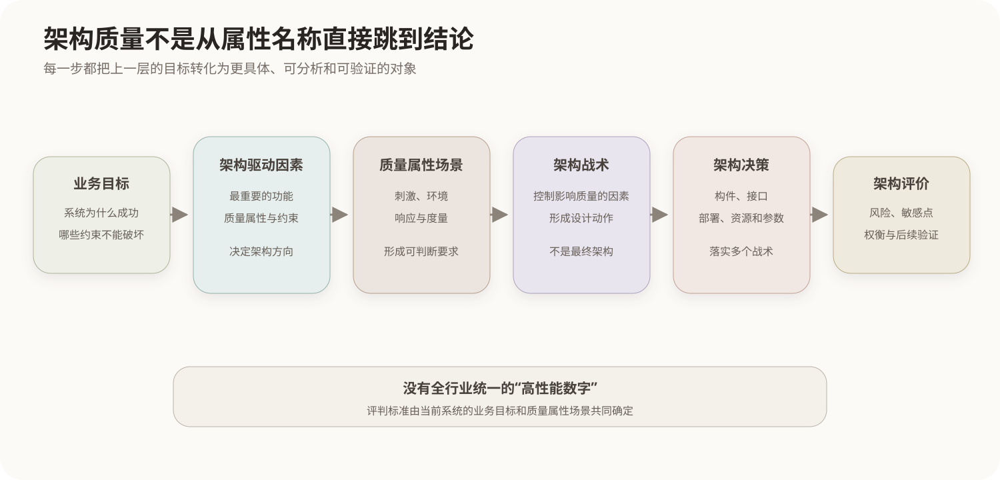
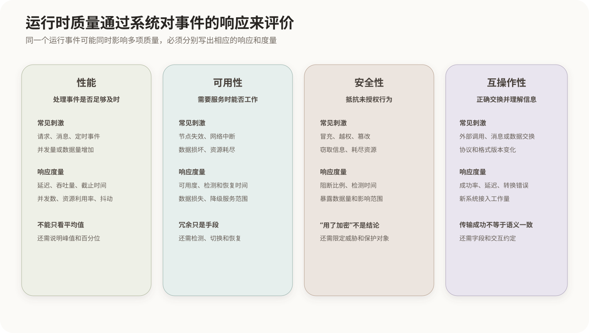
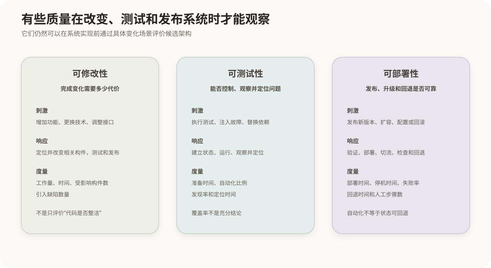
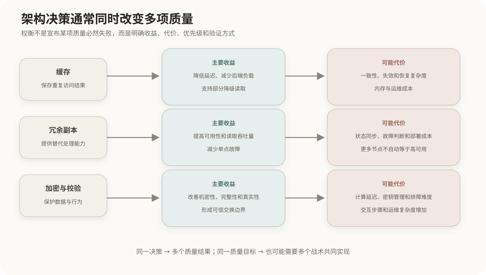
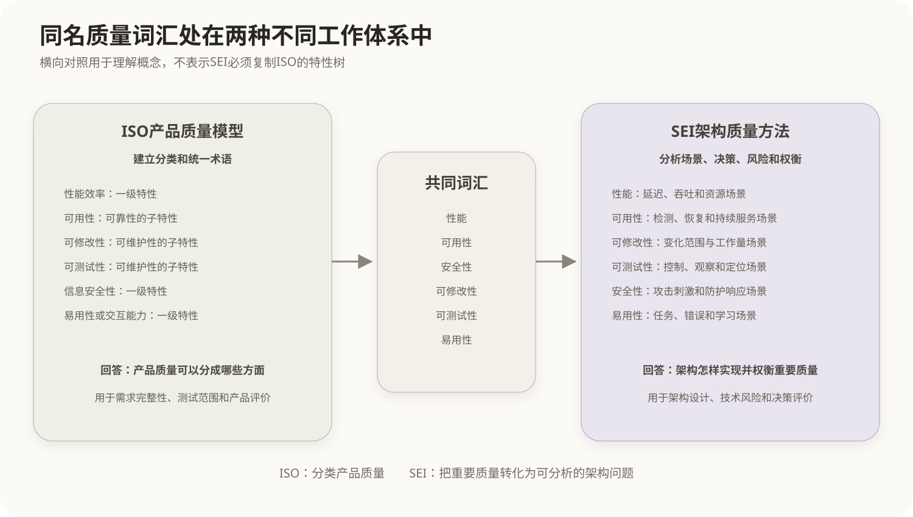

# SEI架构质量属性体系

## 1. SEI及其软件架构研究

SEI全称Software Engineering Institute，即软件工程研究所，由美国卡内基梅隆大学设立。SEI长期研究软件体系结构、软件工程过程和系统能力，形成或推动了质量属性场景、质量属性研讨会QAW、属性驱动设计ADD、SAAM、ATAM和CBAM等架构方法。



SEI不是软件质量标准的名称，也没有简单规定一张所有项目必须采用的固定质量属性清单。它的架构方法强调：从业务目标中找出真正驱动架构的质量要求，把要求写成具体场景，再分析架构决策、技术风险和属性权衡。

## 2. SEI怎样分析架构质量

架构质量属性描述的是架构需要支持的系统性质，例如性能、可用性、安全性和可修改性。只写属性名称无法评价架构，因为不同系统对“高性能”的要求并不相同。



SEI架构方法通常沿以下链条推进：

```text
业务目标
→ 识别架构驱动因素
→ 选择重要质量属性
→ 写成可判断的质量属性场景
→ 选择战术并形成架构决策
→ 评价风险、敏感点和权衡点
```

因此，质量属性的评判标准不是SEI为所有软件规定一个统一数字，而是针对当前系统，在场景中明确刺激、环境、响应和响应度量。

## 3. 运行时质量属性

运行时质量属性可以通过系统运行过程中发生的请求、故障、攻击和系统间交互观察。



### 3.1 性能

性能关注系统对事件的时间和资源响应。

| 分析内容 | 典型表达 |
|---|---|
| 刺激 | 请求、消息、定时事件或并发负载到达 |
| 环境 | 正常负载、业务高峰或资源受限状态 |
| 响应 | 处理事件、排队、分配资源并返回结果 |
| 响应度量 | 延迟、吞吐量、截止时间、并发数、资源利用率、抖动 |

“平均响应时间2秒”可能掩盖少量极慢请求，因此性能场景经常同时规定百分位延迟、峰值负载和持续时间。

### 3.2 可用性

可用性关注系统在需要时能否提供服务，以及故障发生后如何检测、隔离和恢复。

| 分析内容 | 典型表达 |
|---|---|
| 刺激 | 构件崩溃、节点失效、网络中断或数据损坏 |
| 环境 | 正常运行、过载、维护或故障恢复期间 |
| 响应 | 检测故障、限制影响、切换服务、修复并恢复状态 |
| 响应度量 | 可用度、检测时间、恢复时间、允许丢失的数据量、降级服务范围 |

可用性不是只看是否部署了备用节点。只有检测、状态同步、故障转移和恢复过程共同满足场景，冗余才产生实际效果。

### 3.3 安全性

安全性关注系统如何识别、抵抗、检测和恢复来自未授权主体的行为。

| 分析内容 | 典型表达 |
|---|---|
| 刺激 | 冒充身份、越权访问、篡改数据、窃取信息或耗尽资源 |
| 环境 | 正常运行、遭受攻击或部分防护失效 |
| 响应 | 认证、授权、阻断、隔离、记录、告警和恢复可信状态 |
| 响应度量 | 阻断比例、检测时间、暴露数据量、影响范围、恢复时间 |

“采用了加密”只是架构措施，不是完整安全结论。仍需说明保护什么数据、抵抗哪种刺激、密钥怎样管理以及攻击成功时影响多大。

### 3.4 互操作性

互操作性关注两个或多个系统能否正确交换信息，并对交换结果形成一致理解。

| 分析内容 | 典型表达 |
|---|---|
| 刺激 | 外部系统发起调用、发送消息或交换数据 |
| 环境 | 协议版本一致或不一致、网络正常或受限 |
| 响应 | 发现服务、建立连接、转换数据并完成协作 |
| 响应度量 | 成功交换比例、处理延迟、转换错误率、接入工作量 |

能够传输字节并不自动表示具有互操作性。双方还需要对数据结构、字段含义、错误处理和交互协议形成一致约定。

## 4. 开发与演化质量属性

这类属性主要在修改、测试、集成和部署过程中观察，不一定需要系统已经上线运行。



### 4.1 可修改性

可修改性关注完成变化需要付出的时间、人员工作量和影响范围。

| 分析内容 | 典型表达 |
|---|---|
| 刺激 | 增加功能、修改规则、更换技术或调整接口 |
| 环境 | 设计期、开发期、部署前或运行期 |
| 响应 | 定位修改点，改变、测试并发布相关构件 |
| 响应度量 | 工作量、日历时间、受影响构件数、引入缺陷数 |

可修改性不是“代码看起来整洁”，而是某类实际变化能否在限定成本内完成。不同变化可能得到完全不同的评价结果。

### 4.2 可测试性

可测试性关注测试人员能否控制输入和系统状态、观察输出和内部行为，并有效发现和定位故障。

| 分析内容 | 典型表达 |
|---|---|
| 刺激 | 执行测试、注入故障、替换依赖或复现异常 |
| 环境 | 单元、集成、系统或生产诊断环境 |
| 响应 | 建立测试状态、运行测试、观察结果并定位问题 |
| 响应度量 | 测试准备时间、自动化比例、缺陷发现率、定位时间 |

代码覆盖率只能说明测试执行过哪些结构，不能单独证明测试能够发现重要缺陷。

### 4.3 可部署性

可部署性关注软件从构建成果进入目标环境，以及升级、回退和重新部署的难度。

| 分析内容 | 典型表达 |
|---|---|
| 刺激 | 发布新版本、修改配置、执行回滚或扩容 |
| 环境 | 测试、灰度、生产或部分节点运行状态 |
| 响应 | 验证制品、部署、切换流量、检查健康并回退 |
| 响应度量 | 部署时间、停机时间、失败率、回退时间、人工步骤数 |

自动化部署可以减少人工错误，但如果制品不可复现、状态迁移不可回退，仍然难以获得稳定的可部署性。

## 5. 用户使用相关质量属性

### 5.1 易用性

易用性关注特定用户能否理解系统反馈、学习操作并有效完成任务。

| 分析内容 | 典型表达 |
|---|---|
| 刺激 | 用户学习功能、执行任务、发生误操作或请求帮助 |
| 环境 | 初次使用、熟练使用、时间压力或辅助访问环境 |
| 响应 | 提供反馈、阻止危险操作、允许撤销并引导完成任务 |
| 响应度量 | 任务完成率、完成时间、错误率、学习时间、满意度 |

界面美观可能改善感受，但易用性评价仍需观察用户能否正确、高效地完成任务。

## 6. 质量属性之间的权衡

架构决策很少只影响一个属性。同一项设计的主要收益和副作用必须同时分析。



| 架构决策 | 主要改善 | 可能带来的代价 |
|---|---|---|
| 缓存 | 性能、可用性中的降级读取能力 | 一致性、恢复复杂度和内存成本 |
| 冗余副本 | 可用性、读取性能 | 成本、同步复杂度和故障判断难度 |
| 加密和完整性校验 | 安全性 | 延迟、资源消耗和密钥管理成本 |
| 分层与稳定接口 | 可修改性、可测试性 | 调用链、转换开销和理解成本 |
| 详细日志和追踪 | 可测试性、可审计性 | 性能、存储成本和敏感信息泄露风险 |

权衡不表示必须在两个质量属性中放弃一个，而是要求明确当前业务目标、优先级、可接受代价和验证方式。

## 7. SEI架构质量与ISO产品质量的横向对照



ISO产品质量模型和SEI架构方法会使用许多相同或相近的质量名称，因为它们观察的是同一系统的不同层面。

| ISO产品质量模型中的位置 | SEI架构分析中的使用方式 |
|---|---|
| 性能效率是一级产品质量特性 | 性能直接成为架构驱动因素并写成延迟、吞吐场景 |
| 可用性属于可靠性的子特性 | 可用性常被独立分析故障检测、恢复和持续服务 |
| 可修改性属于可维护性的子特性 | 可修改性直接驱动模块、接口、依赖和绑定时机 |
| 可测试性属于可维护性的子特性 | 可测试性直接驱动可观察性、状态控制和依赖替换 |
| 信息安全性是产品质量特性 | 安全性通过攻击刺激、系统响应和安全战术分析 |
| 易用性或交互能力是产品质量特性 | 易用性通过用户任务、反馈、错误和学习指标分析 |

横向对应用于解释共同概念，不表示SEI必须复制ISO的层级。ISO主要为产品质量建立分类和统一术语；SEI架构方法把对当前系统重要的质量要求转化为场景、战术和架构评价问题。

## 核心关系

```text
SEI
→ 软件工程研究机构
→ 形成和推动多种软件架构方法

SEI架构质量方法
→ 不依赖一张固定属性清单
→ 从业务目标识别当前系统的架构驱动因素
→ 用场景规定刺激、环境、响应和度量
→ 用战术和架构决策实现质量要求
→ 用ATAM等方法评价风险和权衡

ISO产品质量模型
→ 对产品质量进行分类

SEI架构质量分析
→ 解释架构怎样实现和权衡重要质量
```

## 参考资料

- [CMU SEI：Architecture Tradeoff Analysis Method Collection](https://insights.sei.cmu.edu/library/architecture-tradeoff-analysis-method-collection/)
- [CMU SEI：ATAM Method for Architecture Evaluation](https://www.sei.cmu.edu/library/atam-method-for-architecture-evaluation/)
- [CMU SEI：Evaluating System Architecture](https://www.sei.cmu.edu/history-of-innovation/evaluating-system-architecture/)
