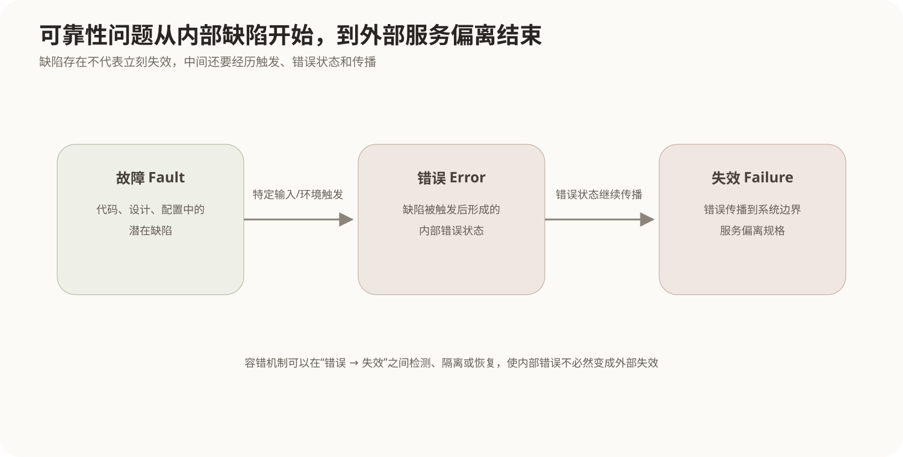
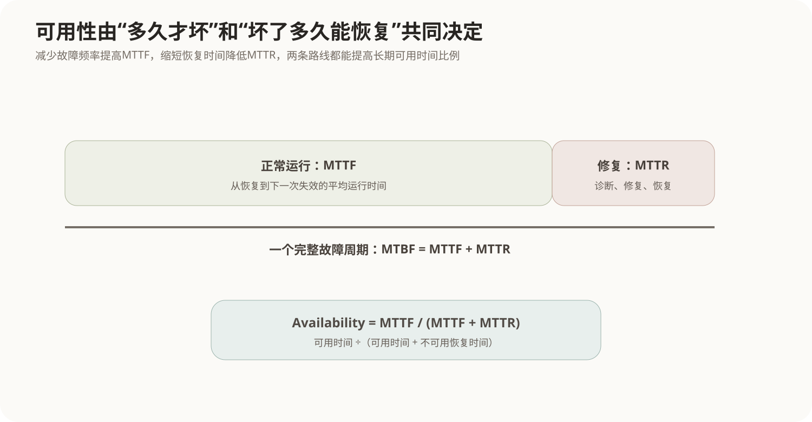
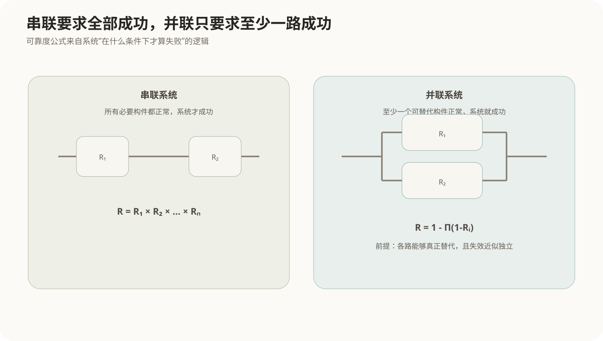

# 软件可靠性基础与计算

## 1. 可靠性关心的不是“有没有Bug”，而是运行时会不会失效

软件可靠性通常描述为：在**规定条件、规定时间内**，软件无失效运行的概率。

这一定义里有三个不能省略的部分：

- **规定条件**：同一软件在不同输入、负载、硬件和外部依赖下，失效概率可能不同；
- **规定时间**：运行1分钟不失效和连续运行1年不失效不是同一个要求；
- **无失效运行**：评价的是外部可观察服务是否保持正确，而不是代码里是否潜藏缺陷。

软件和硬件还有一个重要差别：硬件会因为物理磨损出现老化，软件本身不会因为多执行几次就“材料疲劳”。软件失效通常来自设计或实现中已经存在的缺陷，被某种输入和运行环境触发；修改软件虽然可以修复缺陷，也可能引入新的缺陷。

因此软件可靠性工程的核心是：识别可能导致失效的缺陷和条件，并通过设计、测试、冗余、隔离和恢复机制控制失效发生及其影响。

## 2. 故障、错误与失效是一条因果链

可靠性术语容易混淆，是因为它们描述的是同一问题的不同阶段。



### 2.1 故障 Fault

故障也常被理解为缺陷，是软件设计、代码或配置中潜在的问题。例如：

```text
数组边界判断写错
并发锁顺序设计错误
金额使用错误精度类型
```

故障可以长期存在而没有立即表现出来。

### 2.2 错误 Error

当某个故障被特定输入或运行条件触发后，系统内部状态可能变得不正确，这种错误状态称为Error。

例如越界缺陷只有在输入长度超过某个值时才触发；触发以后内存中的状态已经异常，但外部用户可能还没有立刻看到错误结果。

### 2.3 失效 Failure

当内部错误状态传播到系统边界，导致服务行为偏离规格，就形成失效，例如：

- 返回错误金额；
- 服务崩溃；
- 请求永久无响应；
- 数据没有按要求保存。

可以把因果关系写成：

```text
故障存在
  ↓ 特定条件触发
内部错误状态
  ↓ 传播到系统边界
外部可观察失效
```

并不是所有故障每次都会变成失效，也不是所有内部错误都会传播到外部。容错技术的一个目标就是阻止错误继续传播。

## 3. 可靠性、可用性和可维护性不是同一个指标

### 3.1 可靠性 Reliability

可靠性关注系统在一段运行时间内**不发生失效**的能力。例如一个控制系统要求连续运行24小时不发生危险失效。

### 3.2 可用性 Availability

可用性关注系统在需要提供服务时**处于可服务状态的比例**。一个系统可以偶尔发生故障，但如果恢复极快，长期可用性仍然可能很高。

### 3.3 可维护性 Maintainability

可维护性关注系统发生问题后，诊断、修复、修改和恢复是否容易。它会影响平均修复时间，从而进一步影响可用性。

所以：

```text
可靠性：多久才坏一次
可维护性：坏了以后多快修好
可用性：长期看有多少时间能用
```

## 4. MTTF、MTTR与MTBF怎样串起来



### 4.1 MTTF

MTTF（Mean Time To Failure）表示平均无故障运行时间，即从开始正常运行到发生失效平均能运行多久。

### 4.2 MTTR

MTTR（Mean Time To Repair）表示发生失效后平均需要多长时间恢复服务。

### 4.3 MTBF

对可修复系统，MTBF（Mean Time Between Failures）通常可以理解为从一次恢复到下一次恢复之间的平均周期：

```text
MTBF = MTTF + MTTR
```

有些工程资料会把MTBF近似当作平均正常运行时间使用，尤其当MTTR相对于MTTF很小时。做计算时应以题目给出的定义为准；在严格区分运行和维修时间的模型中，上面的关系更清楚。

## 5. 稳态可用性怎样计算

若系统长期反复经历“正常运行 → 故障 → 修复 → 再运行”，可用时间比例近似为：

```text
A = MTTF / (MTTF + MTTR)
  = MTTF / MTBF
```

例如：

```text
MTTF = 1000小时
MTTR = 10小时
```

则：

```text
A = 1000 / 1010 ≈ 0.9901
  ≈ 99.01%
```

如果保持MTTF不变，把MTTR从10小时降到1小时：

```text
A = 1000 / 1001 ≈ 99.90%
```

这个例子说明：提高可用性既可以减少故障发生，也可以让故障更快被检测和恢复。

## 6. 可靠度R(t)描述“运行到t仍未失效”的概率

可靠度函数`R(t)`表示系统在时间区间`[0,t]`内保持无失效运行的概率。

在一个常见的简化模型中，如果失效率`λ`近似恒定，则：

```text
R(t) = e^(-λt)
```

相应的平均失效前时间：

```text
MTTF = 1 / λ
```

例如平均每1000小时发生一次失效，在指数分布的简化假设下：

```text
λ = 1/1000 每小时
R(100) = e^(-0.1) ≈ 0.9048
```

这里的恒定失效率是数学模型假设，不代表所有真实软件都严格服从指数分布。真实软件的失效率会随版本、输入分布、修复和运行环境变化。

## 7. 串联系统为什么越串越不可靠

当系统只有**所有构件都正常**才能提供服务时，可以把它抽象成串联系统。

如果各构件失效近似独立，系统可靠度为：

```text
Rseries = R1 × R2 × ... × Rn
```

例如两个必要构件可靠度分别为0.99和0.98：

```text
R = 0.99 × 0.98 = 0.9702
```

虽然每个构件都接近99%，整个链路的可靠度却下降了，因为任意一个失败都会导致系统失败。

## 8. 并联系统为什么可以用冗余提高可靠性

如果多个构件中**只要至少一个正常**就能维持服务，可以抽象为并联系统。

系统失效的条件是所有并联构件同时失效，因此：

```text
Rparallel = 1 - (1-R1)(1-R2)...(1-Rn)
```

两个可靠度都为0.9的独立构件并联：

```text
R = 1 - 0.1×0.1 = 0.99
```



但是“部署两台服务器”并不自动获得这个0.99。并联模型隐含关键假设：两份能力能够真正互相替代，而且失效近似独立。如果两台机器共用同一电源、数据库或错误配置，它们可能一起失败，冗余收益会远低于简单公式。

## 9. 冗余怎样从硬件延伸到软件

可靠性设计的基本思路之一是避免单点失效：

- 多实例服务和故障切换；
- 数据副本；
- 备用网络链路；
- 超时、重试和隔离；
- 检查点和恢复；
- 软件多版本设计等。

### 9.1 N版本程序设计

由相互独立开发的多个软件版本处理相同输入，再通过表决器决定结果。它希望降低单个实现缺陷导致错误结果的概率。

真正的难点是“独立失效”并不容易保证。如果不同团队都根据同一份有歧义的需求设计，可能产生相同逻辑错误。

### 9.2 恢复块 Recovery Block

系统先执行主版本，再用验收测试检查结果；如果不满足条件，则回退状态并执行备用版本。

它的核心是：

```text
主方案 → 验收检查
            ↓失败
         状态恢复 → 备用方案
```

N版本强调并行或多版本表决，恢复块强调主备顺序和验收测试。

## 10. 可靠性测试与普通功能测试的关系

功能测试主要验证某个功能在具体输入下是否符合要求；可靠性测试更关注在给定运行剖面和持续运行条件下，失效发生的频率和模式。

例如“登录功能输入正确密码能成功”属于功能验证；按照真实用户访问比例连续运行系统、统计一段时间内出现多少次失效，则更接近可靠性测试。

完整测试分类见[软件测试方法与分类](../05-软件工程基础/07-软件测试方法与分类.md)。

## 11. 核心关系

```text
故障 Fault
  ↓ 被触发
错误 Error
  ↓ 传播到系统边界
失效 Failure

MTTF：平均正常运行多久才失效
MTTR：失效后平均多久恢复
MTBF = MTTF + MTTR
可用性 A = MTTF / (MTTF + MTTR)

串联：所有都正常才成功
R = ΠRi

并联：至少一个正常即可成功
R = 1 - Π(1-Ri)

提高可靠性：减少故障、阻止错误传播、消除单点失效
提高可用性：还可以通过缩短检测与恢复时间实现
```
