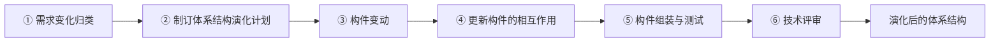

# 软件体系结构演化

## 1. 软件为什么必须演化

软件交付后并不会静止，它会持续面对四类压力：

- **业务变化**：增加新功能、调整既有流程；
- **环境变化**：操作系统升级、硬件换代、需要接入新的外部系统；
- **缺陷暴露**：运行后才发现的问题需要修复；
- **质量要求提高**：性能、可靠性、安全性达不到新的要求。

Lehman 的软件演化法则指出：一个被真实使用的系统必须不断演化，否则就会失效；同时，随着演化进行，系统的复杂度会不断增加，除非投入专门的工作去控制它。这两条法则构成了本章全部内容的出发点：演化不可避免，演化必须被管理。

一个常被引用的事实是：**维护阶段的成本占软件全生命周期成本的 60%～70% 以上**，维护是持续时间最长、花费最大的阶段。这正是"可维护性"成为重要软件质量属性的原因（见 [软件产品质量模型](../05-软件工程基础/06-软件产品质量模型.md)）。

## 2. 两个视角：软件维护与软件演化

面对"软件交付后持续被修改"这同一件事，软件工程发展出两个互补的视角，先分清它们，后面的概念才不会混。

### 软件维护

维护是标准中的正式概念：软件交付后，为修正错误、改善性能或适应环境变化而进行的修改活动。它按**修改的动机**分为四类：

| 维护类型 | 触发原因 | 通俗理解 |
|---|---|---|
| 改正性维护 | 发现并修复缺陷 | 治病 |
| 适应性维护 | 外部环境变化（OS、硬件、法规、对接系统） | 适应搬家 |
| 完善性维护 | 用户提出新需求、要求改善功能或性能 | 改善生活 |
| 预防性维护 | 主动重构、提高可维护性，防止将来出问题 | 体检养生 |

### 软件演化

演化是更宏观的视角：把软件看作随时间不断生长的有机体，关注**版本之间的延续关系**以及**架构在多次修改中的变化轨迹**。

两者的关系：

```text
维护：关注单次修改活动 —— 这次改什么、属于哪一类。
演化：关注跨越多次修改的长期过程 —— 系统整体如何随时间变化。
```

维护回答"为什么改、改了什么"，演化回答"系统在一次次修改中走向何方"。本章的主角——体系结构演化——就是演化视角落在体系结构层面上的具体形态。

## 3. 体系结构演化的概念与判定

### 体系结构三要素

体系结构由三部分组成：

```text
体系结构 = 构件（Component）+ 构件间的交互关系（Connector/Interaction）+ 约束（Constraint）
```

这三要素是理解一切体系结构问题的根：构件是系统的功能单元，交互关系（连接件）规定构件之间如何调用、传递数据和协作，约束规定整体结构必须满足的规则。

### 什么是体系结构演化

**体系结构演化**是为适应需求和环境变化，对系统的构件、构件之间的交互关系及其约束所进行的**体系结构级别**的修改过程。

判定一次修改是否属于体系结构演化，标准只有一条：**系统的骨架有没有动**。

```text
改一个函数的实现            → 代码级修改，体系结构不动
改一个构件的内部逻辑         → 构件级修改，体系结构基本不动
增删构件、改变构件间调用关系 → 体系结构演化
```

体系结构之所以被单独拿出来管理，是因为它是**全局契约**：一个构件的改动会沿着连接关系传导到很远的地方，影响面远超代码级修改。

### 演化失控的两个恶果

如果体系结构修改"想到哪改到哪"，会出现两个经典问题，它们是演化流程存在的直接理由：

- **架构侵蚀（Architectural Erosion）**：实际实现逐渐偏离设计时的体系结构，文档与代码脱节，"图纸还是那张图纸，楼已经不是那栋楼"；
- **架构漂移（Architectural Drift）**：修改过程中逐渐混入不属于原设计的结构和连接，架构越来越乱，可理解性和可维护性持续下降。

对抗这两个问题，需要的不只是良好的愿望，而是一个**有计划的、分步骤的、有验证有评审**的规范流程。

## 4. 体系结构演化的 6 步流程

规范流程按"规划 → 执行 → 验证"三段展开，共 6 个步骤，每一步都是下一步的前提：



### 第 1 步：需求变化归类

收到的变更请求是杂乱的，先分类：是功能性变化还是质量性变化？是局部影响还是全局影响？对应到体系结构的哪些元素？

归类的结果决定演化的范围——小变化可能只动一个构件，大变化可能要动连接结构。不归类就谈不上计划，所以它是整个流程的入口。

### 第 2 步：制订体系结构演化计划

基于归类结果评估：动哪些构件、动哪些连接、工作量多大、风险在哪、如何回退，形成正式的演化计划。

这一步同时承担着**事前把关**的职责：计划需要经过方案层面的评审才能执行，"要不要这么改、改动范围是否合理"这个最大的决策在动手之前就被审过。计划还会控制单次演化的规模，把大变化分解为小步、增量的修改，降低整体风险。

### 第 3 步：构件变动

对构件个体执行修改、增加、删除。这一步改的是**构件自身**——它的功能、实现和接口。

注意对照三要素公式：构件变动只完成了"构件"这一项，等号右边的"交互关系"还没有处理。

### 第 4 步：更新构件的相互作用

构件变动之后，构件之间的调用关系、接口契约、数据交互往往还停在旧状态。例如一个构件的接口改了，所有按老接口调用它的构件都需要调整；新增了构件，就要建立它与既有构件的连接。

这一步把**构件之间**的那一层同步更新，使"构件"和"交互关系"重新构成一个自洽的整体。它是体系结构演化区别于单纯代码修改的关键一步：代码级修改改完构件就结束了，体系结构级修改还必须处理构件之间的关系，否则系统只是"一堆各自改过的零件"，而不是一个结构一致的系统。

### 第 5 步：构件组装与测试

把变动后的构件按更新后的体系结构组装成完整系统，进行集成测试，验证整体行为正确、满足演化目标。

组装与测试绑定的原因是：体系结构级修改的缺陷绝大多数出在构件的**衔接处**而非构件内部——单个构件测试通过不代表协作正确，必须整体组装后才能暴露这类问题。

### 第 6 步：技术评审

由相关人员对演化结果做正式评审：是否实现了归类的需求变化？架构是否仍然一致、合理、可维护？文档是否同步更新？评审通过后结果固化，产出**演化后的体系结构**，作为下一轮演化的新基线。

## 5. 为什么评审放在最后：两道关口的分工

"评审放在最后"常被质疑：演化都完成了才评审，推翻重来岂不是浪费？这个质疑的答案是——**演化流程中其实有两道关口，职责不同**：

```text
归类 → 计划 ──→ 方案把关：要不要这么改？（第 2 步内部）
                     │
构件变动 → 更新相互作用 → 组装测试 ──→ 技术评审：改对了没有？（第 6 步）
```

- **事前把关（计划评审）**：防止"做错的事"。方案在动手前经过评审，方向上的大决策不会等到完工才讨论。
- **事后把关（技术评审）**：防止"把事做错"。方案正确不等于实现正确——接口改得与方案不一致、顺手加入方案外的临时连接、文档没有同步更新，这些执行偏差只有审查结果才能发现。

这和"设计评审之后仍然要测试、编码之后仍然要代码评审"是同一个质量逻辑：**人的执行必然偏离方案，任何工程体系都是事前定方案、事后验结果的双重把关。**

成本上也并非"不过就全部推翻"：第 2 步的计划已经把演化分解为小步增量，评审发现问题时通常只需局部返工，或记录下来纳入下一轮演化计划。真正导致"大量工作作废"的，恰恰是缺少流程约束、一口气乱改到底的项目。

技术评审还有一个收尾职责：**固化基线**。评审通过后，新的体系结构才被正式接受，系统状态从"改了但未确认"转为确定，下一轮演化才有明确的出发点。评审是把一轮演化闭环的动作。

## 6. 容易混淆的相邻概念

下列概念都"听起来很软件工程"，常作为干扰项出现。辨析的关键是分清它们各自的范畴：

| 概念 | 所属范畴 | 与演化 6 步流程的关系 |
|---|---|---|
| 构件版本管理 | 软件配置管理（SCM） | 贯穿全过程的**支撑性管理活动**，负责记录构件各版本、基线和变更历史；它像流程旁边一直开着的"档案室"，不是流程中的一个步骤 |
| 接口设计/调整 | 构件级设计 | 是构件变动（第 3 步）中处理的**局部设计细节**，粒度在单个构件的对外契约上；第 4 步"更新构件的相互作用"是体系结构层面的全局动作，范围比调接口大得多 |
| 需求验证/确认 | 验证与确认（V&V） | 分布在流程后段的**组装测试**和**技术评审**中体现，不是一个独立的中间步骤 |
| 维护四分类 | 软件维护（动机分类） | 回答"为什么要改"；演化 6 步流程回答"具体怎么改"，两者是动机与过程的关系 |

一句话区分：**版本管理管历史，接口调整管局部，需求验证管结果，维护分类管动机——它们都围绕演化流程工作，但都不是流程链条上的一步。**

## 7. 演化的方式：静态演化与动态演化

除了流程维度，演化还有一个时机维度：

- **静态演化**：系统停机后进行修改，改完重新部署启动。成本最低，绝大多数软件采用这种方式，第 4 节的 6 步流程就是静态演化的规范过程。
- **动态演化**：系统在**运行时**在线修改体系结构——增删构件、改变连接——而不中断服务。电信、金融等关键系统需要这种能力，涉及运行时体系结构模型、修改期间的一致性保障等复杂机制，是体系结构研究的前沿方向。

判断标准很直接：**演化期间系统是否持续对外提供服务**。停机改是静态，在线改是动态。

## 核心结论

```text
维护视角：单次修改的动机分类 —— 改正性、适应性、完善性、预防性
演化视角：系统跨越多次修改的长期变化过程
体系结构 = 构件 + 构件间的交互关系 + 约束
体系结构演化的判定：骨架（构件划分与连接关系）是否改变
演化失控的两个恶果：架构侵蚀（实现偏离设计）、架构漂移（混入计划外结构）

演化 6 步流程（顺序即考点）：
需求变化归类 → 制订演化计划 → 构件变动 → 更新构件的相互作用
→ 构件组装与测试 → 技术评审 → 演化后的体系结构

两道把关：计划评审防"做错的事"，技术评审防"把事做错"并固化基线
干扰项定位：版本管理属配置管理，接口调整属构件级局部设计，
           需求验证落在测试与评审环节
演化方式：停机改是静态演化，运行中在线改是动态演化
```

相关章节：[软件产品质量模型](../05-软件工程基础/06-软件产品质量模型.md)（可维护性）、[软件体系结构风格](../09-系统架构设计基础/01-软件体系结构风格.md)（被演化的对象）、[软件生命周期与过程模型](../05-软件工程基础/01-软件生命周期与过程模型.md)（演化型原型与迭代交付）。
