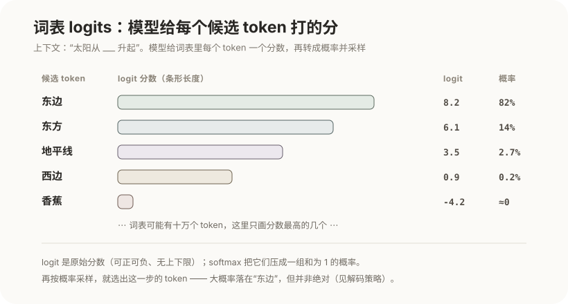
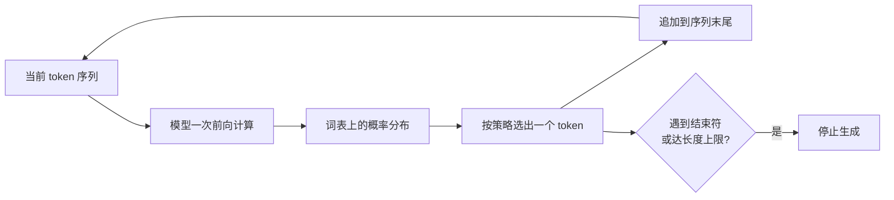
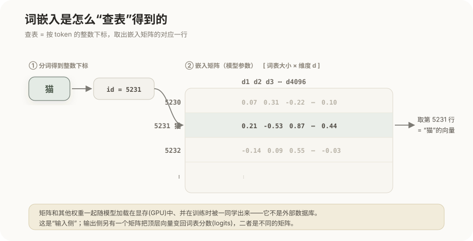
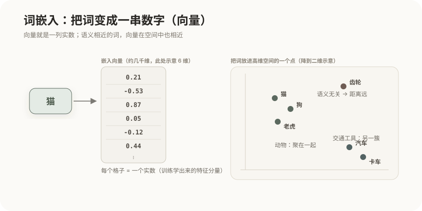
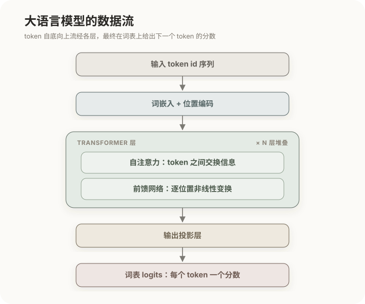
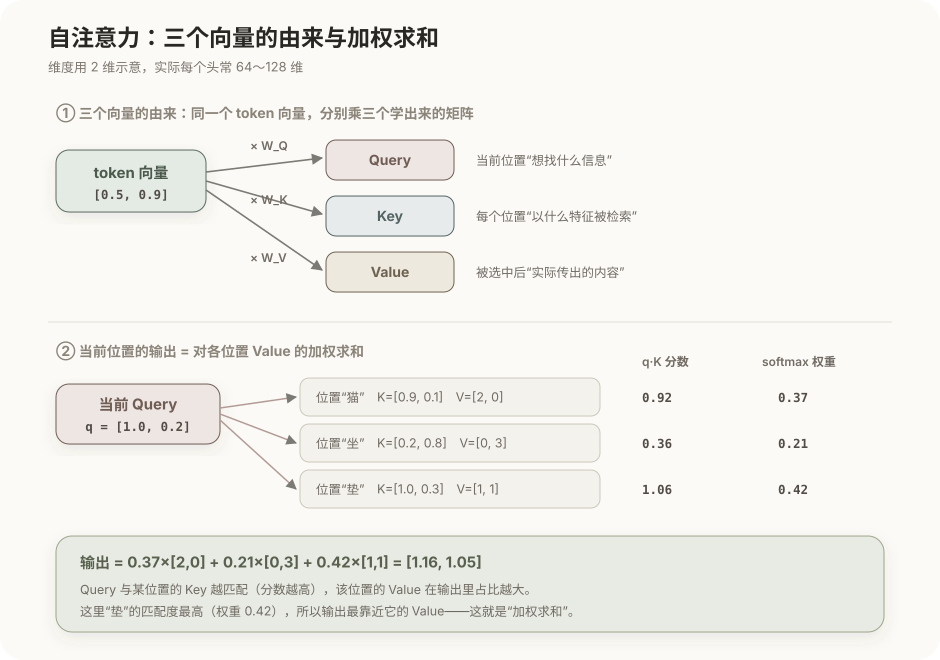

# 大语言模型的工作原理

大语言模型（LLM）看起来会对话、会写代码、会推理，但它内部只做一件事：根据已有的一段文本，预测下一个 token 的概率分布。本章从这个唯一的机制出发，一步步搭到"它为什么能表现出智能、又为什么有那些固有毛病"。理解这条链路，后面所有 Agent 概念才有根基——因为 Agent 不过是把这个"预测下一个 token"的函数放进循环、接上工具而已。

## 1. 语言模型的本质

给定前面已有的 token 序列，模型输出下一个 token 的条件概率分布，记作 `P(下一个 token | 前面所有 token)`。这个分布覆盖整个词表：词表里每一个 token 都分到一个概率。这个"概率分布"具体长什么样？就是给词表里每个候选 token 打一个分数（叫 **logit**），分数再归一化成概率：

模型不是"想好一整句再输出"，而是一次只预测一个 token，选定后把它拼回输入，再预测下一个，如此循环。这种"用自己刚生成的输出作为下一步输入"的方式叫**自回归生成**：

一个只会"预测下一个词"的函数，为什么能写代码、能推理？因为要在海量文本上把下一个词预测得足够准，模型被迫在参数里压缩进语法、事实、代码结构、乃至一定的推理模式——这些能力不是被显式编程进去的，而是"为了预测得准"这一个目标逼出来的副产品。这也解释了它的两面性：表现像理解，本质却是统计拟合，没有独立的事实库或执行引擎在背后兜底。

从这个循环里先记住三个后果，它们会贯穿全章、也贯穿后面每一篇：生成是**逐 token、不可跳跃**的（所以有延迟、能流式输出）；模型每一步都要重新处理整段上下文（所以长上下文既贵又需要缓存优化）；模型一次能看到的长度有**固定上限**（所以需要上下文工程）。

## 2. 分词与词表

上一节说模型处理的是 token 而不是文字，那 token 到底是什么？模型不认识字符或单词，它认识的是**词表**里的离散单元——token。分词器用 BPE 这类子词算法把文本切成这些单元。

为什么切成"子词"而不是按整词或按单字？这是一个权衡：词表若以整词为单位会爆炸式膨胀，还永远盖不全新词、拼写变体；若以单字为单位，序列又太长、丢掉词的整体性。子词是折中——高频词保留为一个 token，低频词拆成若干可复用的片段，既控制住词表规模，又不会遇到"没见过的词"。

| 文本 | 大致切分 | token 数 |
|---|---|---|
| `hello` | `hello` | 1 |
| `tokenization` | `token` + `ization` | 2 |
| `你好世界` | `你` `好` `世` `界` | 3～4 |

这带来几个直接影响工程的事实，后面讲成本和上下文时会反复用到：

- token 不等于字或词。英文平均约 4 个字符一个 token，中文常是一字一到多个 token。**同一句话在不同语言下占用的 token 数不同，成本也不同**。
- 模型的输入长度、输出长度、计费全部以 token 计，而不是字符数或字数。
- 词表是固定的。模型"看到"的世界，就是这些 token 的排列组合；词表外的东西它无法直接表示。

## 3. 词嵌入与向量空间

token 是离散的符号，而神经网络只能做连续的数值运算——中间需要一次转换：把每个 token 变成一个高维向量，称为**词嵌入**（embedding）。这个转换靠"查表"，原理很朴素。

模型里存着一张巨大的**嵌入矩阵**，形状是 `[词表大小 × 维度 d]`——词表里有多少个 token，它就有多少行，每行是一个 d 维向量。分词器先给每个 token 分配一个整数下标（它在词表里的序号），"查表"就是**按这个下标取出矩阵对应的那一行**，那一行就是该 token 的嵌入向量。

举例来说，token"猫"的下标是 5231，它的嵌入就是嵌入矩阵的第 5231 行，比如 `[0.21, -0.53, 0.87, …, 0.44]`。所谓"查表映射"，本质就是一次按下标取行，没有别的玄机。

这张表在哪、是什么？它是**模型参数的一部分**——和注意力里的 W_Q、W_K 这些权重一样，都是训练时被一同学出来的数字，随模型一起加载进显存（GPU）中。它不是一个独立的数据库，也**不是 logits 表**：查嵌入发生在模型的**输入侧**（token → 向量）；而 logits 是模型**输出侧**的产物（顶层向量 → 词表分数），由另一个矩阵负责。二者是不同的东西，不要混为一谈。

关于维度，有两个常被追问的点。其一，**每一维是什么意思**：单看某一维，通常**没有**可指定的含义，你无法说"第 37 维代表是不是动物"。嵌入是一种分布式表示，信息被打散、纠缠在所有维度上；有意义的不是单个坐标轴，而是向量整体的方向和相互距离——所以该关注的是向量之间的几何关系，而不是逐维去解读。其二，**维度有多少、由谁决定**：它是一个**人为设定的超参数**（常记作 d_model 或隐藏维度），由模型设计者选定，而不是算出来的。取多少是一场权衡：维度越高，表示能力越强，但参数量、显存和算力开销越大、需要的数据也越多；维度太低又装不下足够的信息。实践中按经验和算力预算取值，常见几百到上万（如 768、4096、12288），一旦定下，同一个模型自始至终都用这个宽度。

嵌入矩阵的每一行不是随便填的数，而是训练学出来的：模型在拟合语言规律的过程中，会把语义或用法相近的 token 的行，调整到彼此相近的位置，例如"猫"和"狗"的向量比"猫"和"齿轮"更接近。于是"意思相近"就变成了几何上的"距离相近"：

模型后续的加权、比较全都在这个连续空间里进行。而"把文本转成向量、再按距离找相似"这套思想，正是后面**向量检索和 RAG** 复用的基础（见[记忆与检索](07-记忆与检索：Memory、RAG与WebSearch.md)）——嵌入是"语义可计算"的起点。

## 4. Transformer 架构总览

token 变成向量之后，怎样在它们之间交换信息、最终得出"下一个 token 是什么"？这靠的是几十到上百层堆叠的 **Transformer**。数据自底向上流经整个网络：

每一层都由两部分组成，分工明确：**自注意力**负责让不同位置的 token 互相"看见"、交换信息；**前馈网络**负责对每个位置各自做一次非线性变换、加工信息。信息在层与层之间反复"交换—加工—再交换—再加工"，越往高层，表示越抽象。

为什么要堆这么多层、要这么多参数？因为浅层只能捕捉局部、表层的规律（拼写、相邻搭配），深层才能组合出长距离依赖、语义和推理所需的复杂表示。层数、隐藏维度、注意力头数共同决定参数量，从几十亿到数千亿不等，也直接决定了模型的能力上限和推理成本。其中最关键的自注意力，值得单独拆开看。

## 5. 自注意力机制

自注意力是 Transformer 的核心，它要回答一个具体问题：生成某个位置时，应该"参考"上下文里的哪些 token、各参考多少？在它出现之前，模型难以处理长距离依赖（比如一句话开头的主语，决定结尾动词的形式）；自注意力让任意两个位置都能直接建立联系，正是它让长文本建模成为可能。

每个 token 一进模型，就已经是一个嵌入向量。注意力并不直接用这个向量，而是先把它**分别乘以三个不同的、训练学出来的矩阵**（记作 W_Q、W_K、W_V），投影出三个新向量——**查询**（Query）、**键**（Key）、**值**（Value）。键和值就是在这一步成为向量的：三者都由同一个 token 向量投影而来，只是各乘了一个不同的矩阵。它们的维度是一个固定的数（每个注意力头常见 64～128 维），每个元素同样是训练学出来的实数，单看没有含义，有意义的是向量之间的运算结果。

三者拆开而非合一，是因为它们承担三种不同的角色：

- **Query**：当前这个位置想找什么样的信息；
- **Key**：每个位置以什么特征把自己标示出来、供别人检索；
- **Value**：一个位置被选中后，实际要传出去的内容。

输出这样算出来：用当前位置的 Query，和上下文中每个位置的 Key 逐一做**点积**，得到一组匹配分数；分数经 softmax 变成一组和为 1 的**权重**；再用这些权重对各位置的 Value **加权求和**，就是当前位置的输出。这正是"某个位置的输出是所有位置 Value 的加权和"的含义，而加权的依据就是 Query 与各 Key 的匹配度——越匹配的位置，它的 Value 在输出里占比越大。下图用二维小向量把这条链路走一遍：

把"怎么被检索(Key)"和"实际传什么(Value)"分成两个向量，是因为一个词用来**被匹配**的特征，和它要**传递**的信息，未必是一回事——分开成两个，模型才能独立地学"如何被找到"和"被找到后给什么"。

在这个基础机制上还有三个要点：

- **多头注意力**：并行多组 Query/Key/Value，让模型同时捕捉不同类型的关系（语法一致、指代、远距离呼应），而不是只用一种视角看上下文。
- **因果掩码**：生成时每个位置只允许看它左边的 token，不能偷看还没生成的未来——这正好对应自回归"从左往右生成"的方式。
- **位置编码**：注意力本身只看内容、不看顺序，所以要额外注入位置信息，模型才知道谁先谁后。

这里有一个后面反复出现的代价：注意力要让每个位置和其他所有位置两两打分，计算量随序列长度呈**平方**增长。这既是"长上下文很贵"的根本原因，也正是下一节上下文窗口有上限、以及后一篇 KV Cache 要优化的对象。

## 6. 上下文窗口

承接上一节的平方级代价：模型一次能处理的 token 总数有一个固定上限，称为**上下文窗口**，输入和输出共用这个额度。

它是模型**唯一的工作内存**。模型本身不记得窗口之外的任何东西——凡是希望模型"知道"的，都必须出现在这次请求的窗口里；超出的部分必须由外部截断、压缩或检索补入。窗口更大也不等于免费：输入越长，前面说的平方级注意力就越贵、首个 token 响应越慢，而且模型对超长内容的有效利用率会下降（这几点在[上下文工程](05-上下文工程与提示工程.md)里展开）。正因为"工作内存有限且宝贵"，如何往里面放东西才成了一门工程。

以上讲的是模型的结构。但结构里的参数从何而来、为什么它既有知识又会犯错？这要看它是怎么训练出来的。

## 7. 训练的三个阶段

模型的能力和毛病，都可以追溯到分阶段的训练。每一阶段目标不同，缺了哪一段模型就会呈现出对应的缺陷：

- **预训练**：在海量无标注文本上反复做"预测下一个 token"。正是这一步，模型把语言规律、世界知识和大量隐含技能压进了参数——但它此时只学会了"续写"，你问它问题，它可能接着补一个更像的问题，而不是回答。
- **有监督微调（SFT）**：用大量"指令 + 理想回答"的样本继续训练，模型才学会把输入当作**要执行的指令**、按对话格式作答。没有这一步，预训练模型空有知识却不听话。
- **对齐（RLHF / 偏好优化）**：用人类或模型对多个回答的偏好比较来训练一个奖励信号，再据此优化模型，让输出更有用、更符合期望、更安全。这一步塑造的是"风格与分寸"，而非新知识。

用一个贯穿三阶段的例子，能看清每一步到底改变了什么：

- **预训练**做的事，就是把海量文本里的下一个词一次次遮住、让模型猜。喂给它"水在标准大气压下加热到 100 摄氏度会"，它要预测出"沸腾"；喂"`def add(a, b): return`"，它要预测出"`a + b`"。为了把这些猜准，它被迫在参数里记住了物理常识和代码语法——**模型的知识就是这么来的**。但此时它只学会了"接话"：你问它"什么是死锁？"，它很可能接着补一句"什么是活锁？"——因为在训练文本里，一个问题后面常常跟着另一个问题，而不是答案。
- **有监督微调**用大量"指令 → 理想回答"的样本训练后，模型才明白"什么是死锁？"是要它**回答**，于是给出死锁的定义和四个必要条件，而不是续写另一个问题。知识早在预训练就有了，这一步只是教它"把知识用来答题"。
- **对齐**再用人类偏好打磨同一个回答：面对"什么是死锁？"，它学会答得更有条理、分点清楚、详略得当；面对危险或不当的请求，它学会拒绝。塑造的是分寸与表达，而不是新知识。

| 阶段 | 数据 | 解决的问题 | 缺了会怎样 |
|---|---|---|---|
| 预训练 | 海量无标注文本 | 获得知识与语言能力 | 什么都不会 |
| 有监督微调 | 指令与理想回答 | 学会听从指令 | 只会续写、不答问 |
| 对齐 | 偏好比较 | 更有用、更安全 | 答得对但难用、不安全 |

把这三段串起来看：预训练决定知识与能力的**天花板**，微调让能力**能被指令唤起**，对齐让输出**符合期望**。这也解释了模型的固有边界从何而来。

## 8. 能力与固有边界

理解这些边界，不是为了记缺点，而是因为后面每一篇工程手段，本质都在围绕某一条边界打补丁：

| 特性 | 为什么会这样 | 对应的工程手段 |
|---|---|---|
| 无状态 | 模型是纯函数，不在调用之间保存任何东西 | 上下文 + 外部记忆（[07](07-记忆与检索：Memory、RAG与WebSearch.md)） |
| 概率性 | 输出靠采样，天生带随机 | 固定采样参数（[02](02-推理、采样与推理模型.md)） |
| 幻觉 | 目标是"像"，不是"对"，无真值校验 | 检索、给出处、工具核验 |
| 知识截止 | 训练数据有时间边界 | 检索、联网搜索（[07](07-记忆与检索：Memory、RAG与WebSearch.md)） |
| 上下文有限 | 注意力代价随长度平方增长 | 上下文工程（[05](05-上下文工程与提示工程.md)） |

这些都不是能靠"修 bug"消除的缺陷，而是当前架构的固有属性。所以工程的任务从来不是消除它们，而是围绕它们搭建可靠的系统——这正是从下一篇开始要讲的事：先看这个"预测下一个 token"的函数在推理时具体怎么选词。

## 相关章节

- [推理、采样与推理模型](02-推理、采样与推理模型.md)：模型如何从概率分布里选出 token，以及推理模型为何更强。
- [LLM API 与 KV Cache](03-LLM-API与KV-Cache.md)：无状态、上下文窗口、平方级代价在 API 层面的体现与优化。
- [Agent 机制：Agent Loop 与 Tool Use](04-Agent机制：Agent-Loop与Tool-Use.md)：把这个函数放进循环、接上工具。
