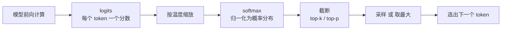
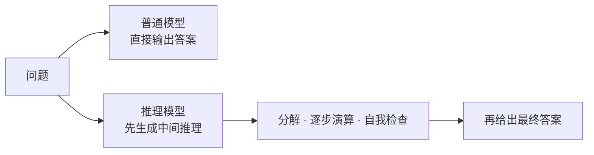

# 推理、采样与推理模型

上一篇讲到，模型每一步输出的是词表上的一个概率分布，而不是一个确定的 token。那么从这个分布到最终"说出口"的那个 token，中间还差一步——**怎么选**。这一步叫解码，它决定了输出到底是确定还是多变、保守还是发散。很多让人困惑的现象——同样的问题两次答得不一样、模型一本正经地胡说、"推理模型"为什么更强——根子都在这一层。本篇就把这一层讲透。

## 1. 从 logits 到概率

模型一次前向计算的直接产物不是概率，而是 **logits**：模型为词表中的每个候选 token 输出一个任意实数，表示当前上下文下对它的相对倾向。logit 可以为正、为零或为负；它没有固定上下限，也不能单独解释成“70% 的可能性”。只有比较同一步生成中各 token 的 logit，才能判断模型更偏向谁。名称中的 logit 也不表示它已经是“对数概率”；在大模型语境中，它通常就是进入 softmax 之前的原始分数。

所谓 **logits 表**，通常不是模型内部长期保存的一张数据表，而是为了便于观察，把“token、logit、转换后的概率”排列成表格。模型实际输出的是一个向量：词表大小为 `V` 时，预测一个位置会得到 `V` 个 logits。训练时一次处理多个样本和多个位置，完整输出常写成 `[批量大小, 序列长度, V]`；自回归生成下一个 token 时，主要使用最后一个位置对应的那组 `V` 个 logits。

假设为了演示，词表里此刻只有三个候选 token：

| 候选 token | 原始 logit | softmax 后的概率 |
|---|---:|---:|
| `猫` | 2.0 | 66.5% |
| `狗` | 1.0 | 24.5% |
| `汽车` | 0.0 | 9.0% |

这里的 `2.0` 不是 2%，也不是 200%；它只是比 `1.0` 和 `0.0` 更高。把 logits 转成概率使用 **softmax**。设第 `i` 个 token 的 logit 为 `z_i`，则：`p_i = exp(z_i) / Σ_j exp(z_j)`

softmax 先对每个分数取指数，再除以所有指数之和，因此结果都大于 0，且总和恰好为 1。上例中，`e²:e¹:e⁰` 约为 `7.39:2.72:1`，归一化后便得到表中的三个概率。

softmax 有四个需要抓住的性质：

- **保留排名**：logit 越大，转换后的概率仍越大。
- **只看相对差距**：给全部 logits 同时加上同一个常数，概率不变。例如 `[2,1,0]` 与 `[12,11,10]` 的结果相同。
- **差距会被指数放大**：最高分只领先一点时，也可能取得明显更高的概率。
- **只负责形成分布，不负责作出选择**：最终取最高概率，还是按概率随机抽取，由后面的解码策略决定。

实际程序通常先减去最大 logit 再计算，即使用 `softmax(z - max(z))`。这不会改变结果，却能避免指数运算产生过大的数值。训练代码里的交叉熵损失也经常直接接收 logits，在内部完成数值稳定的 `log-softmax`；如果损失函数要求 logits，就不应在外部再做一次 softmax。

从模型输出到选出 token 的概念流程如下：

如果总取最高概率的 token，输出会趋于确定；如果按照分布抽样，不同的合理续写便都有机会出现。是否随机、随机多大，由下面的温度和截断策略控制。温度的公式可以直接写成 `softmax(logits / T)`：`T < 1` 时分布更尖锐，`T > 1` 时分布更平坦，`T` 趋近 0 时接近每次取最大 logit。

## 2. 温度

**温度**（temperature）在 softmax 之前对 logits 整体缩放，改变的是分布的"尖锐程度"，从而调节随机性的大小。

机制很直接：温度趋近 0，相当于把分数差距放大到极致，最高分几乎独占全部概率，于是模型几乎总选它，输出确定而保守；温度升高，分数差距被压平，原本的低分 token 也分到可观的概率，于是输出更多样、也更容易跑偏。注意温度**不改变分数的相对高低顺序**，只改变差距被放大还是抹平。

| 温度 | 分布形态 | 输出表现 | 适用 |
|---|---|---|---|
| 趋近 0 | 极尖，几乎只留最高分 | 确定、保守、可复现 | 代码、抽取、分类 |
| 约 0.7 | 适中 | 兼顾质量与多样性 | 通用对话 |
| 偏高（>1） | 平坦，长尾也有机会 | 发散、有创意、也更易出错 | 头脑风暴、文案 |

一个实用判断：凡是下游要拿去解析、执行或核对的输出（代码、JSON、分类标签），就用低温求稳定；凡是要新意的才调高温。这也是为什么后面 Agent 里做工具调用、写结构化数据时几乎都用低温。

## 3. 解码策略

温度调的是"随机多大"，而**截断策略**调的是"允许从哪些候选里随机"——两者配合，才能既有多样性又不至于选到离谱的词。

| 策略 | 做法 | 效果 |
|---|---|---|
| 贪心（greedy） | 每步取概率最高的 token | 完全确定，可能单调 |
| 温度采样 | 按温度调整后的分布随机抽 | 引入可控随机性 |
| Top-k | 只在概率最高的 k 个中采样 | 砍掉长尾，避免选到离谱 token |
| Top-p（核采样） | 只在累计概率达 p 的最小集合中采样 | 动态截断，最常用 |
| 重复惩罚 | 压低已出现 token 的概率 | 抑制复读、绕圈 |

Top-k 和 Top-p 都是"先划一个候选圈，再在圈里采样"，区别在圈怎么划：Top-k 固定取前 k 个，不管分布形状；Top-p 则看累计概率——分布集中时圈子自动缩小（候选少）、分布分散时圈子自动放大（候选多）。因为它随分布自适应，Top-p 成了默认选择，实践中常和温度一起用：温度定随机强度，Top-p 定候选范围。

## 4. 确定性与可复现

上面几节说明了：只要引入采样，输出默认就**不可复现**——同样的输入，两次调用可能给出不同结果。

想要稳定，可以把随机种子固定、并改用贪心解码；但即便如此，硬件差异、批处理方式和浮点实现仍可能带来细微不一致。所以有一个必须记住的工程结论：**不要把一次 LLM 调用当成确定性函数**。凡是依赖模型输出的下游逻辑，都要按"这次和下次可能不一样"来设计——校验输出、容忍偏差、必要时重试。这一点在 Agent 里尤其关键，因为一条链上任何一步的措辞漂移，都可能改变后续走向。

## 5. 幻觉的机制

采样解释了"为什么会变"，而要解释"为什么会错到离谱"，得回到训练目标：模型学的是生成**概率上合理**的下一个 token，而不是**事实上正确**的内容。它没有一个内建的真值数据库去核对自己说的话对不对。

于是当出现下面几种情况时，模型会流畅且自信地编造，这就是**幻觉**：

- 训练数据里根本没有、或极稀疏的事实——模型只能按"像"来猜；
- 上下文没有给出依据，问题却要求一个具体答案——模型宁可编也不倾向于说"不知道"；
- 提问方式暗含了一个不存在的前提——模型顺着前提往下编。

关键要认清：幻觉不是偶发 bug，而是"目标是像、不是对"这一本质的必然产物，靠模型自己无法根除。工程上只能**降低它的发生和危害**：把权威资料放进上下文（检索）、要求模型给出出处以便核对、用工具去验证结果、让另一个环节复查。这条约束直接催生了后面[记忆与检索](07-记忆与检索：Memory、RAG与WebSearch.md)那一整套做法。

## 6. 推理模型与测试时计算

幻觉之外，模型的另一类错误来自"想得不够"：普通模型要在**一次前向**里就把答案定下来，遇到多步数学、复杂代码或长链条推理，很容易在中途某步出错，而且错了没有回头的机会。

**推理模型**（reasoning models）针对的正是这个问题：它在给出最终答案前，先生成一段较长的中间推理（思维链，chain-of-thought），把难题拆成小步逐一演算、甚至自我检查：

它为什么有效？因为多生成的这些中间 token，等于给了模型"演算的草稿纸"——把原本要一步到位的计算，摊成许多步小计算，每步都建立在上一步的显式结果上，出错率自然下降。这在本质上是用**测试时计算**（test-time compute）换准确率：花更多推理 token，换更高的正确率。

| 对比 | 普通模型 | 推理模型 |
|---|---|---|
| 中间过程 | 少或无 | 显式的长推理 |
| 强项 | 简单、直接的任务 | 数学、代码、复杂规划 |
| 代价 | 快、省 | 慢、贵，推理本身占大量输出 token |

由此也能推出使用原则：难题、多步任务用推理模型收益明显；简单任务上，长推理不划算，甚至会"过度思考"、把简单问题绕复杂。**是否启用，取决于任务的多步复杂度，而不是越强越好。**

## 7. 结构化输出

前面几节都在保证"内容质量"，最后还有一个"格式可靠"的问题：当读模型输出的不是人、而是程序时，自由文本很危险——多一句解释、少一个引号，下游解析就崩了。

针对这个场景，有三种由弱到强的约束手段：

- **JSON 模式**：让模型只生成符合指定 schema 的 JSON，靠提示与解码约定；
- **工具调用**：把"返回结构化数据"表达成一次带 schema 的工具调用，由框架保证结构（见[Agent 机制](04-Agent机制：Agent-Loop与Tool-Use.md)）；
- **约束解码**：在解码阶段直接屏蔽掉会破坏格式的 token，从机制上保证输出**一定**可解析。

三者层层加强：前者靠"约定"，后者靠"强制"。对必须机器解析、且不容出错的场景，越靠后越可靠。这也自然引出下一篇——工具调用、结构化输出这些能力，都要通过 API 暴露出来，而 API 的形态又决定了成本与延迟。

## 相关章节

- [大语言模型的工作原理](01-大语言模型的工作原理.md)：logits、词表与采样的来源。
- [LLM API 与 KV Cache](03-LLM-API与KV-Cache.md)：这些解码参数在 API 里怎么用，以及推理为何有快慢两个阶段。
- [上下文工程与提示工程](05-上下文工程与提示工程.md)：用上下文和提示进一步压制幻觉、引导推理。
