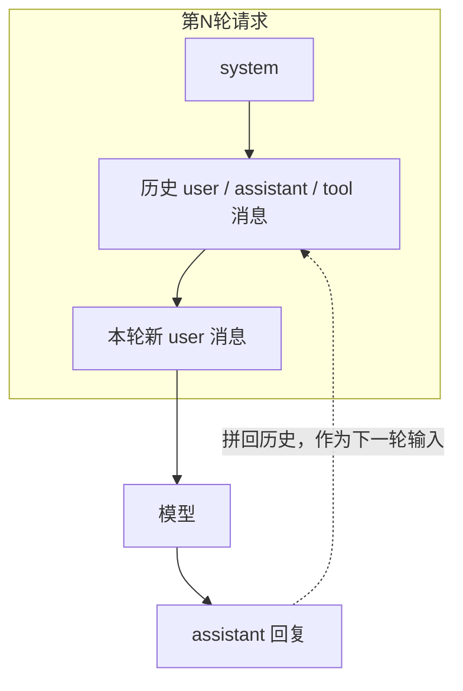
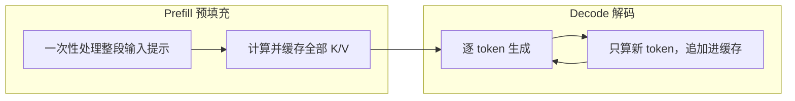
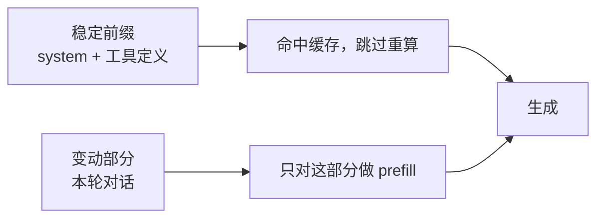

# LLM API 与 KV Cache

前两篇讲的是模型内部；从这一篇起，我们站到调用者的角度。LLM 通过 API 暴露给应用，而这个 API 有几个乍看不起眼、却深刻影响成本、延迟和整个 Agent 设计的性质：它是无状态的、按 token 计费、有上下文上限，而它的推理又天然分成一快一慢两个阶段。KV Cache 与前缀缓存就是围绕后者做的优化。把这一篇弄懂，才能理解为什么后面的 Harness 要斤斤计较"前缀稳定"。

## 1. 请求的结构

主流 LLM API 以**消息列表**为输入，每条消息带一个角色，角色告诉模型这段话是谁说的、该如何对待：

| 角色 | 作用 |
|---|---|
| `system` | 全局指令、角色设定、约束，效力贯穿整段对话 |
| `user` | 用户的输入 |
| `assistant` | 模型自己此前的回复 |
| `tool` | 工具执行结果的回填 |

这里有一个最关键、也最容易被忽视的事实：**API 是无状态的**。服务端不保存任何会话，多轮对话之所以能"记得上文"，是因为客户端每一轮都把之前的完整历史**重新发送一遍**：

换句话说，模型的"记忆"是调用方一次次重发喂出来的假象，而不是服务端替你存着。这个事实有两个直接后果，贯穿本篇：其一，对话越长，每一轮要重发的历史越多，成本和延迟随之上涨；其二，正因为每轮都重发相同的开头，才有了下面 KV Cache 复用前缀的空间。

## 2. token 与上下文窗口

既然按消息计算，具体怎么计量？单位是上一篇讲过的 **token**：

- 输入（全部消息）和输出都按 token 计入，也按 token 计费——**你重发的历史，每一轮都要重新付费**。
- 模型有固定的**上下文窗口**上限，输入与输出之和不能超过它。一旦超出，就必须截断、检索或压缩，没有别的办法。
- 窗口大不等于可以随便塞：输入越长，前一篇说的平方级注意力代价越高，首个 token 越慢，而且模型对超长上下文的有效利用会下降。

所以"上下文窗口"既是能力（能看多少），也是预算（要付多少、要等多久）。如何在有限窗口里放最有价值的内容，是[上下文工程](05-上下文工程与提示工程.md)的主题；这里先记住它是一个受成本和延迟约束的稀缺资源。

## 3. 常用参数

除了消息本身，请求还带一组控制生成的参数，其中大部分在上一篇已经讲过机制，这里是它们在 API 层的对应：

| 参数 | 作用 |
|---|---|
| `temperature` / `top_p` | 控制随机性与候选范围（见[推理与采样](02-推理、采样与推理模型.md)） |
| `max_tokens` | 限制单次输出长度，防止失控地一直生成 |
| `stop` | 命中指定字符串即停止 |
| `tools` | 声明可调用的工具（见[Agent 机制](04-Agent机制：Agent-Loop与Tool-Use.md)） |
| 结构化输出 | 约束输出为指定 JSON schema |

## 4. 流式输出

上一篇说过生成是逐 token 的，这个特性直接决定了输出可以"边生成边返回"。**流式**（streaming）通过 SSE 等方式把 token 一个个推送给客户端，而不是等整段生成完再一次性返回。

它并不改变总耗时——该生成多少 token 还是多少——但极大改善**体感**：用户几乎立刻看到文字开始滚动，而不是对着空白等好几秒。对交互式产品来说，这几乎是必需的。而"为什么开头会等一下、之后就流畅滚动"，答案在下一节：推理分成两个阶段。

## 5. KV Cache 的原理

回到上一篇留下的伏笔：自注意力在生成每个新 token 时，都要用到序列中**之前所有** token 的 Key 和 Value 向量。如果每生成一个 token 都把整段历史的 K、V 重算一遍，代价会随长度平方累积，长对话根本跑不动。

**KV Cache** 就是解决这个的：把已经算过的 Key、Value 缓存下来，生成下一个 token 时只计算这**一个**新 token 的 K、V，历史部分直接从缓存取。这样一来，推理被分成性质截然不同的两个阶段：

| 阶段 | 做什么 | 耗时特征 |
|---|---|---|
| Prefill | 处理输入、把整段提示的 K/V 填满缓存 | 与输入长度成正比，是**长 prompt 首 token 慢**的原因 |
| Decode | 逐个生成输出 token | 每步只算一个新 token，速度相对稳定 |

上一节"开头等一下、之后流畅滚动"的体感，到这里就有了解释：那一下等待是 Prefill 在处理你的长输入，之后的流畅是 Decode 在逐个吐字。理解了这两个阶段，也就理解了下面前缀缓存为什么能省钱。

## 6. 前缀缓存与提示缓存

KV Cache 缓存的是每个位置的 K/V，而某个位置的 K/V 只取决于**它之前的内容**，也就是前缀。这意味着：如果两次请求共享相同的开头——比如固定的 system prompt、工具定义、少样本示例——这段前缀的 K/V 完全可以跨请求**复用**，直接跳过重复的 Prefill。这就是**前缀缓存 / 提示缓存**（prompt caching）：

它对工程的影响是硬性的，直接构成 Harness 设计的一条纪律：

- 把**稳定、共享的内容放在上下文最前面**（系统提示、工具 schema、长期不变的说明），把每轮变动的内容放在后面——这样稳定前缀能一直命中缓存。
- 缓存命中通常带来大幅的延迟下降和成本下降，因为最昂贵的 Prefill 被整段省掉了。
- 反过来，前缀只要改动一个字，它之后的缓存就**全部失效**、必须重算。所以"别乱动前缀"不是洁癖，而是省钱省时的关键。

这条纪律会在[上下文工程](05-上下文工程与提示工程.md)里再次出现：编排上下文时，稳定的东西靠前，不只是逻辑清晰，更是为了吃到缓存。

## 7. 成本与延迟工程

把前面几节合起来，就得到调用 LLM 时控成本、控延迟的整体图景：

- **成本** = 输入 token + 输出 token，各按单价计；命中缓存的输入 token 往往显著更便宜。因为历史要一轮轮重发，长对话的成本主要压在输入侧。
- **降本增速**的常见手段：精简上下文（少发就少付）、稳定前缀以命中缓存、用 `max_tokens` 控制输出长度、把简单子任务交给更小更便宜的模型。
- **延迟**主要由 Prefill（受输入长度影响）和输出长度决定；流式改善体感，缓存改善实际耗时。

这些看似琐碎，却决定了一个 Agent 在多轮、长上下文下到底能不能用。一个不讲究前缀稳定、放任上下文膨胀的实现，会在每一步都白白多花钱、多等时间——而 Agent 恰恰要跑很多步。这就把话题自然带到下一篇：把这个 API 放进一个循环、接上工具，就成了 Agent。

## 相关章节

- [大语言模型的工作原理](01-大语言模型的工作原理.md)：无状态、上下文上限、平方级注意力代价的由来。
- [Agent 机制：Agent Loop 与 Tool Use](04-Agent机制：Agent-Loop与Tool-Use.md)：把无状态的 API 放进循环。
- [上下文工程与提示工程](05-上下文工程与提示工程.md)：在有限且计费的窗口里放最有价值的内容。
