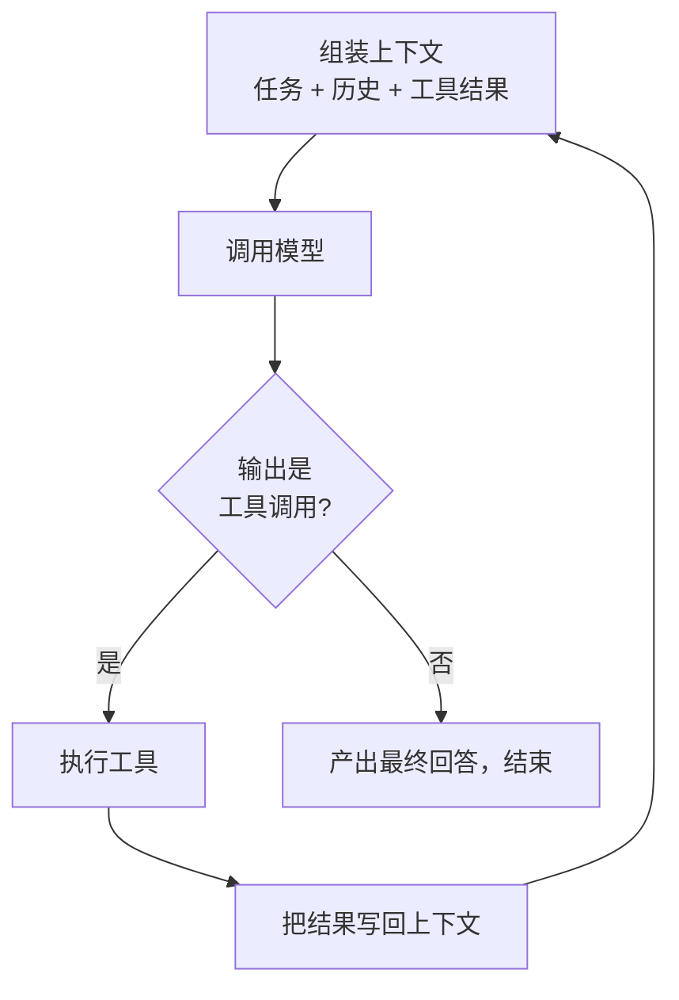
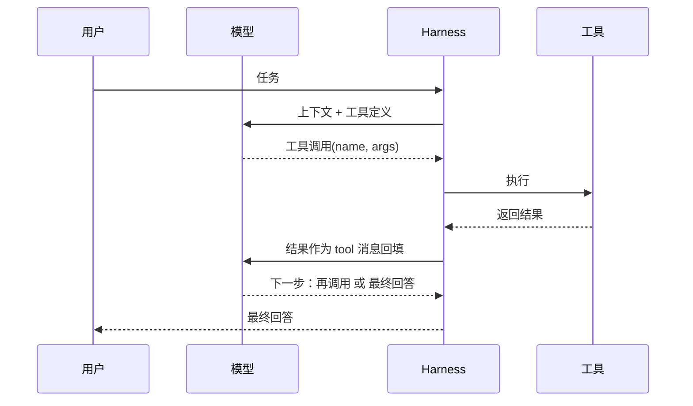
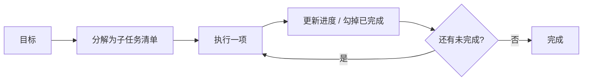

# Agent 机制：Agent Loop 与 Tool Use

到上一篇为止，我们手里是一个无状态的 API：给它一段上下文，它吐一段文本。这远不足以完成真实任务——真实任务需要多步操作、需要读写外部世界、需要根据中间结果调整。把这个 API 放进一个循环、再接上一组工具，它就从"会说话"变成了"能做事"，这就是 **Agent**。本篇讲清楚这个循环怎么转、工具怎么被调用，这是所有 Agent 产品的骨架。

## 1. 什么是 Agent

一个 Agent 至少由三部分组成，缺一不可：

| 组成 | 职责 | 缺了会怎样 |
|---|---|---|
| LLM | 每一步做决策：该想什么、该做什么 | 没有大脑 |
| 循环（loop） | 反复调用模型，直到完成或停止 | 只能一问一答，无法多步 |
| 工具（tools） | 让模型能读写外部世界 | 只能空谈，碰不到真实数据 |

与一问一答的根本区别在于**反馈**：Agent 每做一步，都会看到这一步的真实结果，再据此决定下一步，而不是一次性把答案全想好。正因为能看反馈、能纠偏，它才可能完成那些"事先无法完全规划、必须边做边看"的任务。这三部分里，循环和工具都不在模型内部，而是外层框架提供的——记住这一点，它是后面理解 Harness 的关键。

## 2. Agent Loop

Agent 的运转是一个循环，一直转到任务完成或触发停止：



用伪代码看得更清楚：

```text
messages = [system_prompt, user_task]
for step in range(MAX_STEPS):
    resp = model(messages, tools)          # 一次模型调用
    if resp.tool_calls:                    # 模型决定调用工具
        for call in resp.tool_calls:
            result = run_tool(call.name, call.args)
            messages.append(tool_result(result))   # 结果回填
    else:
        return resp.text                   # 没有工具调用 = 任务完成
raise StepLimitExceeded                     # 兜底停止
```

循环的每一轮，模型看到的上下文都比上一轮更长——多了刚才那次工具调用和它的结果。模型据此判断：还要继续调用工具，还是可以给最终答案了。这里要点破一个常见误解：**模型自己并不循环**，它每次只是被调用一次、输出一次；"循环"是外层框架反复调用模型、并在每轮之间执行工具、回填结果做出来的。也正因如此，上一篇的无状态才不成问题——框架每轮把不断增长的 `messages` 整体重发，模型的"连续性"就是这么拼出来的。

## 3. Tool Use / Function Calling

循环要转起来，靠的是模型和外部世界之间的桥梁——工具调用。这里有一个最容易被误解、也最关键的点：**模型并不执行工具，它只产生"调用意图"**，真正动手的是外层框架。



完整流程是这样的：

1. 请求里用 schema（名称、描述、参数的 JSON Schema）声明有哪些工具可用；
2. 模型在需要时，不返回普通文本，而是返回一个结构化的**工具调用**——工具名加参数；
3. 外层框架接过这个意图，真正去执行（跑命令、查库、调 API）；
4. 执行结果作为 `tool` 消息写回上下文；
5. 模型看到结果，继续下一轮。

为什么是"模型出意图、框架来执行"这种分工？因为这样才能在执行前加上权限检查、参数校验、超时和审计——安全和可控都落在框架这一侧，而不是指望模型自觉。还有一个直接推论：模型选哪个工具、传什么参数，**完全依据工具的名称和描述**——它看不到工具的实现，只看得到你写的说明。所以工具描述本质上就是提示的一部分，写不清楚模型就用不对，这一点在[工具、技能与 MCP](06-工具生态与MCP.md)里会专门展开。

## 4. 一次真实循环长什么样

抽象的循环，落到具体任务上是什么样？以"查出项目里失败的测试并修复"为例：

```text
模型：调用 run_command("npm test")
工具：3 个测试失败，报错指向 utils/date.ts:12
模型：调用 read_file("utils/date.ts")
工具：返回文件内容
模型：调用 edit_file(...)        # 修改第 12 行
模型：调用 run_command("npm test")
工具：全部通过
模型：输出“已修复，3 个测试现在通过”   # 没有工具调用 = 结束
```

值得注意的是：模型从没"一次想好全部步骤"。它每一步只做一个小决策，看到结果（哪个文件、哪一行报错）后才决定下一步读哪个文件、怎么改。**多步能力不是模型一次性规划出来的，而是循环加工具反馈一步步"跑"出来的**。这也解释了为什么同一个模型，配上更好的工具和反馈，能力会明显不同。这种"想一步、做一步、看反馈、再想"的节奏，有一个专门的名字。

## 5. ReAct：推理与行动交替

上面例子里那种"根据当前结果再决定下一步"的模式，叫 **ReAct**（Reasoning + Acting）：让模型在"推理一步"和"行动一步"之间交替，而不是先把整个计划想死再机械执行。

它为什么比"一次规划到底"更好？因为真实环境充满意外——测试报的错可能和预想不同，读到的文件可能不是那个样子。边想边做，意味着每个动作都基于**最新的真实反馈**做出，错了能立刻调整；而事先定死的长计划，一旦某步的现实与假设不符，后面就全乱了。所以在不确定的环境里，ReAct 往往比预先全规划更稳。但完全不规划也有问题——步骤一多就容易迷失方向，这就需要引入显式规划。

## 6. Planning

对步骤多、跨度大的任务，光靠"走一步看一步"容易走着走着忘了全局。此时 Agent 会引入**显式规划**：先把目标拆成子任务清单，再逐项执行、随时更新进度。



规划的价值是给长任务一个骨架：不迷失方向、进度可跟踪、也便于人来审阅"它接下来打算干什么"。但它有个风险——过早锁死的计划，遇到执行中的意外反馈时会失效。所以实践中规划通常**不是取代 ReAct，而是和它结合**：有一份大致的计划提供方向，同时允许根据每步的真实结果边做边改。既有骨架，又能应变。

## 7. 停止与失败处理

循环能转起来只是第一步，能**可靠地停下来、错了能恢复**才算完整，否则 Agent 会空转、烧钱甚至失控。必须由外层框架提供几道保障：

- **停止条件**：任务完成、达到最大步数、超时、token 预算耗尽——任何一个触发都要能干净地收尾；
- **循环检测**：识别"反复调用同一个失败动作"这种死循环，及时打断；
- **错误恢复**：工具报错时，把**可读的错误信息**回填给模型，让它重试或换条路，而不是让整个流程崩掉。

注意这些机制几乎都不在模型里，而在外层框架里。这就引出一个贯穿后续的核心分工：**模型负责每一步的决策，框架负责让这些决策可靠地落地、并在出错时兜底**。这个"模型之外的一整套支架"，正是[Harness 工程](09-Harness工程与智能体评估.md)要系统讲的东西。

## 相关章节

- [LLM API 与 KV Cache](03-LLM-API与KV-Cache.md)：循环每一轮重发的上下文，为何要讲究前缀稳定。
- [工具、技能与 MCP](06-工具生态与MCP.md)：工具描述怎么写，模型才用得对。
- [Subagent 与多智能体系统](08-Subagent与多智能体系统.md)：当单个循环的上下文不够用时。
- [Harness 工程与智能体评估](09-Harness工程与智能体评估.md)：循环、工具、恢复机制的系统设计。
