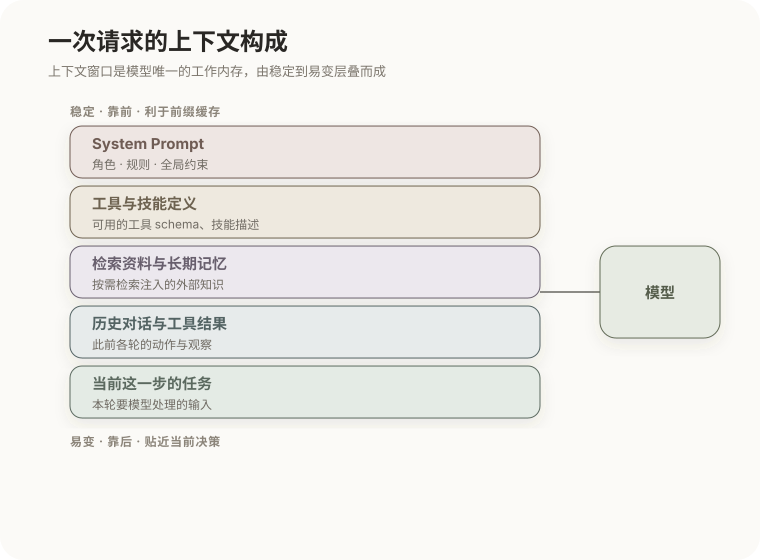

# 上下文工程与提示工程

前一篇的 Agent 循环里，每一轮都要"组装上下文、调用模型"。这一步的质量，几乎决定了 Agent 的成败——因为模型是无状态的，它在某一刻能做出的判断，**完全**取决于那一刻上下文窗口里有什么。于是"往上下文里放什么、怎么放"，就成了核心工程问题。它有两个层次：提示工程管"一段话怎么写"，上下文工程管"整条信息管道怎么管"。本篇讲清两者的分工，以及为什么对 Agent 来说后者更重要。

## 1. 上下文窗口是唯一的工作内存

先把前几篇的结论收拢成一句话：模型不记得窗口之外的任何东西。任务目标、历史动作、工具结果、检索到的资料、长期记忆，凡是希望模型"知道"的，都必须此刻就在上下文里。一次 Agent 请求的上下文，通常由这几部分层叠而成：

这张图的顺序不是随意的——越靠前越稳定（利于上一篇讲的前缀缓存），越靠后越贴近当前决策。而"层叠"本身带来一对始终并存的矛盾：

- 信息**不足**：关键内容没进上下文，模型无从判断，只能猜——于是胡乱行动或幻觉；
- 信息**过载**：无关内容挤占窗口、稀释相关性、抬高成本、拖慢响应——于是抓不住重点。

工程目标就是在这对矛盾之间找平衡：每一步让上下文里恰好是"足够且相关"的信息，不多不少。围绕这个目标，先看粒度较小的一层——提示工程。

## 2. 提示工程

**提示工程**（Prompt Engineering）关注的是单次请求里、一段文字怎么写，才能让模型更可能给出期望输出。它是最直接、也最局部的一层。常用手段：

- 指令**清晰具体**：明确任务、格式和约束，而不是含糊描述——模型不会替你补全你没说清的意图；
- **设定角色与目标**：界定模型的行为边界，缩小它的自由发挥空间；
- **少样本示例**（few-shot）：给出输入与理想输出的范例，让模型照着模仿，这比抽象描述往往更有效；
- **规定输出结构**：字段、顺序、允许取值都定死，便于下游解析；
- **显式给出约束与优先级**：当多个要求可能冲突时，告诉模型谁优先。

这些技巧的共同点是：都作用于**一段确定的文字**。但一旦系统变成多轮、带工具、带检索的 Agent，问题就不再是"这段话怎么写"，而是"每一步到底该把什么拼进这段话"——这就上升到了上下文工程。

## 3. 上下文工程

**上下文工程**（Context Engineering）面向的是整条信息管道：在 Agent 的每一步，从海量候选信息中决定放什么、怎么排、放多少、何时更新。

拆开这四个动作，每一个都在解决前面提到的"不足与过载"矛盾：

- **放什么（选择）**：从任务、历史、工具结果、检索库、记忆里挑出与当前这一步真正相关的部分，把无关的挡在窗口外；
- **怎么排（排序）**：稳定内容靠前，既符合逻辑，也吃到前缀缓存；相关内容靠近当前决策点，因为模型对上下文首尾的利用率更高（下一节会讲为什么）；
- **放多少（压缩）**：裁剪冗余、把长历史摘要成要点，给关键信息腾出空间；
- **何时更新**：随任务进展动态增删，避免旧信息一直堆着。

提示工程其实是上下文工程的一个子集——前者写好"一段文字"，后者决定"每一步由哪些文字拼成"。对单轮任务，把提示写好就够了；但对多步 Agent，上下文工程往往比措辞更决定成败。

| 维度 | 提示工程 | 上下文工程 |
|---|---|---|
| 对象 | 单次请求的一段文字 | 整条信息管道 |
| 时机 | 写死或模板化 | 每一步动态决策 |
| 关注 | 指令、示例、格式 | 选择、排序、压缩、更新 |
| 场景 | 单轮任务 | 多轮、带工具的 Agent |

为什么上下文工程这么关键、又这么难？因为上下文并不是"越长越好"。

## 4. 长上下文的失效模式

一个直觉误区是：既然窗口越来越大，把所有可能有用的东西都塞进去不就行了？恰恰相反。随着窗口被填满，会出现几种典型失效，而且它们是模型机制决定的、绕不开的：

- **相关性稀释**：关键信息被大量次要内容包围，模型的注意力被摊薄，抓不住重点；
- **中段丢失**（lost in the middle）：模型对超长上下文**中部**信息的利用率，明显低于开头和结尾——这也是上一节要"把相关内容排到靠近决策点"的原因；
- **上下文腐烂**（context rot）：过时的中间结论、已经失败的尝试残留在上下文里，会被模型当作有效信息，持续误导后续决策；
- 成本与延迟随长度线性甚至更快增长（见上一篇）。

所以"把能塞的都塞进去"通常适得其反。上下文是**稀缺且会贬值**的资源，必须主动管理，而不是放任堆积。怎么管？主要靠压缩和状态管理。

## 5. 压缩与状态管理

针对上一节的失效，长任务里有几种成熟做法，本质都是"用更少的 token 保住关键信息"：

- **滚动摘要**：把较早的对话或动作压缩成简短摘要，替换掉原始明细——历史还在，但不再占满窗口；
- **结构化状态**：与其逐条堆叠历史，不如维护一份显式、可更新的任务状态（目标、已完成、待办、关键结论），每轮只带这份"当前进度快照"，天然避免了上下文腐烂；
- **外置**：把大块资料放进外部存储，用检索按需取回，而不是让它常驻上下文（这正是[记忆与检索](07-记忆与检索：Memory、RAG与WebSearch.md)要解决的）；
- **子任务隔离**：把过程冗长的局部工作交给子 Agent，只让它回传结论，避免中间细节污染主上下文（见[多智能体](08-Subagent与多智能体系统.md)）。

这几种手段会在后面两篇里各自展开。而在整条上下文的最前端，还有一段最特殊、也最该讲究的内容——系统提示。

## 6. System Prompt 的设计

系统提示承载最稳定的全局指令，它的特殊在于：既在逻辑上统领全局，又在物理上位于上下文最前端。据此有两条实践：

- **分层清晰**：角色、能力边界、格式规范、安全约束各自分明。若这些指令互相冲突（比如一边要简洁一边要详尽），模型会无所适从，输出飘忽；
- **保持稳定并靠前**：稳定的系统提示放在最前面，一举两得——逻辑上是全局约束，工程上则让整段前缀持续命中缓存（回到上一篇的纪律）。反过来，频繁改动系统提示，既让缓存失效、又让模型行为难以复现，调试时会很痛苦。

把本篇收成一句话：**上下文窗口是模型的全部世界，谨慎地决定这个世界里有什么、按什么顺序排列。** 而当"要记住的东西"超出单个窗口、甚至要跨会话保留时，就需要把记忆外置——这是下一篇的主题。

## 相关章节

- [LLM API 与 KV Cache](03-LLM-API与KV-Cache.md)：前缀缓存为何要求稳定内容靠前。
- [记忆与检索：Memory、RAG 与 WebSearch](07-记忆与检索：Memory、RAG与WebSearch.md)：把大块信息外置、按需取回。
- [Harness 工程与智能体评估](09-Harness工程与智能体评估.md)：上下文工程是 Harness 在每一步运行时做的事。
