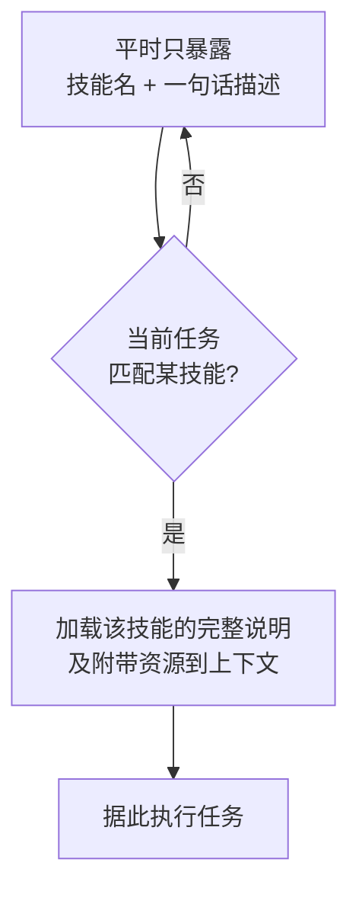
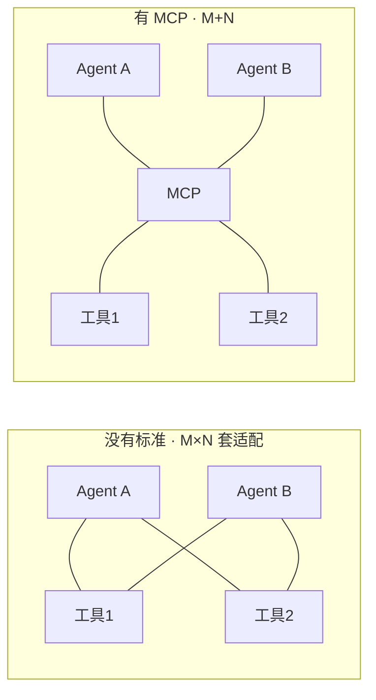
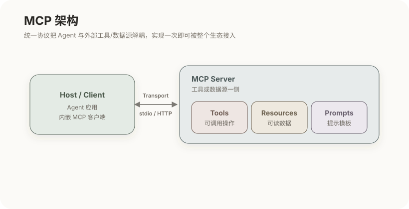

# 工具、技能与 MCP

第 4 篇讲了工具是 Agent 与外部世界的桥梁，但只说了"怎么调用"，没说"怎么设计得好"。这一篇补上：工具的接口质量直接决定模型能否正确行动；当能力越来越多、又不能全塞进上下文时，需要**技能**这种按需加载的组织方式；而当工具和数据源要接入不同的 Agent 产品时，又需要 **MCP** 这样的统一协议。三者层层递进，共同回答"如何把能力可靠、可扩展地供给模型"。

## 1. 工具就是模型的行动能力

先回顾并说透一件事：模型本身只能生成文本，读文件、执行命令、查询数据库、调外部 API，全都要通过工具。一个工具在接口上由四部分组成，而**其中三部分是写给模型看的**：

| 组成 | 作用 | 谁来读 |
|---|---|---|
| 名称 | 标识工具 | 模型 |
| 描述 | 说明做什么、何时用、有何副作用 | 模型 |
| 参数 Schema | 约束入参的结构与类型 | 模型 |
| 实现 | 真正执行的代码 | 框架 |

第 4 篇说过，模型只出"调用意图"、由框架执行，所以模型看不到实现，它决定用不用、怎么用，**唯一依据就是前三项**。这就引出一个反直觉但极其重要的结论：工具设计的一大半，是在写给模型看的文档，而不是写实现。

## 2. 工具设计原则

既然模型靠名称和描述来判断，工具设计本质上就是提示工程的延伸。下面每一条原则，背后都是"模型只能看见接口"这个事实：

- **命名与描述清晰**：说清做什么、何时该用、有什么副作用。若两个工具描述含糊、语义重叠，模型会选错或来回犹豫；
- **参数明确**：用 schema 把类型和取值范围钉死，减少模型传错参数的机会——schema 越严，模型越难出错；
- **粒度合适**：太细碎，模型要调一长串才能完成一件事，链路冗长易错；太笼统，模型又难以正确使用。粒度要贴合"模型一步想做的事"；
- **返回精炼**：工具输出会进入上下文，冗长结果会挤占窗口、稀释相关性（正是上一篇的过载问题），所以只回传对后续决策有用的信息；
- **错误可读**：失败时返回模型能理解、能据此纠正的错误信息，而不是原始堆栈或空结果——好的错误信息能让模型自己修复，坏的会让它卡死；
- **幂等与安全**：对有副作用的操作明确边界，危险动作应可控、可审计。

一句话概括：**工具的接口是写给模型看的，要像写 API 文档一样认真写描述。** 但当一个 Agent 要具备很多种能力时，把所有工具和用法都常驻上下文就撑不住了——这时需要换一种组织方式。

## 3. 技能（Skills）

**技能**是把某一类任务的完整做法打包成一个可复用、按需加载的单元。它通常包含一段说明"该做什么、怎么做"的指令，可选地附带脚本、模板或参考资料。它和工具解决的是不同层次的问题：

| | 工具 | 技能 |
|---|---|---|
| 是什么 | 一次具体的可执行操作 | 一整套"如何完成某类工作"的知识 |
| 内容 | 名称 + 参数 + 实现 | 指令 + 可选脚本/模板/资料 |
| 使用 | 模型发出调用，框架执行 | 模型加载进上下文，据此行动 |
| 关系 | 技能可能调用多个工具 | 常组合使用多个工具 |

技能真正巧妙的地方，是它如何化解"能力多"与"上下文有限"的矛盾——靠**渐进式披露**（progressive disclosure）：

平时上下文里只放每个技能的名字和一句话描述，占用极小；只有当任务匹配到某个技能时，才把它的详细说明乃至附带资源加载进来。这样 Agent 可以"潜在会很多技能"，而每一步的上下文却只装着当下用得到的那一个——用"按需加载"直接对应上一篇"上下文是稀缺资源"的原则。技能因此让能力像模块一样可复用、可共享、可组合，而不必把所有做法写死在系统提示里。

但技能和工具解决的都是"单个 Agent 内部怎么组织能力"。还有一个更大的问题：当很多不同的 Agent 产品，都要接同一批工具和数据源时，怎么办？

## 4. MCP 是什么

如果每个 Agent 产品都用自己的私有方式接工具，就会陷入组合爆炸：M 个 Agent 对接 N 个工具，要写 M×N 套适配，任何一方变动都牵连一片。**MCP**（Model Context Protocol）是一个开放协议，为"Agent 如何连接外部工具和数据"定了统一标准，把 M×N 降为 M+N：

工具方只需实现一次 MCP 服务，任何支持 MCP 的 Agent 都能接入；Agent 方也只需实现一次 MCP 客户端，就能用上整个生态的工具。这个"实现一次、到处可用"正是标准化的意义。

## 5. MCP 的架构

MCP 用的是客户端—服务器结构，两端通过一个传输层通信：

- **Host / Client**：Agent 应用一侧，内嵌 MCP 客户端，负责发现有哪些能力、并发起调用；
- **Server**：工具或数据源一侧，把自己的能力按标准暴露出来；
- **Transport**：两者之间的通道，本地进程常用 stdio，远程服务用 HTTP。

服务器对外暴露的能力分成三类原语，覆盖了 Agent 需要的不同交互：

| 原语 | 含义 | 对应的需求 |
|---|---|---|
| Tools | 可被模型调用的操作（带副作用或计算） | 让 Agent 能"做事" |
| Resources | 可被读取的数据或内容（文件、记录等） | 让 Agent 能"读料" |
| Prompts | 预置的提示模板，供客户端复用 | 让 Agent 能"复用写法" |

标准化最终带来三重收益：**解耦**（Agent 与工具各自独立演进，换模型或加工具都不牵动对方）、**复用**（一个服务器服务多个 Agent）、**生态**（实现一次即可被整个兼容生态使用）。

## 6. 安全边界

无论工具、技能还是 MCP，能力越强，安全越不能省——因为它们让模型能对真实世界产生副作用。两条底线必须由框架层守住，而不是指望模型自觉（回到第 4 篇"执行在框架侧"的分工）：

- **权限控制**：明确哪些操作需要人确认、哪些数据可读可写，危险动作要可拦截、可审计；
- **不可信输入**：工具或外部返回的内容要当作**不可信数据**看待，其中可能藏着试图操纵模型的指令（提示注入）。不能因为"这是工具返回的"就无条件信任。

把这些安全职责放在哪里、循环怎么兜底、上下文怎么管——这些"模型之外的系统设计"，正是[Harness 工程](09-Harness工程与智能体评估.md)的范畴。而在此之前，还有两类扩展 Agent 能力的方式要讲：让它拥有跨会话的记忆，以及让多个 Agent 协作。

## 相关章节

- [Agent 机制：Agent Loop 与 Tool Use](04-Agent机制：Agent-Loop与Tool-Use.md)：工具调用的执行流程与"模型只出意图"的分工。
- [上下文工程与提示工程](05-上下文工程与提示工程.md)：技能的按需加载，正是上下文工程的一种手段。
- [记忆与检索：Memory、RAG 与 WebSearch](07-记忆与检索：Memory、RAG与WebSearch.md)：另一类外部能力——记忆与检索。
- [Harness 工程与智能体评估](09-Harness工程与智能体评估.md)：权限、安全与整体系统设计。
