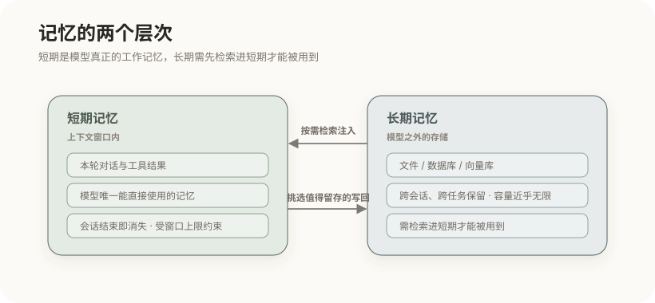
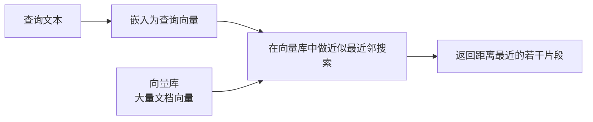
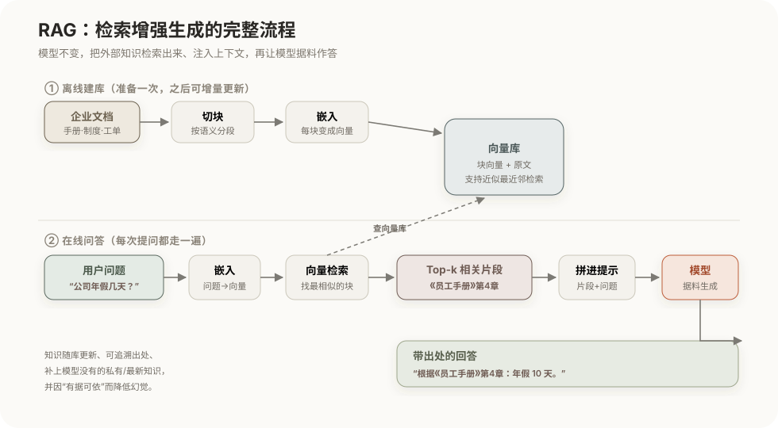

# 记忆与检索：Memory、RAG 与 WebSearch

前面反复提到模型的两道墙：它**无状态**（会话一结束就忘光）、上下文窗口**有限**（一次装不下太多）、知识还有**截止时间**（训练之后的事一概不知）。"记忆"就是让信息跨越单次调用、之后还能影响模型的机制。但"记忆"其实有两种根本不同的承载方式——先把这两种分清，后面的短期/长期记忆、CLAUDE.md、RAG、微调才各归其位。

## 1. 记忆的本质：显式与隐式

记忆的本质，是让一条信息在"一次前向计算"之外保留下来、并能再度影响模型的行为。按信息**存在哪里**，分成两类，这条区分是本篇的主线：

- **隐式记忆（参数化记忆）**：信息被训练进模型的**权重**里。模型"记得"水的沸点、Python 的语法，靠的就是它——这些知识不是存成某条可读的文本，而是分布、纠缠在亿万个参数中（回到[大语言模型的工作原理](01-大语言模型的工作原理.md)：预训练和微调，做的正是往这里写）。它的特点是调用时无需外部查询、"张口就来"；代价是**看不见、改不了单条、更新必须重新训练**，也正因为它只是"大概记得"，记混或没记住时就会编造——这就是幻觉的来源之一。
- **显式记忆（非参数化记忆）**：信息存成模型之外、**可读可编辑的内容**——文件、数据库、向量库、上下文里的文字，乃至一份写给项目的 CLAUDE.md。它的特点是**看得见、可增删改、可追溯、能实时更新**；但它不在模型"脑子"里，必须先被**检索或加载进上下文**，模型才用得上。

这条区分直接决定了后面各种手段的分工：**微调是往隐式记忆里写，而 RAG、长期记忆、CLAUDE.md 都是在操控显式记忆**（也呼应[落地路线](10-大模型的落地路线.md)里 RAG 与微调的差别）。本篇之后讲的记忆与检索，除特别说明外都属于**显式记忆**——因为隐式记忆你只能靠训练间接影响，而显式记忆才是工程上能直接操控的那部分。

## 2. 显式记忆的两个层次：短期与长期

显式记忆按"能活多久"，又分成两层，二者性质完全不同：

| | 短期记忆 | 长期记忆 |
|---|---|---|
| 位置 | 上下文窗口内 | 模型之外的存储 |
| 生命周期 | 会话结束即消失 | 跨会话、跨任务保留 |
| 容量 | 受窗口上限约束 | 基本无上限 |
| 角色 | 模型真正的工作记忆 | 需要时才检索进短期记忆 |

短期记忆就是当前上下文窗口里的内容——它是模型唯一能**直接**使用的记忆，但一关会话就没了，还受窗口大小限制。长期记忆存在外部（文件、数据库、向量库），能长久保留，但模型不能直接访问它，必须先**检索**进上下文才用得上。所以两层之间有一条明确的数据流：值得长期保留的，从短期**写入**长期；当下需要的，从长期**检索**回短期。模型本身不提供长期记忆这一层，它必须由 Harness 显式实现——而实现的关键，不在存储用什么，而在两条策略。

## 3. 持久记忆的实现：写入与召回

长期记忆的难点从来不是"存哪里"，而是两个策略问题：什么该记、什么时候取。

- **写入：何时记、记什么。** 一个常见错误是把所有对话都存下来——那只是把上下文膨胀问题原样搬到存储层，检索时照样捞出一堆噪声。正确做法是只记录**稳定、可复用的结论**：用户偏好、项目约束、已确认的事实、关键决策，且每条精炼、单一。判断标准是"这条以后还用得上吗"。
- **召回：何时取、取哪些。** 不是把长期记忆全倒进上下文，而是**在当前任务需要时，检索出相关的几条**注入。召回的相关性直接决定记忆有没有用——取回一堆不相关的记忆，比不取还糟，因为它们会稀释上下文。

一句话原则：**长期记忆里存的是"未来会用得上的结论"，而不是流水账。**

## 4. 系统规范文件：CLAUDE.md / AGENT.md

有一种特殊而重要的长期显式记忆，是放在项目里的**规范文件**——如 Claude Code 的 `CLAUDE.md`、以及逐渐通用的 `AGENTS.md`。它值得单独讲，因为它同时扮演"记忆"和"规范"两个角色。

- **它是什么**：一份由你或团队手写、随项目仓库一起保存的 Markdown，记录这个项目的约定：技术栈、目录结构、常用命令、代码风格、测试方式、注意事项，以及"希望 Agent 怎么做事"的指令。
- **它解决什么**：Agent 是无状态的，每开一个新会话都从"失忆"开始。没有它，你每次都得重新交代"这个项目用 pnpm、测试跑 `npm test`、别碰 `legacy/` 目录"。把这些一次写进 `CLAUDE.md`，就相当于给 Agent 装了一份**跨会话的项目长期记忆**，一劳永逸。
- **它怎么起作用**：会话开始时，Harness 会**自动把它加载进上下文**，通常放在靠前、稳定的位置（这样既是全局约束，又利于[前缀缓存](03-LLM-API与KV-Cache.md)）。所以它本质上是"自动注入的、项目级的显式记忆 + 行为规范"——既让 Agent 记住项目事实，又约束它的行为。
- **和 RAG 的分工**：`CLAUDE.md` 是**整份、每次都加载**的稳定规范，适合放"总是该知道"的少量项目级信息；RAG 是**按需检索**的海量知识，适合放"用到才取"的大量易变资料。项目的"宪法"用 `CLAUDE.md`，知识库用 RAG，二者互补。

## 5. 向量嵌入与语义检索

长期记忆的召回、以及下面的 RAG，都要解决同一个技术问题：怎么"按语义找相关"，而不是按关键词精确匹配——用户问"怎么退货"，相关文档可能写的是"退换货流程"，字面不同但语义相近。答案回到第 1 篇的嵌入：把文本转成**向量**，语义相近的文本，向量距离也近。

离线时把知识切块、逐块嵌入、存进**向量数据库**；在线时把查询也嵌入成向量，在库里用近似最近邻（ANN）搜索找出距离最近的若干条。用"近似"而非精确，是因为库里可能有海量向量，精确搜索太慢，ANN 用微小的精度损失换来大幅的速度提升。这套"嵌入 + 向量检索"是长期记忆召回和 RAG 共同的底层机制。

## 6. RAG：检索增强生成

模型的隐式记忆有两个硬伤：知识截止（训练之后的事不知道）、且**没有**你的私有知识（企业文档不可能在训练数据里）。**RAG**（Retrieval-Augmented Generation）用显式记忆来补这两个洞——它不改模型，而是在模型回答前，把相关资料检索出来、塞进上下文，让模型**据料作答**。

它分离线、在线两段，下图用"查公司年假几天"这个具体问题走一遍：

- **离线建库（准备一次）**：把企业文档按语义切成小块，每块嵌入成向量，连同原文存进向量库。文档更新了，增量重建对应部分即可。
- **在线问答（每次提问都走）**：把用户问题也嵌入成向量，在向量库里检索出最相关的 Top-k 个片段（这里命中了《员工手册》第 4 章），把这些片段连同问题一起拼进提示，交给模型；模型据此生成回答，并能标注出处（"根据《员工手册》第 4 章：年假 10 天"）。

这样一来，它同时解决了三件事：补上模型**没有的私有/最新知识**、因为**有据可依**而降低幻觉、还能给出**可追溯的出处**。

**RAG 在整体架构里的位置。** 这是最容易含糊的一点：RAG 既不是模型的一部分，也不是一个独立的处理阶段，它嵌在 Agent Loop 每一轮的"**组装上下文**"这一步——把知识库（显式长期记忆）里相关的片段检索出来、放进上下文窗口，模型照常读上下文来生成。模型甚至"不知道"有 RAG，它只是看到上下文里多了几段检索来的资料。换句话说，RAG 就是"**知识库 → 上下文窗口**"的那条检索通道（在总架构图里，就是那条标着"RAG 检索"的橙色箭头，见 [Harness 工程与智能体评估](09-Harness工程与智能体评估.md) 的整体架构图）。这也再次点明它和微调的分工：微调改的是隐式记忆（模型本身），RAG 只往上下文里塞显式记忆，模型始终不变。

## 7. 检索质量的决定因素

RAG 的效果好坏，主要不取决于模型，而取决于**检索**这一环——因为模型只能基于检索到的片段作答，关键片段没被召回，模型再强也无米下炊。所以 RAG 的工程重心在这几点：

- **切块（chunking）**：块太大，一块里混入多个主题、引入噪声、稀释相关性；块太小，又切断上下文、丢失完整语义。要按内容的自然边界权衡。
- **重排（rerank）**：向量检索的初步召回未必把最相关的排在最前，用一个更精细的模型对候选二次排序，能显著提升命中。
- **混合检索**：向量检索擅长语义、但可能漏掉精确的专有名词或编号，配合关键词检索，兼顾"意思相近"和"字面精确"。
- 认清最常见的失败：**关键片段没被召回**。排查 RAG 问题，先看检索回来的到底是不是对的片段，再看模型怎么用它们。

## 8. Web Search 作为工具

当所需信息是实时的（今天的新闻、最新版本号）或开放的（互联网上的公开资料），本地知识库无能为力，这时把**联网搜索**作为一种工具接入 Agent（工具机制见第 4 篇）：

它和 RAG 是**同一套思路的两种数据源**：都是"检索 → 注入上下文 → 生成"，区别只在检索对象——RAG 面向受控的私有知识库，Web Search 面向开放实时的互联网。也正因思路相同，两条注意事项一样：检索质量决定成败，且都要**保留来源**以便核验、对抗幻觉。

把本篇收拢成一句话：**记忆分隐式（在权重里）与显式（在模型之外）；工程上能直接操控的是显式记忆，而 RAG、长期记忆、CLAUDE.md 都是把外部的显式记忆，在恰当的时机检索或加载进上下文，供模型使用。** 而这些"把什么放进上下文"的动作最终由谁统一调度，是下一篇 Harness 的主题。

## 相关章节

- [上下文工程与提示工程](05-上下文工程与提示工程.md)：检索到的内容如何注入、排序、压缩。
- [Harness 工程与智能体评估](09-Harness工程与智能体评估.md)：整体架构图，RAG、记忆在其中的位置。
- [大模型的落地路线](10-大模型的落地路线.md)：RAG（显式）与微调（隐式）的选型。
