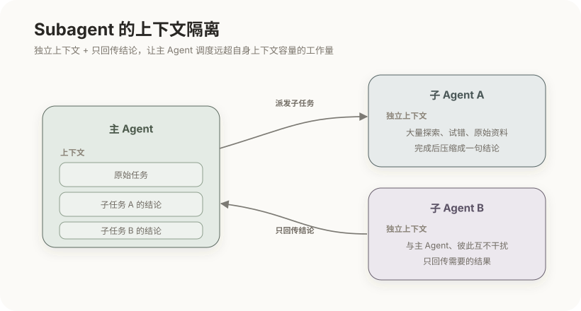
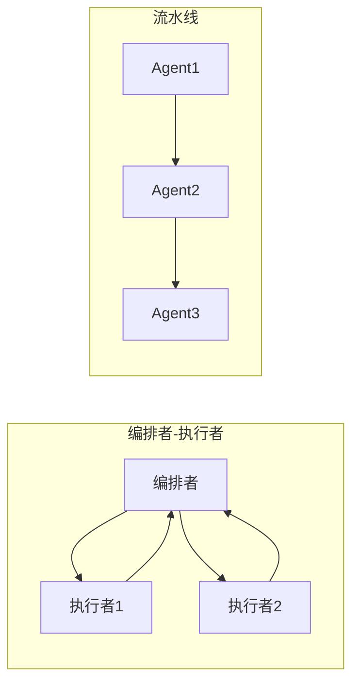

# Subagent 与多智能体系统

上一篇用记忆和检索突破了"知识"的限制，但还有一堵墙没解决：**单个 Agent 的上下文终究有限**。当一个任务需要海量探索、多种专门能力、或大量并行子工作时，把这一切都压进一个 Agent 的上下文，很快就会过载、腐烂、失焦。把工作拆给多个 Agent 协作，正是应对之道。而它最深层的动机，其实还是上下文工程——理解这一点，才不会把多智能体当成"更强"的万能药。

## 1. 为什么要多个 Agent

拆成多个 Agent，图的是三件具体的事，每一件都对应前面讲过的一个痛点：

- **上下文隔离**：主 Agent 的上下文有限且宝贵（第 5 篇）。让子 Agent 独立处理某个子任务、只回传结论，就能把大量中间探索和原始资料**挡在主上下文之外**——这本质上是一种上下文压缩手段；
- **专业化**：不同子 Agent 可以配不同的系统提示、工具集甚至模型，各自专注一类工作，比一个"什么都会一点"的通用 Agent 更可靠；
- **并行**：相互独立的子任务可以同时推进，缩短总时长。

这三点里，上下文隔离最根本、也最容易被低估，值得单独看它是怎么实现的。

## 2. Subagent 与上下文隔离

**Subagent** 指主 Agent 在执行过程中派生出的子 Agent，去完成一个界定清晰的子任务。关键在于：它有**自己独立的上下文窗口**，完成后只把**精炼的结论**返回主 Agent。

看清楚这里发生了什么：子 Agent 在自己的上下文里可能翻了几十个文件、试了好几条路、读了大段原始资料——这些**全都留在它自己的上下文里**，不进入主流程；主 Agent 收到的只是一句"结论是 X"。于是主 Agent 用很小的上下文代价，调度了远超自身窗口容量的工作量。

这正是它的典型用途：并行调研、大范围搜索，以及任何"**过程很长、但结论很短**"的子任务。反过来也提示了它不适合什么——如果子任务的中间过程本身就是主 Agent 需要持续参与、频繁交互的，硬拆成子 Agent 反而增加来回传递的开销。理解了单个 subagent，就可以看它们组合成的更大结构。

## 3. 多智能体架构

多个 Agent 怎么组织协作，有几种常见形态，选哪种取决于任务的结构：

| 架构 | 结构 | 适用 |
|---|---|---|
| 编排者—执行者 | 一个主 Agent 分派任务、汇总结果，多个子 Agent 执行 | 任务可分解、需要汇总 |
| 流水线 | Agent 串联，前一个的输出是后一个的输入 | 阶段分明的处理链 |
| 评审 / 辩论 | 一个生成、另一个批判或复核 | 需要交叉检查、提升质量 |
| 群体协作 | 多个对等 Agent 通过共享状态协作 | 复杂、动态的问题 |

其中编排者—执行者是最常见的形态，它其实就是上一节 subagent 模式的展开：编排者是主 Agent，执行者是各个子 Agent。不同形态之间也常组合——流水线的某一环内部可能又是一个编排者—执行者结构。选型的核心问题是：任务是能"分头做再汇总"（编排者—执行者），还是"一环接一环"（流水线），还是"需要互相挑错"（评审）。而无论哪种，都要解决同一个问题：信息怎么在 Agent 之间流动。

## 4. 协调机制

多个 Agent 要协作，就得约定信息如何传递，常见三种：

- **任务分解与分派**：编排者把目标拆成子任务、下发给执行者，这是编排者—执行者的核心动作；
- **消息传递**：Agent 之间通过结构化消息交换请求与结果，各自保持独立上下文；
- **共享状态 / 黑板**：用一块共享的可读写空间汇集中间结论，供各 Agent 随时参考——适合协作关系复杂、难以用简单消息串起来的场景。

协调机制越复杂，出错的地方也越多，这就引出最后、也最重要的一点：多智能体不是免费的。

## 5. 代价与取舍

多智能体很容易被当成"比单 Agent 更强"的默认选择，但它有明确且不小的成本：

| 代价 | 说明 |
|---|---|
| token 成本上升 | 每个 Agent 各自的上下文与多轮调用，总消耗可能成倍增长 |
| 协调复杂度 | 任务划分、结果合并、冲突处理都可能出错，且难调试 |
| 错误传播 | 上游 Agent 的错误结论，会被下游当作事实继续放大 |
| 延迟 | 串联结构会把各环节耗时累加起来 |

尤其"错误传播"很隐蔽：子 Agent 回传的是一句结论，主 Agent 看不到它推导过程中的瑕疵，只能照单全收——一个错误的中间结论会悄悄污染整条链。所以实践原则很朴素：**能用单 Agent 解决就不拆**。只有当任务确实可并行、需要上下文隔离、或需要专门化时，多智能体的收益才盖过它的协调成本和错误风险。把它当成默认更优的方案，往往得不偿失。

到这里，扩展 Agent 能力的几条路——工具、技能、记忆、检索、多智能体——都讲完了。但它们都只是"零件"。把这些零件组织成一个可靠运转的系统，还需要一层统管全局的工程，这就是下一篇的 Harness。

## 相关章节

- [Agent 机制：Agent Loop 与 Tool Use](04-Agent机制：Agent-Loop与Tool-Use.md)：单个 Agent 的循环，是多智能体的基本单元。
- [上下文工程与提示工程](05-上下文工程与提示工程.md)：上下文隔离为何是一种上下文压缩手段。
- [Harness 工程与智能体评估](09-Harness工程与智能体评估.md)：把所有零件组织成可靠系统。
