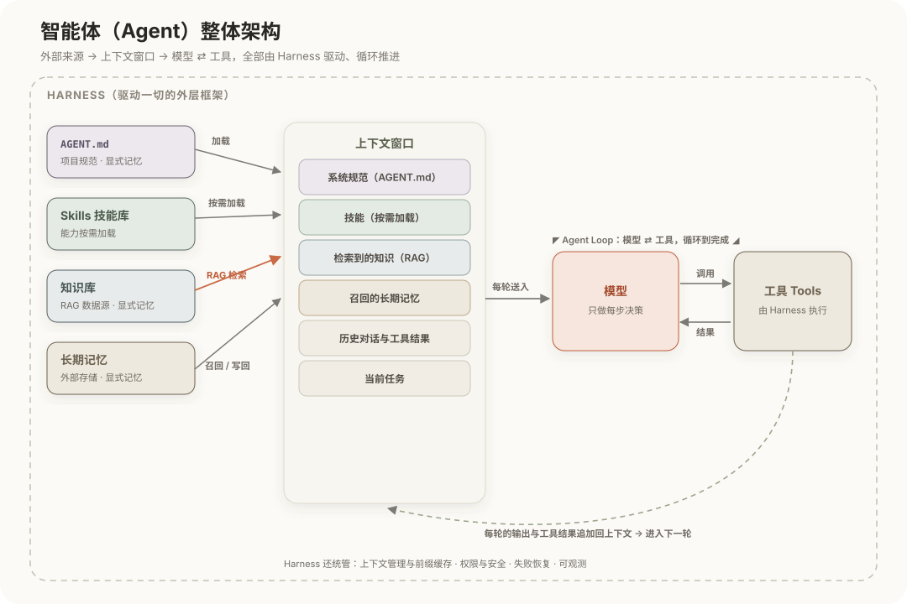
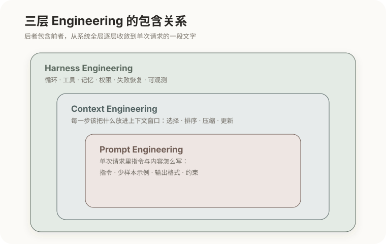
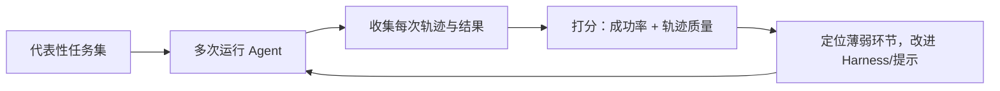

# Harness 工程与智能体评估

前面八篇拆解了一堆零件：模型、循环、工具、技能、上下文、记忆、多智能体。但零件不等于产品。把这些零件组织成一个能在真实环境里可靠完成任务的系统，靠的是模型之外的一整套支架——**Harness**。它决定了同一个模型能发挥出多少能力；而**评估**则决定了我们能否判断它到底可不可靠。这两件事，是把 Agent 从"能跑的 demo"推向"可用的产品"的最后一关，也是本章的收束。

## 1. Harness 是什么

Harness 是模型之外、驱动 Agent 运转的全部工程结构。前几篇其实已经把它的零件逐个讲过了，这里把它们归位到一张全景里：模型居中只负责决策，其余一切都是围绕它的支架。

这张图把前面各篇的零件放进了一张全景，顺着数据流读一遍，就能看清它们如何连接：

- **外部来源（左）**：`AGENT.md` / `CLAUDE.md` 提供项目规范、技能库提供可加载的能力、知识库是 RAG 的数据源、长期记忆存放跨会话的结论——它们都属于显式记忆（见[记忆与检索](07-记忆与检索：Memory、RAG与WebSearch.md)）。
- **上下文窗口（中）**：这些来源各自通过一条通道汇入上下文——规范被**加载**、技能**按需加载**、知识库经 **RAG 检索**注入、长期记忆被**召回/写回**。上下文是模型唯一的工作内存（见[上下文工程](05-上下文工程与提示工程.md)）。
- **模型 ⇄ 工具（右）**：每一轮把上下文整体送入模型；模型产出工具调用，Harness 执行工具、把结果回填上下文，再进入下一轮——这就是 **Agent Loop**（见[Agent 机制](04-Agent机制：Agent-Loop与Tool-Use.md)）。
- **Harness（外框）**：以上一切都跑在 Harness 里，它还统管上下文管理与前缀缓存、权限与安全、失败恢复、可观测。

**RAG 的位置在图里一目了然**：它不是模型的一部分，而是"知识库 → 上下文"的那条检索通道，嵌在每一轮"组装上下文"的环节；模型只是照常读上下文，并不知道其中哪些是检索来的。

| 组成 | 职责 | 出自哪一篇 |
|---|---|---|
| Agent Loop | 反复调用模型直至完成，管理停止条件 | 第 4 篇 |
| 工具执行层 | 把模型的调用意图真正执行并回填结果 | 第 4、6 篇 |
| 上下文管理 | 每步喂给模型什么，如何压缩、保持稳定前缀 | 第 3、5 篇 |
| 记忆与检索 | 持久化存储与按需召回 | 第 7 篇 |
| 权限与安全 | 控制危险操作、隔离不可信输入、审计 | 第 6 篇 |
| 失败恢复 | 错误重试、循环检测、超时与预算控制 | 第 4 篇 |
| 可观测 | 记录每一步的输入输出与工具调用 | 本篇 |

可以看出，"Harness 工程"不是一个新话题，而是把前面所有工程手段**统一到一个系统里**的视角。模型只提供"每一步该怎么做"的判断，其余的"让判断可靠落地"全在这层。

## 2. 模型不等于产品

为什么要如此强调这层支架？因为一个反复被验证的事实：**同一个模型，配上不同的 Harness，表现可能天差地别。**

道理并不玄：模型决定了能力的**上限**，但能力能否被稳定地发挥出来，取决于 Harness。一个强模型，套在混乱的循环、失控的上下文、描述糟糕的工具、没有错误恢复的框架里，会频繁失败、原地打转；而一个设计良好的 Harness，能把同一个模型的能力充分且可靠地压榨出来。

这对工程实践有一个很实际的含义：当模型选定之后，**Harness 往往是投入产出比最高的着力点**——它不需要重新训练模型（那既贵又慢），却能显著改变最终体验。前面每一篇的工程细节，最终都在这里汇合成"如何设计这套支架"。

## 3. 三层 Engineering 的关系

把全章的工程话题理一遍，会发现它们不是并列的技巧，而是逐层外扩、层层包含的三个圈：

- **提示工程**（最内）：单次请求里，指令和内容那一段文字怎么写；
- **上下文工程**（中层）：每一步该把什么放进上下文窗口的整体管理；
- **Harness 工程**（最外）：整个循环、工具、记忆、权限、恢复机制的系统设计。

后者**包含**前者，这个包含关系不是比喻：Harness 在运行时，每一轮都要做上下文工程的决策（这一步放什么进窗口）；而上下文里的每一段文字，又是提示工程的产物。所以三者是从系统全局逐层收敛到一段文字的**同一件事**，只是尺度不同。理解了这层嵌套，就不会再把"写好提示"和"设计好 Agent"当成两回事。

## 4. 可观测与调试

Harness 里有一个前面没细讲、但对工程至关重要的组成——可观测。为什么它单独值得一说？因为 Agent 是**多步且非确定**的系统（第 2、4 篇），出了错很难靠一次输出定位：它可能在第七步、因为看到了某个工具的错误返回、做出了一个错误决策，而你只看到最终结果不对。

解决办法是**轨迹**（trace）：完整记录每一步的上下文、模型输出、工具调用与结果。有了轨迹，才能回答"它在第几步、基于什么、走错了哪一步"。所以可观测不是上线后再补的东西，而应是 Harness 的一等组成——它也正是下面"评估"能做起来的前提。

## 5. 智能体评估

最后一个问题：怎么知道一个 Agent 到底可不可靠？评估 Agent 比评估单次问答难得多，难点仍是那个老问题——**多步且非确定**。

常用的评估维度，对应着不同层面的问题：

| 维度 | 看什么 |
|---|---|
| 任务成功率 | 端到端完成的比例，最直接的结果指标 |
| 轨迹评估 | 中间步骤是否合理：有没有绕路、误用工具、陷入循环 |
| 基准测试 | 用标准任务集横向比较不同模型或 Harness |
| 回归 | 一次改动后，原本能完成的任务有没有退化 |

这里最容易踩的坑，是"跑一次成功就以为可靠"。因为采样带来的非确定性（第 2 篇），同一个任务多次运行，结果可能时对时错——所以要**多次运行看成功率的分布**，而不是拿单次结果下结论。这也是为什么可观测和评估体系本身，往往和 Harness 一样，是决定 Agent 产品能否**持续改进**的关键基础设施：没有可靠的评估，任何改动都只是凭感觉，你甚至不知道它究竟变好了还是变坏了。

至此，从"模型只会预测下一个 token"，到"如何把它搭成一个可靠、可评估、可持续改进的 Agent 系统"，这条线就走完了。每一层工程，都是在为模型那几条固有边界（第 1 篇）打造可靠的支架。

## 相关章节

- [Agent 机制：Agent Loop 与 Tool Use](04-Agent机制：Agent-Loop与Tool-Use.md)：Harness 最核心的循环与失败恢复。
- [上下文工程与提示工程](05-上下文工程与提示工程.md)：三层嵌套中的内两层。
- [LLM API 与 KV Cache](03-LLM-API与KV-Cache.md)：Harness 管理上下文时要遵守的成本与缓存纪律。
