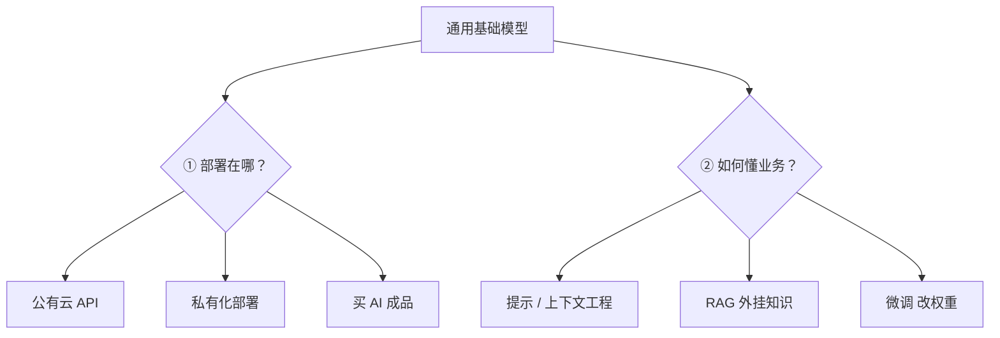
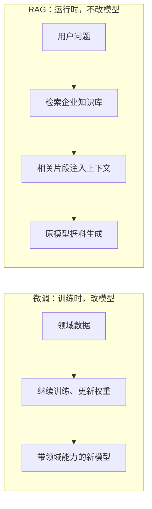
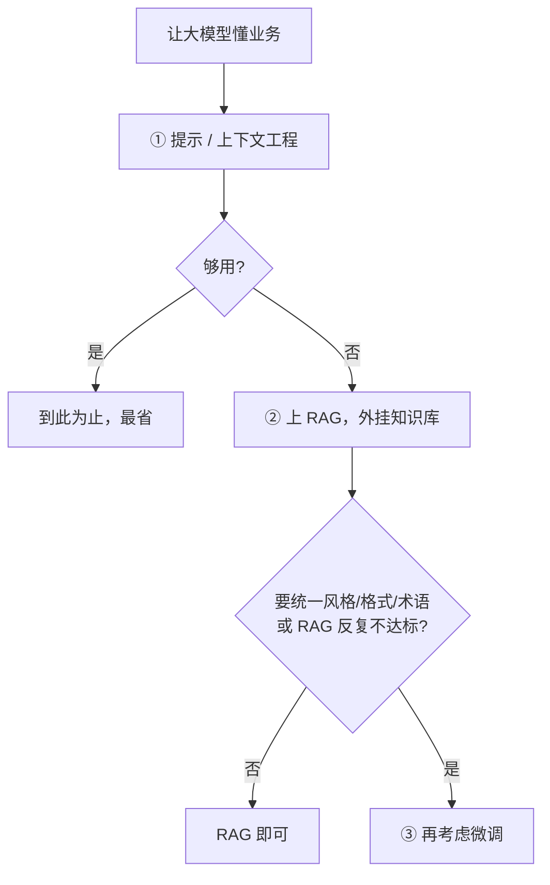

# 大模型的落地路线：部署与领域特化

前面各篇讲的是大模型和 Agent 的原理与机制。要把它真正用到业务里，还得回答两个**相互独立**的问题：模型**部署在哪、由谁托管**，以及怎样让通用模型**懂你的业务**。市面上常听到的公有云 API、私有化部署、RAG、微调、AI 成品，其实分别是这两个问题的不同答案。把它们放进这两条轴里，选型就不再是一堆并列名词，而是一张能对号入座的地图。

## 1. 两个正交的问题

落地的所有技术路线，都落在两条彼此独立的轴上：

- **部署形态**：模型放在哪、谁维护、数据走不走出你的边界；
- **领域特化**：如何让通用模型掌握你的专属知识和口径。

这两条轴独立，可以任意组合：既能"公有云 API + RAG"，也能"私有化部署 + 微调"。把它们混成一道单选题，是选型时最常见的错误。下面分两轴各自讲清。

## 2. 部署形态：模型放在哪

这条轴的核心分歧只有一个——**数据和算力，是交给厂商，还是攥在自己手里**。三种形态是这条光谱上的三个点。

### 公有云 API 调用

直接调用厂商托管的模型，你不碰模型权重、也不碰 GPU，按 token 付费（机制见[LLM API 与 KV Cache](03-LLM-API与KV-Cache.md)）。它的价值在"快"：无需自建算力、几行代码就能接入、还能随时用上最新最强的模型。代价也很明确——请求里的数据要发到厂商那一侧，带来**数据出境与合规风险**；按量计费在高并发下长期成本可能不低；可用性和政策都受制于厂商，可定制性最低。适合快速验证、流量不确定、对数据敏感度不高的场景。

### 开源模型私有化部署

把开源权重的模型（如 Llama、DeepSeek 等）跑在自有或私有云的 GPU 上，自建推理服务。它换来的正是 API 缺的那几样：**数据不出域**（满足强合规）、成本相对固定可控（用自有算力，不按 token 计）、可深度定制（改推理、做微调或蒸馏）。代价是你要自备 GPU 和运维能力，开源模型能力通常略逊于最强闭源，且更新、优化都得自己跟。适合数据敏感、强合规，或规模大到自建更划算、需要深度定制的场景。

### AI 原生应用（买成品）

直接用别人做好的、面向某行业或场景的 AI 产品，开箱即用。它把模型和工程全外包了，**上线最快、几乎零部署**。但定制自由度最低，能力边界由产品方划定，还可能被供应商在数据、流程和迁移成本上**锁定**。适合需求标准化、想最快见效、没有自研意愿的场景。

| 形态 | 上手速度 | 需要 GPU | 数据出域 | 成本形态 | 定制自由度 | 锁定风险 |
|---|---|---|---|---|---|---|
| 公有云 API | 最快 | 否 | 是 | 按量计费 | 低 | 中 |
| 私有化部署 | 慢 | 是 | 否 | 固定（自有算力） | 高 | 低 |
| AI 成品 | 即用 | 否 | 视产品 | 订阅 | 最低 | 高 |

## 3. 领域特化：让通用模型懂业务

通用模型不知道你的私有知识，也不熟你的表达口径。让它"懂业务"有三种手段，由轻到重，**应当从轻的先试**。

### 提示与上下文工程（最轻）

先试这个：把要求、示例和必要资料直接写进提示与上下文（见[上下文工程与提示工程](05-上下文工程与提示工程.md)）。它零训练、改一句话就能迭代，够用就不必上更重的手段。局限是受上下文窗口约束——知识量一大，塞不下、也塞不高效，就该换 RAG。

### RAG：运行时外挂知识

模型本身不动，把企业知识库切块、嵌入、建索引；提问时检索出相关片段、注入上下文再生成（机制见[记忆与检索](07-记忆与检索：Memory、RAG与WebSearch.md)）。它的特点是知识在**运行时**注入：改库即改知识、可实时更新、能给出处、降低幻觉，而**不改模型权重**。局限是效果取决于检索质量，且它只能补"知道什么"，改不了模型的风格、格式和推理习惯。适合知识量大、更新频繁、要可追溯来源的场景。

### 微调 Fine-Tuning：训练时改权重

用领域数据继续训练，**更新模型权重**（本质是[大语言模型的工作原理](01-大语言模型的工作原理.md)里 SFT 的延伸），把领域的风格、格式、术语乃至技能固化进模型本身。它在**训练时**注入，改变的是模型的行为：输出更一致、术语更准、更贴合某种固定格式，而且训练完成后推理时不必再额外检索。代价是需要高质量标注数据和训练成本，知识一更新就得重训，且它不擅长承载大量易变的事实。适合要统一输出口径、固定术语、稳定完成某类任务的场景。

**RAG 与微调最容易混，关键差别在"何时注入、改的是什么"：**

| 维度 | RAG | 微调 |
|---|---|---|
| 注入时机 | 运行时 | 训练时 |
| 改的是什么 | 只改喂进去的上下文，模型不动 | 改模型权重本身 |
| 更新知识 | 改库即可、实时 | 需重新训练 |
| 擅长 | 大量、易变、要溯源的**事实** | 稳定的**风格 / 格式 / 术语 / 技能** |
| 可追溯 | 能给出处 | 不能 |

二者**不互斥、常组合**：用微调统一口径与格式，用 RAG 提供最新、可溯源的事实，是很常见的搭配。

## 4. 选型路线

选型不是挑"最强"或"最重"的，而是挑"够用且合规"的最省一档。两条轴各有一个务实顺序。

领域特化，沿"轻→重"的阶梯走，够用就停：

部署形态，按"数据敏感度 + 见效速度"定：数据敏感、强合规就**私有化部署**；要快速验证、流量不定就用**公有云 API**；需求标准化、想最快见效就直接用**成品**。

两条轴独立组合，常见的落地组合例如：

- **公有云 API + RAG**：快速上线、知识常更新，对数据敏感度不高；
- **私有化部署 + 微调**：强合规且要稳定口径，愿意投入算力与数据；
- **成品**：标准需求、追求最短上线路径。

## 核心结论

一句话：**部署形态回答"模型放哪、数据走不走出去"，领域特化回答"怎么让它懂业务"，两条轴独立、可自由组合。** 落地不追最重的方案，而是沿"提示 → RAG → 微调"和"成品/API → 私有化"两条阶梯，取满足合规与效果的最省一档。

## 相关章节

- [LLM API 与 KV Cache](03-LLM-API与KV-Cache.md)：公有云 API 调用的机制与成本。
- [记忆与检索：Memory、RAG 与 WebSearch](07-记忆与检索：Memory、RAG与WebSearch.md)：RAG 的完整流程与检索质量。
- [上下文工程与提示工程](05-上下文工程与提示工程.md)：最轻量的领域特化手段。
- [大语言模型的工作原理](01-大语言模型的工作原理.md)：微调是训练（SFT）的延伸。
