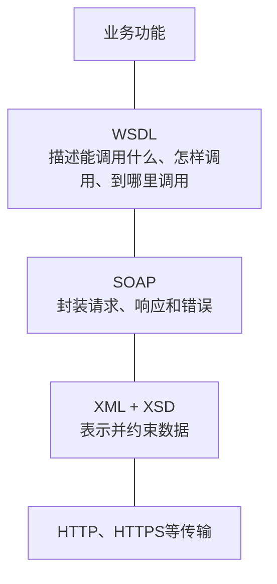
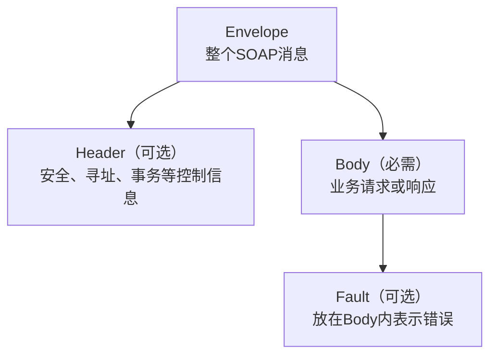
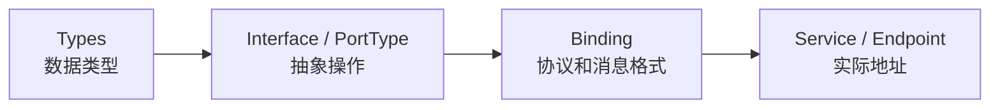
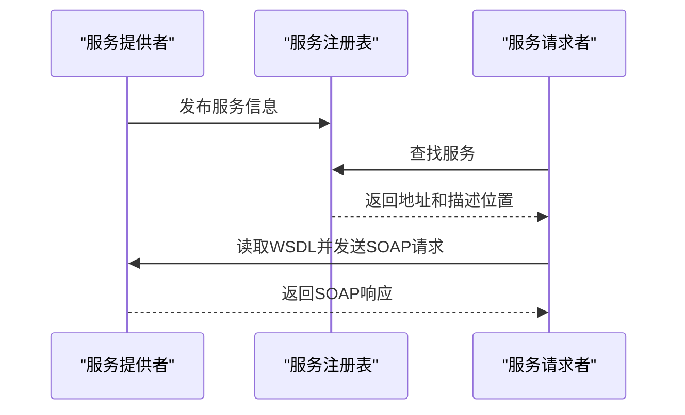
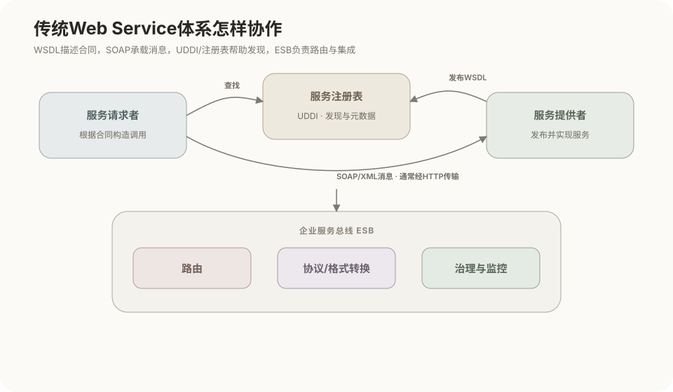
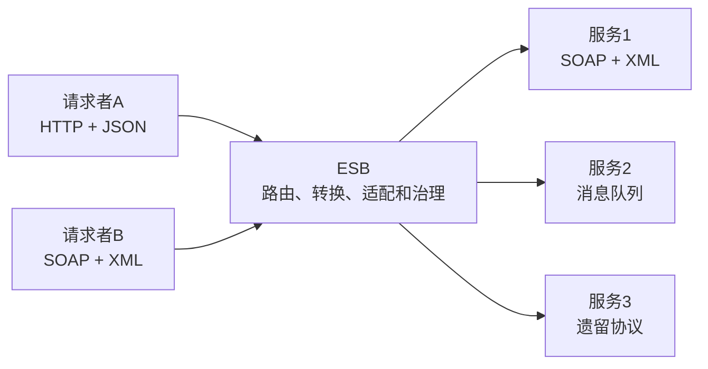

# Web Service与SOA

## 1. Web Service的定位

Web Service是一套让不同程序通过网络交换结构化消息、调用对方功能的技术体系。传统Web Service通常以XML、XSD、SOAP、WSDL和UDDI为核心。



Web Service主要解决：

- 客户端和服务端采用不同语言、操作系统或框架；
- 调用者需要获得服务操作、参数、返回值和地址；
- 双方需要共同的数据结构和消息规则；
- 企业系统需要安全、可靠消息、事务和服务治理。

Web Service不等于网站页面，也不要求使用浏览器。它是程序与程序之间的服务接口技术。

## 2. XML与XSD

### XML

XML使用元素、属性和命名空间表示结构化数据：

```xml
<doc:GetMetadataRequest xmlns:doc="https://example.org/document">
  <doc:documentId>DOC-1024</doc:documentId>
</doc:GetMetadataRequest>
```

XML只规定结构化文本的基本语法，不负责说明服务地址、可调用操作或网络传输。

### XSD

XSD（XML Schema Definition）约束XML允许出现的元素、属性、类型、顺序和数量。

```xml
<xs:element name="GetMetadataRequest">
  <xs:complexType>
    <xs:sequence>
      <xs:element name="documentId" type="xs:string"/>
    </xs:sequence>
  </xs:complexType>
</xs:element>
```

需要区分：

- **格式正确（Well-formed）**：XML标签闭合、嵌套合法；
- **模式有效（Valid）**：XML还满足指定XSD的约束。

```text
XML：承载具体数据
XSD：规定这类XML数据允许采用的结构
```

## 3. SOAP

SOAP是基于XML的消息交换框架。SOAP消息主要包括：



简化请求：

```xml
<soap:Envelope xmlns:soap="http://www.w3.org/2003/05/soap-envelope"
               xmlns:doc="https://example.org/document">
  <soap:Header/>
  <soap:Body>
    <doc:GetMetadataRequest>
      <doc:documentId>DOC-1024</doc:documentId>
    </doc:GetMetadataRequest>
  </soap:Body>
</soap:Envelope>
```

### SOAP与HTTP

SOAP消息可以作为HTTP请求体发送。XML当然可以放入HTTP请求体，只要双方约定相应的`Content-Type`和解析规则。

```text
HTTP负责：URL、请求头、请求体和网络传输语义
SOAP负责：请求体内部的消息信封、业务内容和错误结构
```

SOAP通常通过HTTP或HTTPS传输，但SOAP不等于HTTP，也不强制只能使用HTTP。使用HTTP时，仍然存在URL、域名和端口。GET、POST属于HTTP方法，不属于REST专有规定；SOAP over HTTP通常使用POST。

## 4. WSDL

WSDL（Web Services Description Language）是服务的机器可读合同，描述：

- 服务提供哪些操作；
- 每项操作使用什么输入和输出消息；
- 消息采用哪些XSD类型；
- 使用什么协议和消息格式；
- 服务端点位于什么地址。



工具可以根据WSDL和XSD生成客户端代理。业务代码调用代理方法，代理负责把对象序列化成SOAP/XML并发送到服务端。

| 开发方式 | 过程 |
|---|---|
| Contract-first | 先设计WSDL和XSD，再生成或实现代码 |
| Code-first | 先写服务代码，再由工具生成WSDL |

WSDL不是服务代码，也不是SOAP消息本身。

## 5. UDDI、服务注册表与经典调用过程

UDDI（Universal Description, Discovery and Integration）规定Web Service的登记、分类和发现机制。

| UDDI数据 | 主要内容 |
|---|---|
| `businessEntity` | 提供服务的组织 |
| `businessService` | 服务分类和说明 |
| `bindingTemplate` | 服务地址和绑定信息 |
| `tModel` | 可复用技术模型或分类标识 |

教材常把登记信息概括为：

- 白页：谁提供；
- 黄页：属于什么分类；
- 绿页：怎样连接。

UDDI与服务注册表不处于同一层次：

```text
UDDI：规定怎样登记和查询的标准
服务注册表：实际保存和提供服务信息的组件
```

服务注册表可以采用UDDI，也可以使用其他技术。

经典Web Service过程是“发布—发现—绑定”：



注册表通常不是每次业务调用的中转站。请求者获得地址后，一般直接访问提供者。现代系统也可能使用配置中心、服务发现平台、API目录或固定配置代替公共UDDI。

## 6. 五项技术的职责边界

| 技术 | 核心问题 | 不负责什么 |
|---|---|---|
| XML | 数据用什么基本语法表示 | 不定义服务接口 |
| XSD | XML允许有哪些元素和类型 | 不指定服务地址 |
| SOAP | 请求、响应和错误怎样封装 | 不登记服务 |
| WSDL | 有什么操作、怎样调用、地址在哪里 | 不执行业务逻辑 |
| UDDI | 服务怎样登记、分类和发现 | 不定义SOAP正文 |

完整调用链可以压缩为：

```text
通过注册表或配置获得服务
→ 读取WSDL
→ 按XSD构造XML
→ 封装SOAP消息
→ 经HTTP/HTTPS等方式发送
→ 服务端解析并执行业务逻辑
```

## 7. SOA与Web Service

SOA（Service-Oriented Architecture，面向服务的体系结构）是一种按服务组织系统能力的架构思想，强调：

- 服务具有明确合同和边界；
- 调用者依赖合同而不是内部实现；
- 服务之间尽量降低耦合；
- 服务可以组合为业务流程；
- 服务具有独立部署和治理能力。



Web Service是一种实现服务通信和描述的技术，SOA是组织系统能力的思想。因此：

- 使用SOAP Web Service不自动等于形成完整SOA；
- SOA不强制使用SOAP、WSDL或UDDI；
- Web Service强调跨平台接口，SOA还强调服务划分、组合和治理。

## 8. 服务耦合与ESB

请求者直接调用提供者时，可能依赖：

| 耦合维度 | 依赖内容 |
|---|---|
| 接口 | 操作、参数和返回结构 |
| 地址 | URL、端口和实例位置 |
| 协议 | HTTP、SOAP、消息队列等 |
| 数据格式 | XML、JSON及字段结构 |
| 路由 | 应该调用哪个服务实例 |
| 时间 | 双方是否必须同时在线 |
| 版本 | 接口版本及兼容规则 |

Web Service减少语言、平台和私有消息格式依赖，但直接调用时仍可能存在地址、路由、协议和版本耦合。

ESB（Enterprise Service Bus，企业服务总线）位于请求者和提供者之间，集中承担消息接入、路由、转换和治理：



ESB常见能力：

- 消息路由和服务实例选择；
- 协议及数据格式转换；
- 消息过滤、校验和安全策略；
- 同步与异步方式适配；
- 服务组合、日志、监控和故障处理。

| 组件 | 首要职责 | 通常是否转发业务消息 |
|---|---|---:|
| Web Service | 提供标准服务接口和消息交互 | 是 |
| UDDI | 规定服务登记和发现方式 | 否 |
| 服务注册表 | 保存服务地址和元数据 | 通常否 |
| ESB | 运行期路由、转换和治理消息 | 是 |

ESB把请求者对具体提供者的多种依赖集中到中间层，但没有消除全部耦合：请求者仍依赖ESB的合同，ESB本身也需要高可用、监控和容量设计。

## 9. WS-*与安全

WS-*是围绕SOAP Web Service形成的一组扩展规范：

| 规范 | 主要用途 |
|---|---|
| WS-Security | 安全令牌、消息签名和加密 |
| WS-Addressing | 目标、回复地址、动作和消息标识 |
| WS-ReliableMessaging | 消息编号、确认和重传 |
| WS-Policy | 表达服务能力和策略要求 |
| WS-Coordination | 建立分布式协调上下文 |
| WS-AtomicTransaction | 支持原子事务协调 |
| BPEL | 编排多个服务形成业务流程 |

HTTPS保护客户端与某个端点之间的通信通道；WS-Security可以保护SOAP消息本身，适合消息经过中间节点或需要独立验证消息内容的场景。

Web Service仍需分别考虑身份认证、访问控制、机密性、完整性、抗抵赖性、审计和重放防护。

## 10. SOAP Web Service与REST API

SOAP是消息框架，REST是架构风格，二者不处于完全相同的概念层级，但经常作为接口方案比较。

| 对比项 | SOAP Web Service | REST API |
|---|---|---|
| 组织方式 | 操作和消息 | 资源及其表示 |
| 常见格式 | XML | JSON常见，也可用其他格式 |
| 消息外层 | SOAP Envelope | 不要求统一消息信封 |
| 接口合同 | WSDL | 常用OpenAPI，但REST不强制 |
| HTTP使用 | 常作为SOAP传输通道 | 强调URI、方法和状态码语义 |
| 企业扩展 | WS-*规范 | 常组合TLS、OAuth、网关等 |

需要明确：

- REST不等于JSON；
- 使用HTTP不等于REST；
- GET、POST、请求头、请求体和状态码来自HTTP，不是REST发明的；
- SOAP消息中的XML可以作为HTTP请求体；
- SOAP服务同样可以拥有URL、域名和HTTPS端点。

## 11. 核心关系

```text
XML：表示数据
XSD：约束数据
SOAP：封装消息
WSDL：描述服务合同
UDDI：规定服务登记和发现
服务注册表：保存并查询服务信息
SOA：从架构层面组织和治理服务
ESB：在服务之间路由、转换和治理业务消息
```

## 相关章节

- [HTTP消息与Web请求](../02-计算机网络/04-HTTP消息与Web请求.md)
- [HTTPS与TLS](../02-计算机网络/05-HTTPS与TLS.md)
- [REST接口设计](06-REST接口设计.md)
- [Spring家族与Java Web请求链路](07-Spring家族与Java-Web请求链路.md)
- [网格计算与OGSA](11-网格计算与OGSA.md)

## 参考资料

- [W3C：Web Services Architecture](https://www.w3.org/TR/2002/WD-ws-arch-20021114/)
- [W3C：SOAP Version 1.2 Part 1](https://www.w3.org/TR/soap12/)
- [W3C：Web Services Description Language 1.1](https://www.w3.org/TR/2001/NOTE-wsdl-20010315)
- [W3C：XML Schema Definition Language 1.1](https://www.w3.org/TR/xmlschema11-1/)

