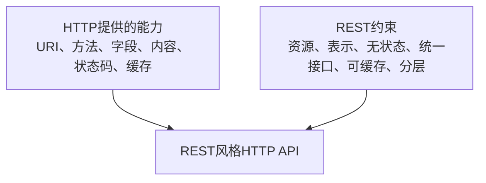
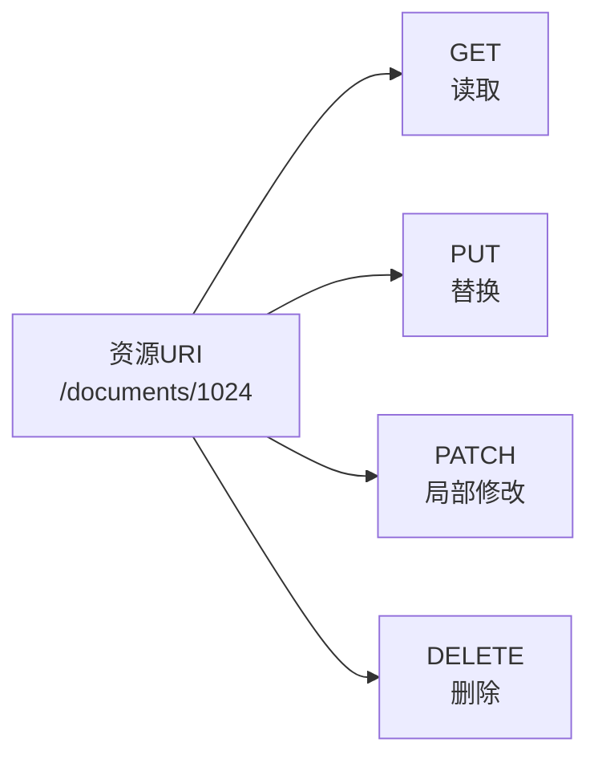
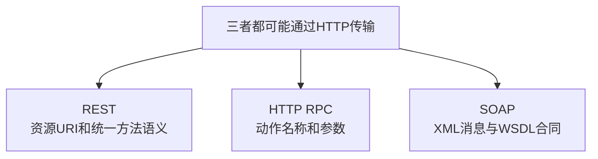
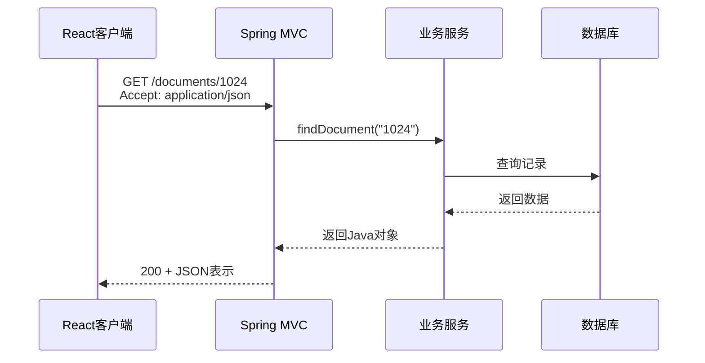

# REST接口设计

## 1. REST的性质

REST（Representational State Transfer，表述性状态转移）是一种分布式系统架构风格，不是传输协议，也不是一种固定数据格式。

REST没有发明以下内容：

- GET、POST、PUT、DELETE；
- URL、请求头和请求体；
- 200、404、500等状态码；
- JSON和XML。

这些分别来自HTTP和具体的数据格式标准。REST规定的是应用如何以资源、表示和统一接口为核心组织交互。



## 2. REST的六项约束

| 约束 | 含义 |
|---|---|
| Client-Server | 客户端界面职责与服务器数据、业务职责分离 |
| Stateless | 每个请求包含服务器处理它所需的信息，不依赖服务器记住上一次请求的临时交互状态 |
| Cacheable | 响应明确能否缓存，以便客户端或中间节点安全复用 |
| Uniform Interface | 使用统一的资源标识、表示和消息语义 |
| Layered System | 客户端不必知道连接的是源服务器还是中间层 |
| Code-on-Demand | 服务器可按需下发可执行代码；这是可选约束 |

现实中的很多“REST API”只采用其中一部分。严格符合REST与工程上习惯称为RESTful，需要根据实际约束程度区分。

## 3. 资源、URI与表示

### 3.1 资源

资源是系统希望通过接口识别和操作的目标，例如：

- 文档集合；
- 某一份文档；
- 某份文档的评论集合；
- 某一条评论。

### 3.2 URI标识资源

```text
/documents
/documents/1024
/documents/1024/comments
/documents/1024/comments/8
```

REST不强制路径必须使用复数名词，也不强制添加`/api`前缀。这些属于接口设计约定。

### 3.3 表示

服务器内部的资源可能是数据库记录和Java对象。传输时需要转化为一种表示。

JSON表示：

```json
{
  "id": "1024",
  "title": "设计说明",
  "status": "AVAILABLE"
}
```

XML表示：

```xml
<document>
  <id>1024</id>
  <title>设计说明</title>
  <status>AVAILABLE</status>
</document>
```

JSON和XML都可以作为资源表示。REST不等于JSON。

## 4. 统一接口与HTTP方法

HTTP方法由HTTP定义。REST风格API通常按照HTTP方法语义操作资源：

| 目标 | 请求 |
|---|---|
| 查询文档列表 | `GET /documents` |
| 查询一份文档 | `GET /documents/1024` |
| 在集合中创建文档 | `POST /documents` |
| 整体替换文档 | `PUT /documents/1024` |
| 局部修改文档 | `PATCH /documents/1024` |
| 删除文档 | `DELETE /documents/1024` |



## 5. REST与CRUD不是完全等同

CRUD是数据操作分类：

```text
Create、Read、Update、Delete
```

REST是完整架构风格。HTTP方法与CRUD常见映射为：

| CRUD | 常用HTTP方法 |
|---|---|
| Create | POST，有时使用PUT |
| Read | GET |
| Update | PUT或PATCH |
| Delete | DELETE |

但REST还包含无状态、缓存、分层和统一接口等约束，因此“具有CRUD接口”不能单独证明系统采用了REST。

## 6. 无状态的准确含义

无状态不表示服务器不能保存数据库数据、缓存或账户信息。它表示服务器处理当前请求时，不应依赖只保存在服务器中的上一轮客户端交互上下文。

一个自包含请求可能是：

```http
GET /documents/1024 HTTP/1.1
Host: api.example.com
Authorization: Bearer eyJ...
Accept: application/json
```

其中包含目标资源、身份凭据和期望的表示格式。

需要区分：

- **资源状态**：数据库中保存的文档、用户等业务状态，可以由服务器保存。
- **会话交互状态**：某个客户端上一步进行到哪里，严格REST倾向由客户端在后续请求中明确提供。

## 7. 内容协商

客户端通过`Accept`声明希望收到的表示：

```http
Accept: application/json
```

服务器通过`Content-Type`说明实际返回的表示：

```http
Content-Type: application/json
```

请求体的数据类型也由`Content-Type`说明：

```http
Content-Type: application/json
```

`Accept`描述希望接收什么，`Content-Type`描述当前消息内容实际是什么，不能混用。

## 8. 状态码的合理使用

状态码属于HTTP。REST风格接口应尽量按照HTTP语义使用它们：

| 场景 | 建议状态码 |
|---|---|
| 查询成功 | 200 |
| 创建成功 | 201，并可返回`Location` |
| 删除成功且无响应内容 | 204 |
| 请求字段无法解析 | 400 |
| 没有有效认证凭据 | 401 |
| 已认证但无访问权限 | 403 |
| 资源不存在 | 404 |
| 资源状态冲突 | 409 |
| 请求体类型不支持 | 415 |
| 请求过于频繁 | 429 |
| 服务器发生未预期错误 | 500 |

一种不推荐的做法是HTTP永远返回200，再把真正的失败写进业务字段：

```json
{
  "code": 500,
  "message": "server error"
}
```

业务错误码可以补充细分错误，但不应无理由地覆盖HTTP层的真实处理结果。

## 9. 幂等性与重试

接口是否幂等会影响客户端能否安全重试。

| 方法 | 标准语义上的幂等性 |
|---|---|
| GET | 幂等 |
| PUT | 幂等 |
| DELETE | 幂等 |
| POST | 通常不幂等 |
| PATCH | 不保证幂等 |

创建类POST接口可能通过幂等键避免网络重试产生重复记录：

```http
Idempotency-Key: 7df9c4...
```

幂等键是工程设计，不是REST或HTTP自动实现的能力。

## 10. 查询、分页、排序和过滤

集合资源通常通过查询参数表达读取条件：

```text
GET /documents?status=AVAILABLE&page=2&pageSize=20
GET /documents?sort=createdAt,desc
GET /documents?ownerId=80
```

查询参数适合表达读取条件；敏感信息不应仅因为放在HTTPS URL中就被认为绝对安全，因为URL可能进入访问日志、浏览器历史或监控系统。

## 11. 版本管理

常见版本策略包括：

```text
路径版本：
/api/v1/documents

请求头版本：
Accept: application/vnd.example.v1+json
```

REST本身没有规定必须采用哪种版本方式。版本设计的重点是兼容性、废弃周期和调用方迁移。

## 12. 错误响应

错误响应应具有稳定、可解析的结构，例如：

```json
{
  "type": "https://example.com/problems/document-not-found",
  "title": "Document not found",
  "status": 404,
  "detail": "Document 1024 does not exist",
  "instance": "/documents/1024"
}
```

HTTP状态码表示通用结果类别，响应体提供业务细节和定位信息。

## 13. REST与RPC、SOAP的区别

### 13.1 REST风格

```http
DELETE /documents/1024
```

资源由URI标识，操作主要由HTTP方法表达。

### 13.2 HTTP上的RPC风格

```http
POST /execute
Content-Type: application/json

{
  "method": "deleteDocument",
  "documentId": "1024"
}
```

它使用HTTP和JSON，但主要由请求体中的方法名表达操作，因此更接近RPC。

### 13.3 SOAP

```http
POST /DocumentService
Content-Type: application/soap+xml
```

```xml
<soap:Body>
  <DeleteDocumentRequest>
    <documentId>1024</documentId>
  </DeleteDocumentRequest>
</soap:Body>
```

SOAP主要通过XML消息中的操作表达调用，并由WSDL描述接口合同。



## 14. REST没有规定的内容

REST没有统一规定：

- 请求体必须使用JSON；
- URL必须以`/api`开头；
- Java必须使用Spring MVC；
- 数据库必须使用MySQL；
- 认证必须使用JWT；
- 接口说明必须使用OpenAPI；
- 所有操作都必须对应简单CRUD。

这些属于技术选择和工程规范。

## 15. REST风格接口的处理链



REST约束主要反映在客户端与Spring MVC之间的接口组织方式。内部是否采用Service、MyBatis或其他结构，不由REST决定。

## 参考资料

- [Roy Fielding博士论文：Representational State Transfer](https://roy.gbiv.com/pubs/dissertation/rest_arch_style.htm)
- [RFC 9110：HTTP Semantics](https://www.rfc-editor.org/rfc/rfc9110.html)
- [RFC 9457：Problem Details for HTTP APIs](https://www.rfc-editor.org/rfc/rfc9457.html)

