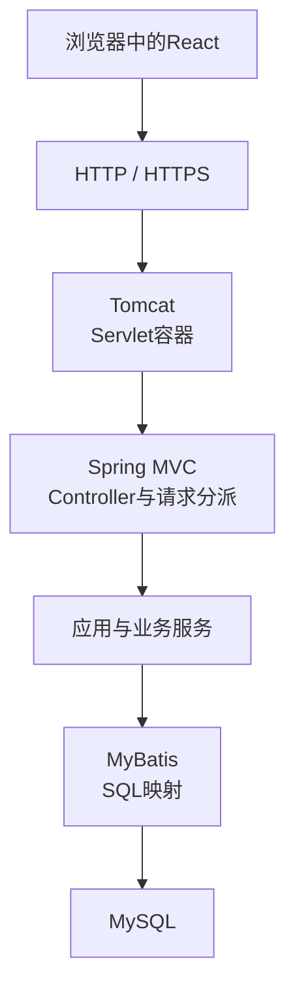
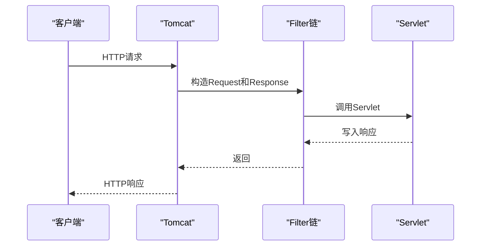
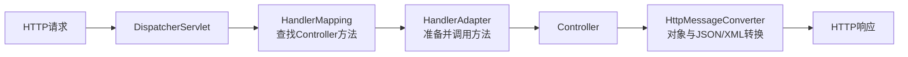
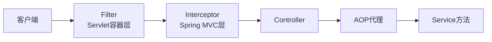
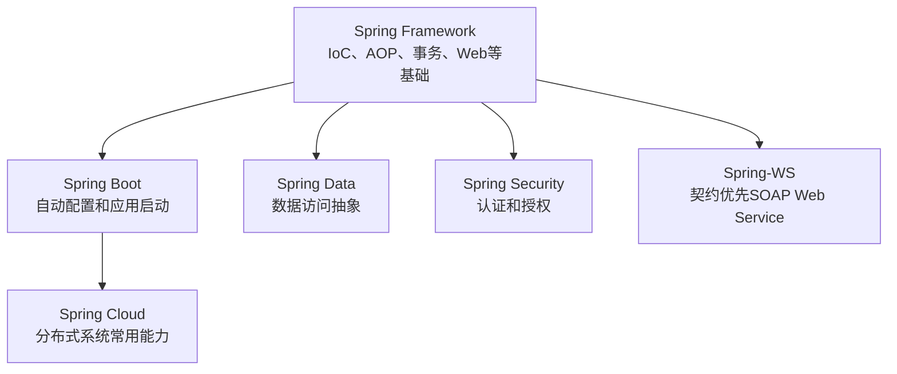
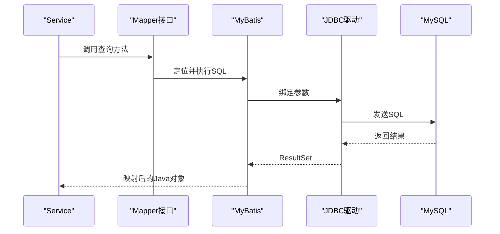
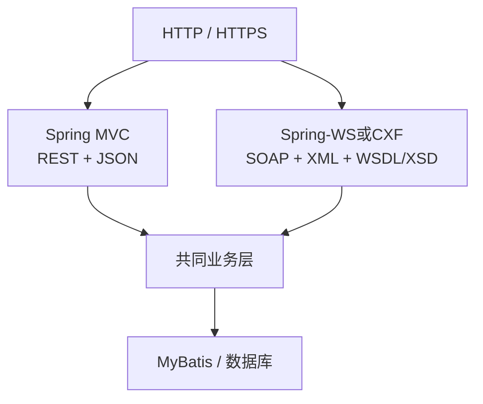
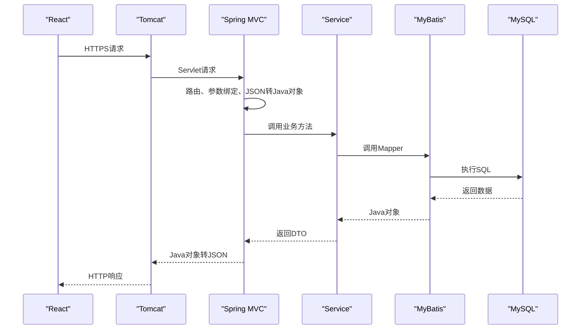

# Spring家族与Java Web请求链路

## 1. 一套Java Web系统中的技术层次

以React、Spring、MyBatis和MySQL组成的系统为例：



各层职责不同：

| 层次 | 负责内容 |
|---|---|
| React | 页面显示、交互、在浏览器中发起请求 |
| HTTP/HTTPS | 规定请求和响应怎样传输；TLS保护通信通道 |
| Tomcat/Servlet | 接收网络请求并提供Java Web运行环境 |
| Spring MVC | 把请求映射到Controller并转换参数、返回值 |
| 业务层 | 执行业务流程和规则 |
| MyBatis | 把Java调用和SQL执行连接起来 |
| MySQL | 持久化和查询数据 |

## 2. Servlet与Tomcat

### Servlet

Servlet是Java服务器端处理请求的一套规范。它定义Servlet的生命周期，以及`HttpServletRequest`、`HttpServletResponse`、Filter等接口。

Servlet是规范和编程模型，不是独立服务器。

### Tomcat

Tomcat是Servlet容器和Web服务器实现，主要负责：

- 监听网络端口；
- 接收并解析HTTP请求；
- 创建请求和响应对象；
- 执行Filter链；
- 把请求交给Servlet；
- 管理Servlet生命周期；
- 把响应写回网络。



Spring MVC运行在Servlet体系之上，并没有取代Servlet和Tomcat。

## 3. Spring Framework与Spring MVC

Spring Framework的核心能力包括：

- IoC/依赖注入：由容器创建对象并建立依赖；
- AOP：在方法执行周围加入事务、日志、安全等横切行为；
- 事务抽象；
- Web MVC；
- 数据访问与第三方技术集成。

Spring MVC的核心入口是`DispatcherServlet`。它根据请求路径和HTTP方法寻找Controller方法：

```java
@RestController
@RequestMapping("/documents")
public class DocumentController {

    @GetMapping("/{id}")
    public DocumentDto get(@PathVariable long id) {
        return documentService.get(id);
    }
}
```



Controller不是Servlet规范本身，而是Spring MVC提供的编程方式；`DispatcherServlet`才是接入Servlet容器的核心Servlet。

## 4. HTTP消息怎样转换为Java对象

Spring MVC根据参数注解和内容类型处理请求：

| 写法 | 典型数据来源 |
|---|---|
| `@PathVariable` | URL路径变量 |
| `@RequestParam` | 查询参数或表单参数 |
| `@RequestHeader` | HTTP请求头 |
| `@CookieValue` | Cookie |
| `@RequestBody` | 请求体 |

`HttpMessageConverter`负责在HTTP请求体和Java对象之间转换：

```text
Content-Type: application/json
JSON请求体 → Jackson转换器 → Java对象

Content-Type: application/xml
XML请求体 → XML转换器 → Java对象
```

返回值也会根据内容协商和转换器写入响应体。因此请求体可以是JSON、XML、纯文本或二进制，HTTP本身不限制只能使用JSON。

## 5. Filter、Interceptor与AOP

三者都能在业务方法周围增加处理，但位置不同：



| 机制 | 所在层次 | 常见用途 |
|---|---|---|
| Filter | Servlet规范 | 编码、跨域、通用认证、请求包装 |
| Interceptor | Spring MVC | Controller前后检查、用户上下文、请求日志 |
| AOP | Spring Bean方法调用 | 事务、方法级权限、审计、性能统计 |

它们可能解决相似问题，但拦截范围和能够获得的上下文不同。

## 6. Spring Boot与Spring家族

Spring Boot不是替代Spring Framework的新框架，而是简化Spring应用的配置、依赖组合、启动和部署。

它常提供：

- 自动配置；
- Starter依赖；
- 内嵌Tomcat、Jetty或Undertow；
- 外部化配置；
- 健康检查和运行指标。



常见成员：

| 项目 | 主要用途 |
|---|---|
| Spring MVC | 基于Servlet的Web和REST接口 |
| Spring WebFlux | 响应式Web编程 |
| Spring Security | 认证、授权和常见安全防护 |
| Spring Data | 多种数据访问技术的统一抽象 |
| Spring-WS | SOAP Web Service |
| Spring Cloud | 配置、网关、服务治理等分布式能力 |

## 7. MyBatis、数据库与事务

MyBatis是数据访问框架，负责：

- 把Java方法与SQL语句关联；
- 为SQL绑定参数；
- 执行JDBC操作；
- 把查询结果映射为Java对象；
- 与Spring事务管理集成。



Spring的声明式事务通常通过AOP代理建立事务边界：

```java
@Transactional
public void publishDocument(long id) {
    documentMapper.updateStatus(id, "PUBLISHED");
    auditMapper.insertRecord(id);
}
```

Spring负责开始、提交或回滚事务；MyBatis执行SQL；数据库提供真正的事务和锁能力。

## 8. REST与SOAP在Spring系统中的位置

两种路线可以使用同一套底层Java基础设施：



REST路线通常使用Controller、URI、HTTP方法、状态码和JSON；SOAP路线通常从WSDL/XSD合同出发，用SOAP Envelope封装XML消息。

SOAP同样拥有URL、域名、端口、HTTP请求头和请求体。GET、POST来自HTTP，不属于REST专有；SOAP over HTTP通常使用POST。

## 9. 完整请求链路



关键边界：

```text
HTTP定义网络消息
Servlet定义Java Web容器接口
Tomcat实现Servlet并接收请求
Spring MVC完成路由和对象转换
业务层执行业务规则
MyBatis连接Java方法与SQL
MySQL保存和查询数据
REST或SOAP规定接口组织和消息方式
```

## 相关章节

- [HTTP消息与Web请求](../02-计算机网络/04-HTTP消息与Web请求.md)
- [HTTPS与TLS](../02-计算机网络/05-HTTPS与TLS.md)
- [REST接口设计](06-REST接口设计.md)
- [Web Service与SOA](03-Web Service与SOA.md)

## 参考资料

- [Jakarta Servlet Specification](https://jakarta.ee/specifications/servlet/)
- [Spring Framework Reference](https://docs.spring.io/spring-framework/reference/)
- [Spring Boot Reference](https://docs.spring.io/spring-boot/)
- [MyBatis Documentation](https://mybatis.org/mybatis-3/)

