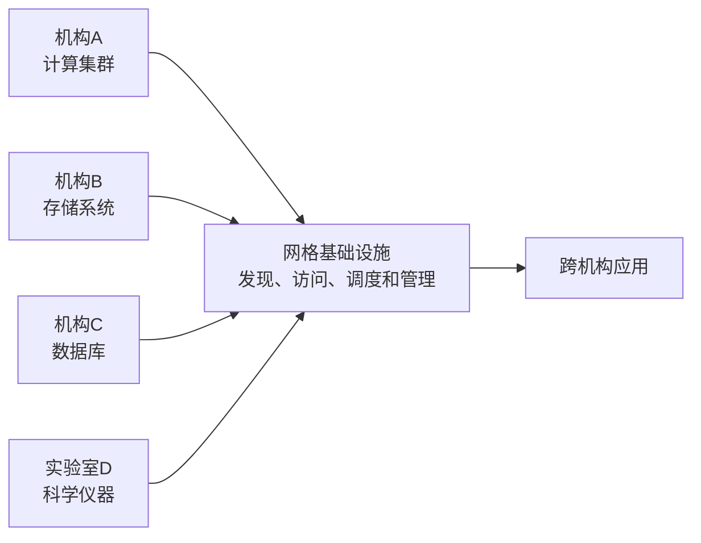
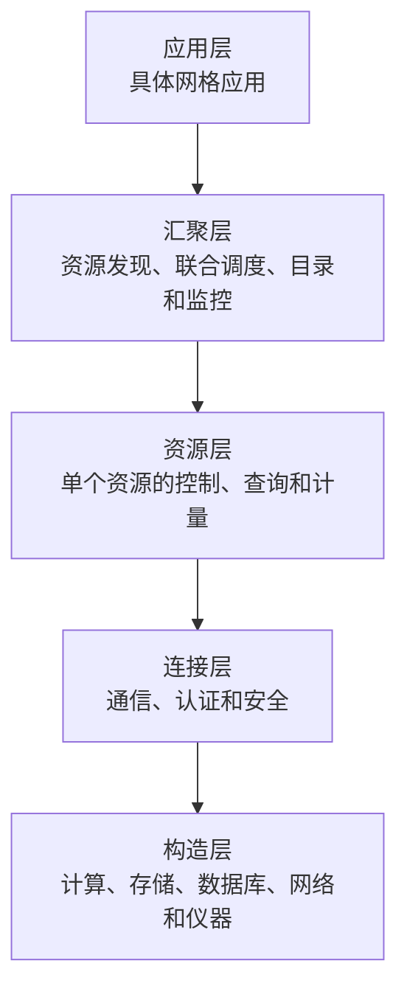
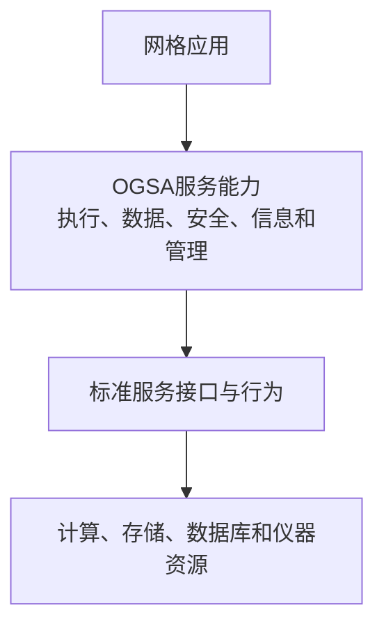
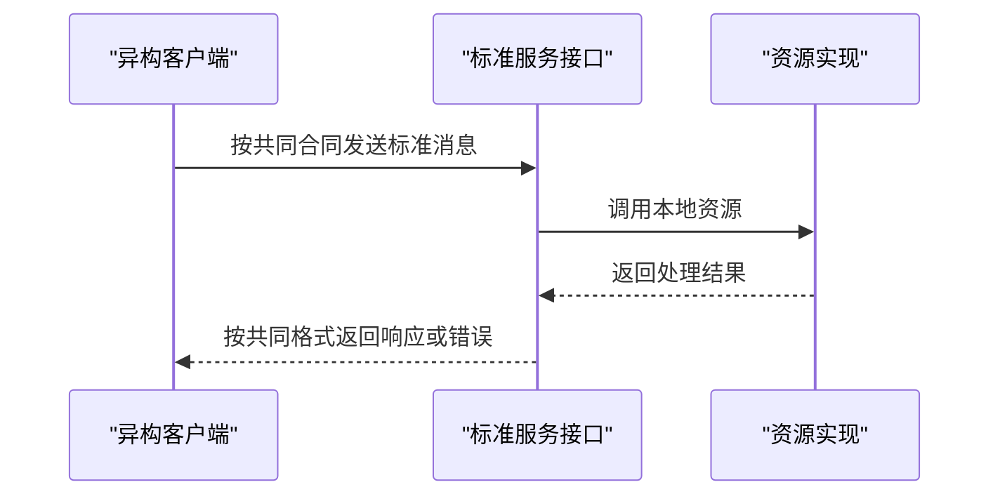
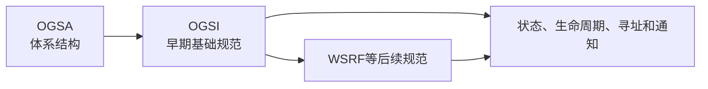
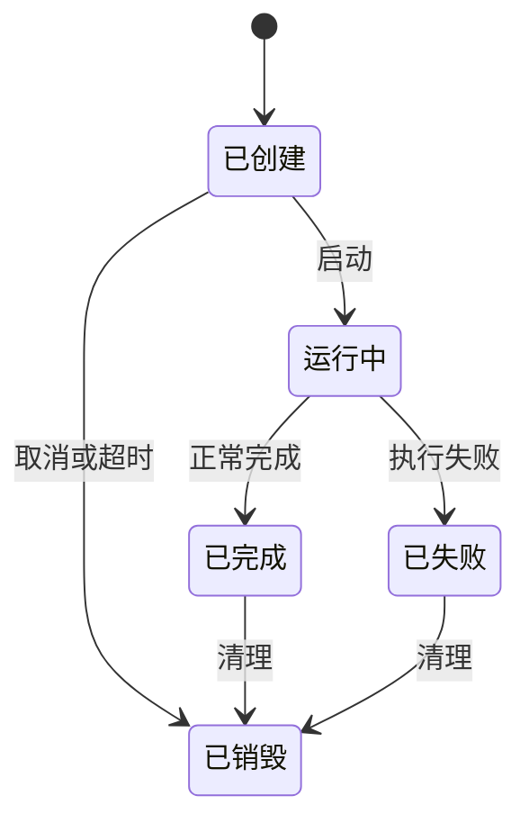

# 网格计算与OGSA

## 1. 网格计算

网格计算（Grid Computing）用于联合分布在不同地点、可能属于不同机构的计算、存储、数据、网络和仪器资源，使它们能够被统一发现、访问、调度和管理。

网格计算主要面对：

- 资源跨地域、跨机构和跨管理域；
- 硬件、操作系统及接口存在差异；
- 资源会动态加入、退出或改变状态；
- 用户身份和权限需要跨机构协调；
- 一个任务可能同时使用计算、存储和数据资源。

多个参与机构可以按照共同策略组成虚拟组织（Virtual Organization，VO），在保留各自管理权的同时共享约定范围内的资源。

## 2. 网格、集群、计算池与云计算

| 概念 | 主要范围 | 核心关注点 |
|---|---|---|
| 集群 | 通常由同一机构统一管理的一组节点 | 节点协同计算、高可用或负载均衡 |
| 计算池 | 可被统一分配的一组计算能力 | 资源汇集、分配和利用率 |
| 网格 | 可以跨机构和管理域的异构资源 | 资源共享、跨域协作和互操作 |
| 云计算 | 服务提供者按需交付虚拟化资源和平台能力 | 弹性、自助服务、计量和服务化交付 |

计算池说明计算能力怎样汇集和分配，不能单独说明异构系统怎样通过标准接口互操作。

## 3. 五层沙漏体系

经典网格体系常被概括为五层沙漏结构：

| 层次 | 主要职责 |
|---|---|
| 构造层（Fabric） | 提供实际计算、存储、数据和设备资源 |
| 连接层（Connectivity） | 提供资源间通信、认证和消息保护 |
| 资源层（Resource） | 管理和控制单个资源 |
| 汇聚层（Collective） | 协调多个资源，完成发现、调度、监控和复制 |
| 应用层（Application） | 使用下层能力完成具体任务 |

“沙漏”表示大量应用和大量异构资源通过中间相对统一的协议与接口连接。它说明网格能力怎样分层，不是一种具体消息格式。

## 4. OGSA与资源服务化

OGSA（Open Grid Services Architecture，开放网格服务架构）是一种面向服务的网格体系结构。它把资源和管理能力表示为具有标准接口的服务。

OGSA重点描述：

- 服务暴露哪些接口；
- 服务怎样寻址和发现；
- 服务状态怎样表示；
- 服务实例的生命周期怎样管理；
- 服务怎样认证、授权、通知和协作。

资源服务化是给实际资源增加可通过网络调用的服务接口。例如，计算资源提供提交任务、查询状态、取消任务和取得结果等操作。服务化增加的是统一访问层，不改变资源本身的物理性质。

OGSA是体系结构，不是编程语言或单独的软件产品。

## 5. 标准化Web Service与互操作

不同系统要互操作，必须共同理解接口、数据、消息和错误的含义。传统Web Service提供以下基础：

| 技术 | 职责 |
|---|---|
| XML | 表示结构化消息数据 |
| XSD | 约束XML元素和数据类型 |
| SOAP | 定义消息和错误的封装结构 |
| WSDL | 描述服务接口、操作、消息和端点 |
| WS-* | 扩展安全、寻址、可靠消息和资源状态等能力 |

客户端和服务端内部实现可以不同，只要它们在服务边界共同遵守公开的接口和消息规范。

一些教材使用“开放式Web Service”概括公开、跨平台、不绑定单一厂商的标准服务体系。它通常不是一项独立协议，具体实现仍依赖WSDL、SOAP、XML以及相关规范。

## 6. OGSA、OGSI与WSRF

三者处于不同层次：

| 名称 | 定位 |
|---|---|
| OGSA | 面向服务的网格体系结构 |
| OGSI | OGSA早期采用的一组网格服务基础规范 |
| WSRF | 后续用于表达Web Service与有状态资源关系的一组规范 |

OGSI（Open Grid Services Infrastructure）曾在Web Service基础上定义：

- 有状态的服务实例；
- 服务创建和销毁；
- 生命周期管理；
- 服务数据查询和更新；
- 服务实例寻址；
- 状态变化通知和统一故障消息。

后来这些能力被重新整理，以便更容易与主流Web Service规范配合，形成WS-Resource Framework等规范。

## 7. 状态、生命周期与主要服务

网格任务可能持续较长时间，因此服务需要表示任务状态并管理实例生命周期：

OGSA涉及的主要服务能力包括：

| 能力 | 主要内容 |
|---|---|
| 执行管理 | 描述、提交、启动和监控任务 |
| 数据服务 | 数据访问、移动、复制、缓存和联合 |
| 信息与发现 | 登记资源、查询能力和动态状态 |
| 安全 | 跨机构认证、授权、消息保护和审计 |
| 资源管理 | 监控、配置、故障和生命周期管理 |
| 策略与QoS | 约束、协商和服务水平管理 |

一次典型任务可能依次完成身份认证、资源发现、任务提交、资源分配、数据读取、状态更新和结果返回。

## 8. 概念边界

| 概念 | 主要回答的问题 |
|---|---|
| 计算池 | 计算能力怎样汇集和分配 |
| 五层沙漏 | 网格协议和能力怎样分层 |
| OGSA | 怎样以服务方式组织网格资源和通用能力 |
| 资源服务化 | 怎样把资源能力包装成可调用服务 |
| 标准化Web Service | 异构系统怎样按公开接口和消息互操作 |
| OGSI | 早期网格服务的状态、生命周期等基础行为怎样规定 |
| WSRF | Web Service怎样与有状态资源建立联系 |

五层沙漏与OGSA都服务于网格计算，但前者是经典分层表达，后者采用面向服务方式描述资源、接口、状态和交互。

## 9. 核心关系

```mermaid
flowchart TB
    NEED["跨机构共享异构资源"]
    GRID["网格计算"]
    LAYER["五层沙漏<br/>分层组织能力"]
    OGSA["OGSA<br/>面向服务的体系结构"]
    SERVICE["资源服务化"]
    WS["标准化Web Service<br/>接口与消息互操作"]
    RESULT["可发现、可调用、可管理的网格资源"]

    NEED --> GRID
    GRID --> LAYER
    GRID --> OGSA
    OGSA --> SERVICE
    OGSA --> WS
    SERVICE --> RESULT
    WS --> RESULT
```

## 相关章节

- [Web Service与SOA](03-Web Service与SOA.md)
- [网络体系结构与OSI、TCP/IP模型](../02-计算机网络/08-网络体系结构与OSI-TCP-IP模型.md)
- [OSI安全体系结构的五类安全服务](../04-信息安全技术基础/01-OSI安全体系结构的五类安全服务.md)

## 参考资料

- [Open Grid Forum：The Open Grid Services Architecture, Version 1.0](https://ogf.org/documents/GFD.30.pdf)
- [Open Grid Forum：OGSA Data Architecture](https://ogf.org/documents/GFD.121.pdf)
- [Globus：From OGSI to WS-Resource Framework](https://www.globus.org/sites/default/files/ogsi_to_wsrf_1.0.pdf)

