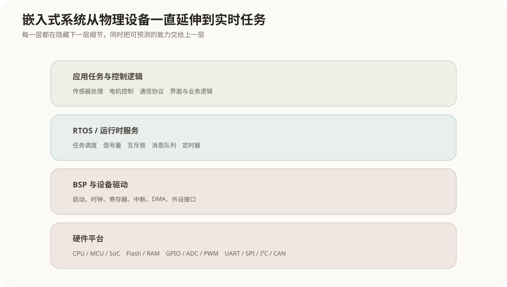
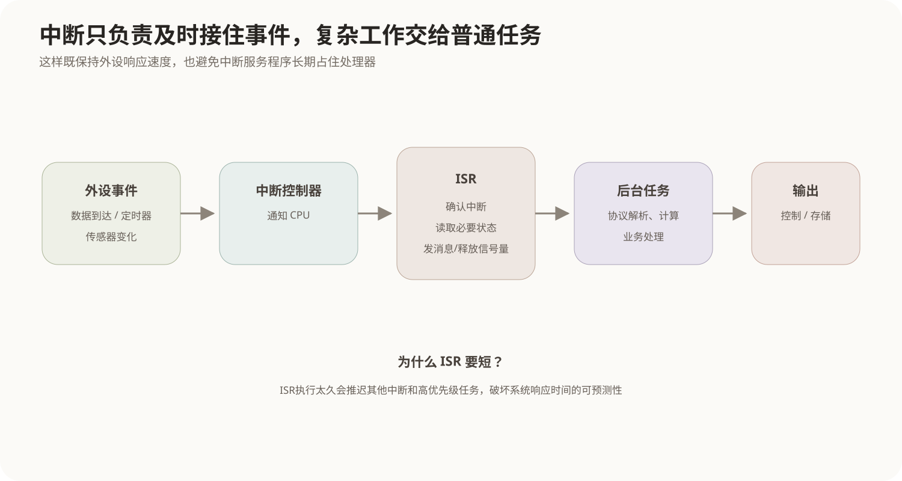
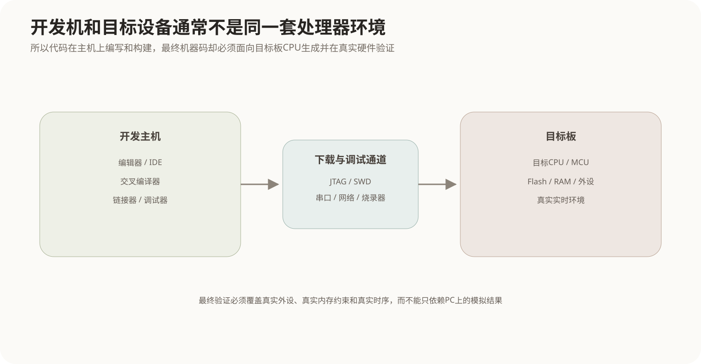

# 嵌入式系统基础

## 1. 嵌入式系统不是“小型电脑”，而是设备中的专用计算系统

嵌入式系统通常被嵌入到更大的设备或产品中，为特定目标完成控制、采集、通信或信号处理任务。例如汽车控制器、工业设备、路由器、摄像机、医疗仪器和家电内部都可能包含嵌入式计算系统。

它和通用PC最大的差别不是体积，而是设计目标：

- 功能范围通常较明确；
- 软硬件高度结合；
- 资源可能受到功耗、成本、存储和算力限制；
- 经常直接连接传感器、执行器和专用外设；
- 很多场景对响应时间有明确上限；
- 产品一旦部署，现场升级和维修成本可能很高。

因此嵌入式设计经常不是“先选软件再找硬件”，而是围绕功能、实时性、功耗、可靠性和成本共同进行软硬件权衡。

## 2. 一个嵌入式系统从硬件到应用有哪些层次



最底层是处理器、存储器和外设；驱动程序把硬件寄存器和中断封装成软件可使用的接口；上层可以运行RTOS，也可以在非常简单的系统中直接运行裸机程序；最终由业务任务完成设备功能。

典型结构可以写成：

```text
应用任务 / 控制逻辑
        ↓
RTOS服务：任务、信号量、队列、定时器
        ↓
设备驱动 / BSP
        ↓
CPU / MCU / 存储 / 总线 / 外设
```

其中BSP（Board Support Package，板级支持包）通常包含与具体硬件板相关的启动、时钟、底层驱动和平台适配代码。

## 3. MCU、MPU、DSP和SoC为什么会同时出现

### 3.1 MCU

MCU（Microcontroller Unit，微控制器）往往把处理器核心、Flash、RAM、定时器、GPIO、串口、ADC等外设集成在一颗芯片中，适合控制类、成本和功耗受限的设备。

### 3.2 MPU

MPU（Microprocessor Unit，微处理器）更强调高性能处理核心，常需要外部内存和更多外围芯片，适合运行复杂操作系统和图形界面的设备。

### 3.3 DSP

DSP（Digital Signal Processor，数字信号处理器）针对乘加、滤波、FFT等数字信号处理操作进行优化，常用于音频、通信和实时信号处理。

### 3.4 SoC

SoC（System on Chip）把CPU、内存控制器、GPU、DSP、各种接口甚至专用加速器集成在一颗芯片上。SoC是系统级集成概念，内部可以同时包含多个不同类型的处理核心。

这些名词不是简单的“从低级到高级”关系，而是面向不同应用和集成方式的硬件组织。

## 4. 嵌入式存储为什么常同时有Flash和RAM

嵌入式设备断电后仍需要保存固件，所以常用非易失性Flash存储程序和持久数据；运行时又需要可以快速随机读写的RAM保存栈、堆和运行状态。

典型启动过程是：

```text
上电复位
→ CPU从固定启动地址执行
→ 初始化时钟和基础硬件
→ Bootloader检查或加载固件
→ 初始化内存、驱动
→ 启动RTOS或进入主循环
→ 创建应用任务
```

有些MCU可以直接从片上Flash执行代码；复杂SoC可能需要Bootloader把后续阶段代码从Flash、eMMC等存储装载到RAM。

## 5. 外设、总线与I/O是嵌入式系统的核心部分

嵌入式系统往往需要直接和真实世界交互：

- GPIO控制开关量；
- ADC把模拟传感器信号转换成数字值；
- PWM控制电机、灯光等执行器；
- UART、SPI、I²C连接外围器件；
- CAN、以太网等连接其他控制器和网络。

软件通常通过内存映射寄存器或专用I/O机制配置这些外设。设备驱动把寄存器位、DMA、中断等硬件细节封装成上层可理解的读写或控制接口。

## 6. 中断为什么比不停轮询更适合很多外设事件

CPU如果一直执行：

```text
while (没有数据) {
    继续检查设备;
}
```

这叫轮询，会持续占用处理器时间。中断机制允许CPU先做其他工作，设备事件发生后再主动通知处理器。



典型链路是：

```text
设备产生事件
→ 中断控制器通知CPU
→ CPU暂停当前上下文
→ 进入中断服务程序 ISR
→ 快速确认事件、读取必要状态
→ 通知或唤醒后台任务
→ 返回原执行流
```

中断服务程序通常应该尽量短，因为它运行期间会影响其他任务和中断的响应。耗时计算、复杂协议处理通常放到普通任务中继续完成。

## 7. 实时系统的“实时”不是单纯运行得快

实时系统的正确性同时取决于**结果和结果产生的时间**。同样的计算结果，如果超过截止时间才产生，在实时系统中可能仍然是错误的。

### 7.1 硬实时

硬实时任务一旦错过截止期限就可能造成不可接受后果，例如某些飞控、工业保护和安全控制环节。

### 7.2 软实时

软实时任务偶尔超时会降低服务质量，但通常不会直接造成灾难性后果，例如多媒体播放出现短暂卡顿。

因此：

```text
实时 ≠ 平均速度快
实时 = 对响应时间具有可预测的约束
```

RTOS的价值之一就是提供可预测的任务调度、中断响应和同步机制。

实时调度算法的详细关系见[实时系统调度算法](../01-操作系统/03-实时系统调度算法.md)。

## 8. RTOS中的任务是什么

RTOS通常把并发工作划分为多个任务或线程，每个任务有自己的执行上下文和优先级：

```text
高优先级：安全监控任务
中优先级：传感器处理任务
低优先级：日志上传任务
```

当高优先级任务变为就绪时，抢占式RTOS可以暂停低优先级任务，先运行更紧急的工作。

任务之间还需要同步和通信，常见机制包括：

- 信号量和互斥锁；
- 消息队列；
- 事件标志；
- 软件定时器；
- 共享内存等。

信号量的具体机制见[PV操作与进程同步](../01-操作系统/08-PV操作与进程同步.md)。

## 9. 优先级反转为什么是实时系统的特殊风险

假设低优先级任务L持有一把锁，高优先级任务H随后需要这把锁，于是H只能等待L。但如果此时中优先级任务M不断抢占L，低优先级任务反而没有机会释放锁，高优先级任务H就会被间接延迟。

```text
L：持锁
H：等待L释放锁
M：优先级高于L，不断抢占L
→ H虽然优先级最高，却长期得不到资源
```

这称为优先级反转。RTOS常通过**优先级继承**等协议缓解：当H等待L持有的锁时，临时提升L的优先级，使L尽快执行并释放锁。

这说明实时系统不仅要设计“谁优先级高”，还要分析任务之间的共享资源依赖。

## 10. 嵌入式软件为什么经常需要交叉开发

开发机通常是性能强大的PC，而目标设备可能没有完整编译环境，因此常用交叉工具链：



```text
主机编写代码
→ 交叉编译器生成目标CPU机器码
→ 下载/烧录到目标板
→ 通过JTAG、串口或日志调试
→ 在真实外设和实时条件下验证
```

“在PC上编译通过”不能证明嵌入式系统正确，因为目标板的CPU架构、内存大小、字节序、外设和时序条件都可能不同。

## 11. 看门狗如何处理软件失控

Watchdog（看门狗）是常见的可靠性机制。软件必须周期性“喂狗”表明系统仍然正常运行；如果程序死循环、任务卡死而长时间没有喂狗，看门狗超时后可以触发复位或其他恢复动作。

```text
正常：任务周期运行 → 喂狗 → 计时器重新开始
异常：程序卡死 → 无法喂狗 → 超时 → 复位
```

看门狗不能修复程序缺陷，但可以把“永久卡死”转化为“被检测并恢复”，提高无人值守设备的可用性。

## 12. 核心关系

```text
嵌入式系统 = 专用计算目标 + 受约束硬件 + 软件控制

硬件：CPU/MCU + Flash/RAM + 总线 + 外设
  ↓
驱动/BSP把硬件细节封装给软件
  ↓
RTOS提供任务、调度、同步和定时
  ↓
应用任务完成控制、采集和通信

外设事件 → 中断 → ISR → 唤醒任务

实时性关注“结果是否在截止时间前产生”
不是单纯平均运行速度

开发常在主机上交叉编译
最终必须在真实目标板和真实时序条件下验证
```
