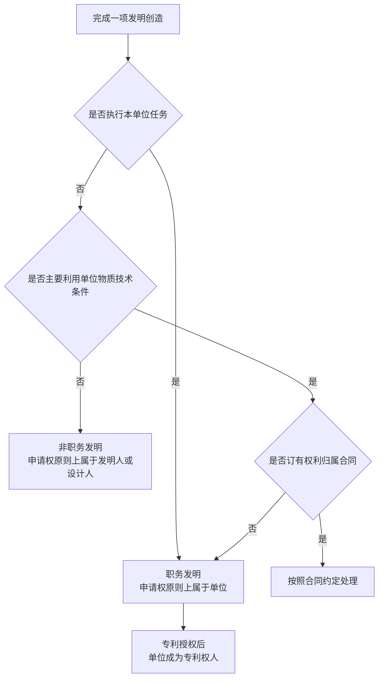

# 专利权与职务发明

专利制度需要分别确定两类问题：一项发明创造是否属于职务发明，以及相应的专利申请权和专利权属于谁。职务发明的认定以工作任务、单位物质技术条件及成果形成过程为依据，不能只根据发明人的任职状态判断。

## 1. 专利相关主体与权利

| 主体 | 含义 |
|---|---|
| 发明人、设计人 | 对发明创造的实质性特点作出创造性贡献的自然人 |
| 专利申请人 | 依法向国家知识产权局提出专利申请的个人或单位 |
| 专利权人 | 专利获得授权后依法享有专利权的个人或单位 |

发明人或设计人描述的是创造性贡献者，专利申请人和专利权人描述的是权利主体，二者不一定相同。职务发明的申请权通常属于单位，但完成创造的自然人仍然是发明人或设计人，依法享有署名以及获得奖励、报酬的权利。

## 2. 职务发明的两条认定路径

根据《中华人民共和国专利法》第六条，职务发明有两条基本认定路径：

1. **执行本单位的任务所完成的发明创造**；
2. **主要利用本单位的物质技术条件所完成的发明创造**。

单位的物质技术条件包括资金、设备、零部件、原材料和不对外公开的技术资料等。“主要利用”强调这些条件对完成发明创造起主要作用，使用普通办公场所或通用办公设备并不必然构成主要利用。

对于主要利用单位物质技术条件完成的发明创造，单位与发明人、设计人对申请权和专利权归属订有合同的，可以按照约定处理。

## 3. 执行本单位任务的三种情形

《中华人民共和国专利法实施细则》第十三条把“执行本单位的任务”分为以下三种情形。

### 3.1 本职工作中完成

发明创造属于岗位职责覆盖的工作内容。例如，研发人员负责某类图像识别算法，其在履行该职责过程中形成的相关技术方案，属于在本职工作中完成的发明创造。

认定时应结合劳动合同、岗位说明、实际工作内容和研发记录，不能只根据单位的经营范围判断。

### 3.2 执行单位额外分配的任务

单位明确交付了本职工作之外的研发任务，员工在完成该任务时作出的发明创造，也属于执行本单位任务完成的职务发明。

任务书、项目文件、工作邮件、会议记录以及研发安排等材料，可以用于证明单位是否实际分配过相应任务。

### 3.3 离职后作出的相关发明

退休、调离原单位或者劳动、人事关系终止后作出的发明创造，在满足法定期限和工作关联条件时，仍可能被认定为执行原单位任务完成的职务发明。

这项规则不是把离开单位后完成的所有发明都归入职务发明，而是同时受到时间范围和工作关联性的限制。

## 4. 离职后的职务发明认定

发明创造可能经历长期的技术积累、方案形成和试验完善，劳动或人事关系结束不代表原单位工作任务的影响立即消失。法律因此设置明确的认定期限，同时通过工作关联条件限制原单位权利的范围。

### 4.1 法定期限

现行《中华人民共和国专利法实施细则》第十三条规定的期限为 **1年内**，适用于以下三种离开原单位的情况：

- 退休；
- 调离原单位；
- 劳动关系或者人事关系终止。

### 4.2 期限从何时开始

期限从退休、调离或者劳动、人事关系实际终止时开始计算，不从专利申请日、专利公开日或专利授权日开始计算。

```text
退休、调离或劳动/人事关系终止
              │
              ├────────── 1年内 ──────────┤
              │                             │
        审查工作关联条件              超过法定期限
```

发生争议时，可以根据退休证明、调动文件、离职证明、劳动合同和人事记录等材料确定起算时间。

### 4.3 时间条件

发明创造必须在退休、调离或者劳动、人事关系终止后1年内作出，才符合该项规定的时间条件。

超过1年后作出的发明创造，不再直接适用这项离职期限规则。但是，如果技术方案实际上在离职前已经形成，或者存在主要利用原单位物质技术条件、合同约定等其他事实，仍需依据相应规则另行判断。

### 4.4 工作关联条件

在1年期限内作出只是必要条件之一，发明创造还必须与发明人在原单位承担的本职工作或者原单位分配的任务有关。

工作关联性通常结合以下事实判断：

- 原岗位的职责和实际工作内容；
- 原单位明确分配的研发任务；
- 新发明与原研发项目在技术内容上的联系；
- 技术资料、设计文档和研发记录的延续关系；
- 发明创造的具体形成过程。

仅仅处于同一个行业或者使用相近的通用知识，不足以直接认定发明创造与原单位任务有关。最高人民法院也指出，不应对工作关联作过于宽泛的解释，以免不适当地限制研发人员正常流动和合法开展新的研发活动。

### 4.5 “作出时间”与“申请日”的区别

“作出时间”指技术方案及其创造性内容实际形成的时间；“申请日”指专利申请文件提交给国家知识产权局的日期。二者可能相隔一段时间。

```text
形成技术构思 → 完善技术方案 → 完成必要验证 → 整理申请文件 → 提交专利申请
       └──────── 发明创造的形成过程 ────────┘          └─ 申请日
```

因此，不能仅凭申请日是否处于离职后1年内判断职务发明。研发记录、设计文档、试验数据、代码提交记录、邮件和专利申请材料等，都可能用于确定发明创造的实际形成时间。

### 4.6 期限内、期限外的典型情况

离职后的认定结果取决于时间条件和工作关联条件是否同时成立：

| 发明创造的形成情况 | 对该项规则的适用 |
|---|---|
| 1年内作出，并与原本职工作或原单位任务有关 | 同时满足时间条件和工作关联条件 |
| 1年内作出，但与原单位工作任务无关 | 不满足工作关联条件 |
| 超过1年后作出，即使与原工作领域相近 | 不满足该项规定的时间条件 |
| 1年内作出，但只能证明属于同一行业 | 不能仅凭行业相同认定工作关联 |
| 申请日在1年期限外，但技术方案在期限内已经形成 | 不能只根据申请日判断，需要查明实际作出时间 |

## 5. 申请权与专利权归属

职务发明和非职务发明的权利归属可以按以下顺序判断：



单位取得申请权和专利权，不会改变实际作出创造性贡献者的发明人或设计人身份。非职务发明的申请权原则上属于发明人或者设计人，任何单位或个人不得压制其依法申请专利。

## 6. 奖励、报酬与常见混淆

单位被授予职务发明专利权后，应当依法对发明人或设计人给予奖励。专利实施后，单位还应当根据推广应用范围和取得的经济效益给予合理报酬。奖励和报酬针对创造性贡献，不等同于把专利权重新转移给发明人。

常见认定错误包括：

- **把发明人直接等同于专利权人**：创造者身份和权利主体是两个问题。
- **只看是否仍在职**：职务发明还包括单位额外分配的任务以及符合法定条件的离职后发明。
- **只看离职后的时间**：1年期限必须与工作关联条件结合判断。
- **把申请日当作发明作出时间**：申请日只是证据之一，不能替代对技术方案形成过程的审查。
- **把同一行业直接等同于工作相关**：行业相同不代表发明与原岗位职责或原单位任务存在实质联系。
- **把离职期限与竞业限制混为一谈**：前者处理特定发明创造的认定和权利归属，后者处理劳动者离职后的从业限制。
- **把一般办公条件视为主要利用单位条件**：应判断单位条件是否对完成发明创造起主要作用。

> 法律依据：《中华人民共和国专利法》第六条；[《中华人民共和国专利法实施细则》](https://xzfg.moj.gov.cn/front/law/detail?LawID=1697)第十三条；[国家知识产权局关于职务发明与非职务发明的说明](https://www.cnipa.gov.cn/art/2020/6/8/art_1750_107424.html)；[最高人民法院关于离职员工职务发明认定的案例](https://ipc.court.gov.cn/zh-cn/news/view-1273.html)。法规可能修订，处理实际权利争议时应核对现行正式文本。
