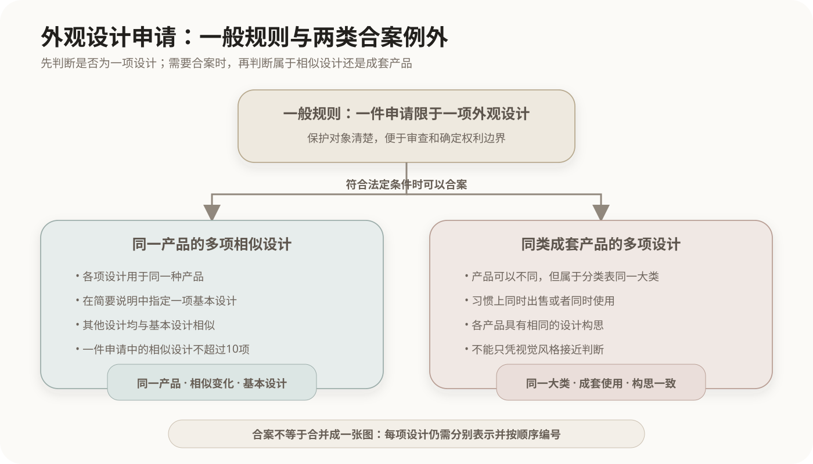

# 外观设计专利与合案申请

## 1. 外观设计专利的保护对象

我国专利包括发明、实用新型和外观设计三种类型。外观设计保护的是产品整体或者局部具有视觉效果并适于工业应用的新设计，设计要素包括：

- 产品的形状；
- 产品的图案；
- 形状与图案的结合；
- 色彩与形状、图案的结合。

外观设计保护产品呈现出来的设计，不保护产品内部采用的技术原理。技术方案通常由发明或实用新型专利处理。

## 2. 一件申请一项设计的基本原则

外观设计专利申请原则上应当限于一项外观设计。这样可以明确每件申请的保护对象，便于检索、审查和确定权利边界。

法律同时允许两类具有紧密关系的设计合并为一件申请：



```text
一件申请原则上对应一项外观设计
        ├── 例外一：同一产品的多项相似外观设计
        └── 例外二：同一类别且成套出售或者使用的多项外观设计
```

合案申请只是允许多项设计共用一件申请，并不表示这些设计失去各自的图片、照片和编号。

## 3. 同一产品的相似外观设计

多项相似外观设计合并申请，需要同时满足以下条件：

1. 各项设计用于**同一种产品**；
2. 各项设计之间相似，而不是彼此没有关联的独立设计；
3. 在简要说明中指定其中一项作为**基本设计**；
4. 其他设计应当与基本设计相似；
5. 一件申请中的相似外观设计**不得超过10项**。

基本设计是判断其他设计是否与其相似的比较中心，不是额外附加在数量上限之外的一项。图片或者照片应当按照“设计1、设计2……”的顺序编号。

相似设计通常保持主要设计构思，仅在局部形状、图案、色彩或其组合上有所变化。如果不同设计分别用于不同产品，仅仅因为产品用途接近或属于相近类别，不能直接按“同一产品的相似设计”处理。

## 4. 成套产品的外观设计

第二类合案申请不是“同一产品的多个版本”，而是多个不同产品共同构成一套。现行实施细则要求这些产品：

- 属于外观设计产品分类表中的同一大类；
- 习惯上同时出售或者同时使用；
- 具有相同的设计构思。

例如，具有统一造型语言并成套出售、使用的杯、壶等产品，可以按照成套产品判断。只有风格接近，但通常不成套出售或使用，不能仅凭外观协调就合案申请。

“相似设计的数量限制”针对同一产品的多项相似设计，不能不加区分地套用到所有成套产品问题上。

## 5. 申请文件

外观设计专利申请主要包括：

| 文件 | 主要作用 |
|---|---|
| 请求书 | 记载申请人、设计人、产品名称等申请事项 |
| 图片或者照片 | 表示请求保护的外观设计，是确定保护范围的核心材料 |
| 简要说明 | 说明产品名称、用途、设计要点等必要事项 |

申请局部外观设计时，需要通过整体产品视图以及虚实线结合等方式明确请求保护的部分。请求保护色彩时，应当提交彩色图片或者照片，并在简要说明中写明。

相似设计合案申请还必须在简要说明中指定基本设计。简要说明用于解释图片或者照片，不得用商业宣传语言描述产品性能。

## 6. 授权条件与保护期限

外观设计获得授权需要满足以下基本要求：

- 不属于现有设计；
- 没有任何单位或者个人就同样设计在申请日前提出申请并在申请日后记载于公告的专利文件中；
- 与现有设计或者现有设计特征的组合相比具有明显区别；
- 不与他人在申请日前已经取得的合法权利相冲突。

现行专利法规定，外观设计专利权期限为**十五年**，从申请日起计算。发明专利为二十年，实用新型专利为十年，三者不能混记。

## 7. 常见概念边界

| 容易混淆的概念 | 判断重点 |
|---|---|
| 同一产品的相似设计 | 产品相同，以一项基本设计为中心判断其他设计是否相似 |
| 成套产品设计 | 产品可以不同，但同属一大类、成套出售或使用并具有相同设计构思 |
| 一项设计与一件申请 | 原则上一件申请一项设计；符合法定条件时，多项设计可以合案 |
| 外观设计与实用新型 | 外观设计保护视觉设计，实用新型保护产品形状、构造或其结合形成的技术方案 |
| 基本设计与其他设计 | 基本设计是相似性判断中心，不代表只有基本设计受到保护 |

## 核心关系

```text
外观设计申请
├── 一般规则：一件申请限一项设计
└── 合案申请
    ├── 同一产品的多项相似设计
    │   ├── 指定基本设计
    │   ├── 其他设计与基本设计相似
    │   └── 一件申请不得超过10项
    └── 同一类别的成套产品设计
        ├── 同一大类
        ├── 成套出售或者使用
        └── 相同设计构思
```

## 法律依据

- [《中华人民共和国专利法》](https://www.cnipa.gov.cn/art/2020/11/23/art_524_171347.html)第二条、第二十三条、第三十一条和第四十二条；
- [《中华人民共和国专利法实施细则（2023年修订）》](https://www.cnipa.gov.cn/art/2023/12/21/art_98_189197.html)第三十一条和第四十条；
- [《专利审查指南（2023）》](https://www.cnipa.gov.cn/module/download/downfile.jsp?classid=0&amp;filename=5753f257e6a04b6f8e305eb6d34ba452.pdf&amp;showname=%E4%B8%93%E5%88%A9%E5%AE%A1%E6%9F%A5%E6%8C%87%E5%8D%97.pdf)第一部分第三章。

法规和审查规则可能修订，处理实际申请或权利争议时应核对国家知识产权局公布的现行文本。
