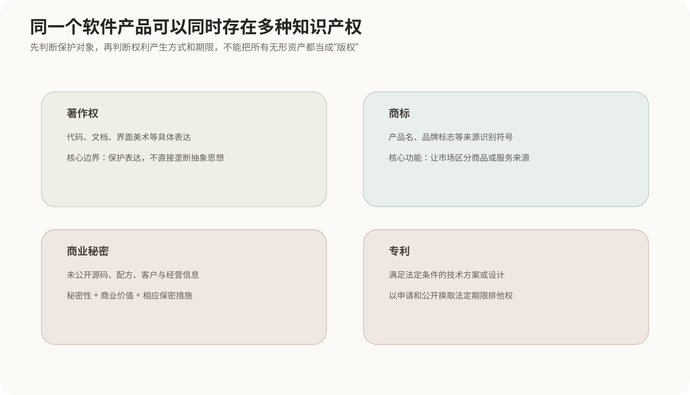
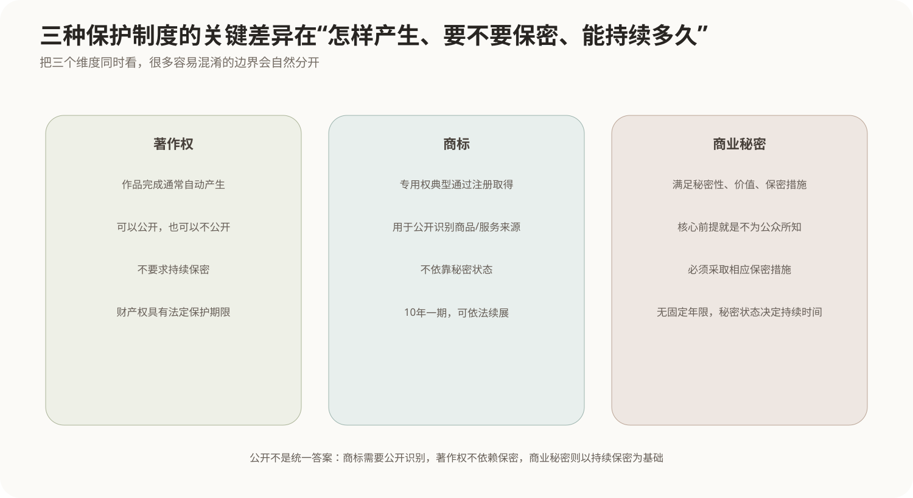

# 著作权、商标与商业秘密

## 1. 知识产权保护的不是同一种“东西”

软件、品牌和企业技术资料都属于重要无形资产，但它们受到保护的理由并不相同：

- 一段程序代码首先是一种具体表达，可以进入著作权保护；
- 一个用来区分商品或服务来源的品牌标志，可以通过商标制度取得专用权；
- 没有公开、能够带来商业价值并采取了保密措施的技术或经营信息，可以作为商业秘密保护；
- 满足专利法条件的技术方案还可能通过专利制度保护，相关内容见[专利权与职务发明](01-专利权与职务发明.md)。

因此面对一个信息资产，不能只问“有没有知识产权”，而应该先判断**保护对象是什么、权利怎样产生、保护期限和公开要求是什么**。



## 2. 著作权保护表达，不直接保护思想本身

著作权的基本边界是“思想—表达二分”：法律保护作品的具体表达形式，但通常不因为某个人先提出一个抽象思想、算法原理或业务方法，就禁止其他人独立采用同样思想并用自己的方式表达。

对软件来说，可以这样理解：

```text
算法思想 / 功能概念
       ↓ 用具体代码实现
源程序、目标程序以及相关文档的具体表达
       ↓
进入计算机软件著作权保护范围
```

因此两套程序“功能相同”不自动意味着侵犯著作权；关键还要看是否未经许可复制、改编或使用了受保护的具体表达。

## 3. 软件著作权怎样产生

按照中国著作权制度，著作权通常随作品创作完成而产生，不以登记作为权利产生的必要条件。软件登记可以用于权利证明和管理，但不能把“未登记”简单理解为“没有著作权”。

计算机软件著作权保护的典型对象包括：

- 源程序；
- 目标程序；
- 与软件开发、使用有关的文档等受保护表达。

软件开发过程中还要区分“谁写了代码”和“著作权最终归谁”。职务开发、委托开发、合作开发等场景可能受到法律规定和合同约定共同影响，不能只依据代码提交者姓名判断权属。

## 4. 软件著作权的保护期限

根据中国现行计算机软件保护规则，软件著作权中的财产权保护期限需要区分权利主体。

### 4.1 自然人软件

自然人的软件著作权保护期通常为作者终生及死亡后50年，截止于作者死亡后第50年的12月31日；合作开发的软件，以最后死亡的自然人作者为基准计算。

### 4.2 法人或其他组织软件

法人或其他组织的软件著作权，相关财产权通常保护到软件首次发表后第50年的12月31日；如果软件自开发完成之日起50年内没有发表，则不再获得这部分期限保护。

著作权中的署名等人身权与财产权期限规则并不完全相同，因此遇到具体题目时应先看题目问的是哪一项权利。

## 5. 什么行为容易落入软件著作权侵权问题

典型风险包括未经权利人许可：

- 复制软件；
- 向公众发行侵权复制品；
- 对软件进行超出许可范围的修改、翻译等；
- 故意规避或破坏权利管理措施；
- 超出合同授权范围安装、复制或传播软件。

实际法律责任还要结合许可合同、法定例外、证据和行为性质判断。学习时最重要的是先建立边界：

```text
“功能类似”不是当然侵权
“复制受保护表达并超出许可”才进入核心侵权判断
```

## 6. 商标保护的是市场中的来源识别

商标的主要作用是让消费者区分商品或服务来源。文字、图形、字母、数字等符合条件的标志可以申请注册商标。

它和著作权关注点不同：

```text
著作权：作品表达是谁创作、谁有权复制传播
商标：市场上这个标志代表谁的商品或服务来源
```

商标专用权通常通过注册取得。我国注册商标的有效期为**10年**，自核准注册之日起计算；有效期届满可以依法续展，而且续展可以反复进行。

因此一个持续经营的品牌可以通过不断续展长期保持商标权，而不是像多数著作财产权那样到固定年限后自然终止。

## 7. 商标侵权为什么强调“混淆”与标志使用

商标制度要避免消费者对商品或服务来源产生错误认识。典型侵权风险包括未经许可在相同或类似商品、服务上使用相同或近似标志，并达到法律规定的侵权条件。

判断时通常需要考虑：

- 标志是否相同或近似；
- 商品或服务是否相同或类似；
- 是否属于商标意义上的使用；
- 是否容易导致相关公众混淆；
- 是否存在驰名商标等特殊保护情形。

所以“两个Logo看起来有一点像”本身还不是完整法律结论，需要放回具体使用场景和商品服务类别判断。

## 8. 商业秘密的核心是“没有公开 + 有价值 + 真正在保密”

商业秘密保护的不是已经公开给全社会的表达，而是企业因为**不为公众所知悉**而具有竞争价值的信息。

根据中国反不正当竞争制度，商业秘密的核心条件可以概括为：

1. **不为公众所知悉**；
2. **具有商业价值**；
3. **权利人采取相应保密措施**。



商业秘密可以包括技术信息，也可以包括经营信息，例如：

- 未公开配方和工艺参数；
- 源代码或内部算法实现；
- 未公开客户名单；
- 供应价格和经营策略；
- 内部研发资料等。

## 9. 商业秘密为什么没有固定“20年”或“50年”期限

商业秘密依赖的是秘密状态本身。只要信息仍符合秘密性、商业价值和保密措施等条件，就可以持续受到保护；一旦合法公开到公众能够普遍获得，商业秘密基础就可能消失。

因此它与专利形成鲜明对比：

```text
专利：以公开技术方案换取法定期限的排他保护
商业秘密：不公开，依靠持续保密维持保护
```

一项技术适合申请专利还是保持商业秘密，需要权衡能否被逆向发现、技术寿命、公开后的竞争影响等因素。

## 10. 什么叫“采取相应保密措施”

企业不能仅仅在争议发生后说“这是我的秘密”。保密措施需要体现权利人确实有控制信息传播范围的行为，例如：

- 与员工和合作方签署保密约定；
- 根据岗位设置访问权限；
- 对敏感文档进行分类和标记；
- 控制源代码仓库、下载和复制权限；
- 对离职、外包、访客等场景建立资料交接和回收流程。

具体措施是否足够，要结合信息价值、企业规模和实际保护方式判断。

## 11. 三种权利怎样快速区分

| 维度 | 著作权 | 商标 | 商业秘密 |
|---|---|---|---|
| 主要保护对象 | 作品的具体表达 | 区分商品/服务来源的标志 | 未公开且有商业价值的信息 |
| 权利产生 | 作品完成通常自动产生 | 典型专用权通过注册取得 | 满足秘密性、价值和保密措施 |
| 是否要求保密 | 不要求 | 不要求 | 必须保持秘密 |
| 是否要求公开 | 作品可公开也可不公开 | 注册信息公开 | 一旦普遍公开会失去秘密基础 |
| 期限特点 | 财产权有法定期限 | 10年一期，可续展 | 没有固定期限，取决于秘密状态 |

## 12. 核心关系

```text
代码、文档的具体表达
        → 著作权

品牌名称、标志用于区分来源
        → 商标

未公开技术/经营信息
+ 商业价值
+ 相应保密措施
        → 商业秘密

技术方案满足专利条件并申请公开
        → 专利

同一软件产品可能同时受到多种制度保护：
代码表达有著作权
品牌有商标
未公开核心实现可能是商业秘密
符合条件的技术方案还可能申请专利
```
