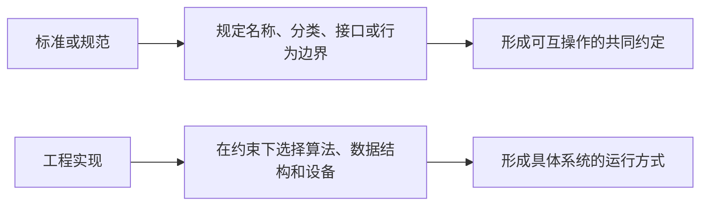

# 规范性知识与工程解释

## 1. 两类结论的来源

计算机知识中，一部分结论来自标准、协议或教材定义，另一部分来自具体系统的工程实现。两者可以相关，但不能互相替代。



## 2. 规范性知识

规范性知识回答的是“某份标准明确规定了什么”。判断这类结论需要确定：

1. 标准的发布组织和版本；
2. 标准覆盖的对象和边界；
3. 标准采用的正式术语；
4. 某个名称是否实际列入该标准的分类体系。

一个概念没有被列入某份标准，不等于它在工程上无用；只能说明它不属于该标准给出的正式分类。

## 3. 工程解释

工程解释回答的是“系统为什么这样实现、如何运行、有哪些代价”。它通常需要考察：

- 需要解决的具体问题；
- 输入、输出和状态；
- 使用的数据结构与算法；
- 时间、空间和兼容性成本；
- 不同实现之间允许存在的差异。

解释工程实现时，应提供可验证的机制和具体过程，不能仅凭已经知道的结论倒推一套理由。

## 4. 使用边界

```text
标准事实：以指定版本的正式定义为边界。
工程事实：以具体系统、版本和实现为边界。
理解性说明：帮助建立联系，但不能替代前两者的证据。
```
